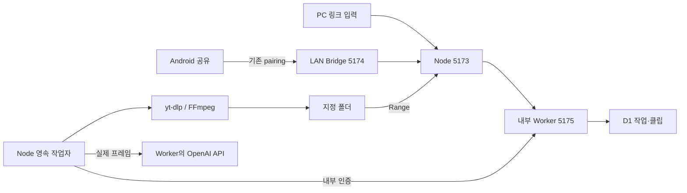

# PC 로컬 영상 수집 운영 안내

[기술문서](README.md) · [현재 구조·API](local-video-ingestion-reference.md) · [구현·검증 기록](local-video-ingestion-progress.md)

2026-10-03. Windows PC의 Node 실행기가 공개 YouTube·Instagram 개별 영상을 내려받고, 기존 OpenAI 프레임 API로 분석한다. Android의 YouTube 공유 진입·연결 주소·페어링 방식은 유지한다. 실제 검증의 남은 조건은 구현·검증 기록을 먼저 확인한다.

## 시작과 설정

PC 실행기와 개발 서버를 종료한 상태에서 기존 `.wrangler/state`, `.dev.vars`, `.cutnote-pc`를 보존한다. 기존 DB를 지우거나 새 DB로 교체하지 않는다. 저장소 루트에서:

```powershell
cd apps/web
npm run build
npm run db:init
npm start
```

`db:init`은 같은 로컬 D1에 미적용 migration만 적용한다. 이번 추가는 `0009_pc_jobs.sql`이며 전체 10개다. 새 작업 경로는 `npm start`에서 제공한다. `npm run dev`와 온라인 사이트는 외부 프로그램을 실행하지 않는다.

PC에서 `http://127.0.0.1:5173/`을 열고 **PC 저장 폴더와 다운로드 도구 설정**을 펼친다.

1. 저장 폴더를 절대 경로로 입력한다. 기본은 Windows 사용자 폴더 아래 `Videos/Cutnote`다. 최초 시작 전에 `CUTNOTE_DOWNLOAD_DIR`로 기본 위치를 지정할 수도 있다. UNC·네트워크 경로·symlink·junction은 지원하지 않는다.
2. `ytDlp`, `ffmpeg`, `ffprobe` 실행 파일의 절대 경로를 입력하고 **설정 저장·도구 점검**을 누른다. 비우면 PATH에서 검색한다. FFmpeg와 ffprobe는 같은 배포본의 bin 폴더에 두고 모두 버전이 표시되는지 확인한다.
3. PC의 **AI 연결**에서 **OpenAI**를 선택해 키를 등록한다. Gemini 연결만으로는 이 작업의 분석이 실행되지 않는다. 비밀값을 채팅·문서·Git에 넣지 않는다.
4. 링크를 넣고 **PC에 저장하고 분석**을 누른다. 기존 레퍼런스 추가 폼의 링크 저장도 같은 작업 큐로 접수된다. 다운로드가 끝나면 분석 실패 상태여도 원본 재생이 가능하다.

휴대폰도 연결하려면 위 `npm start` 대신 저장소 루트에서 `node apps/android/launcher.mjs`를 실행한다. 기존 PC 서버가 있으면 재사용하고, 없으면 PC 실행기를 시작한다. 안내된 PC 사설 IP·페어링 코드를 기존 Android 앱에 입력한다. 실행기가 개발 서버를 발견해 로컬 다운로드를 지원하지 않는다고 안내하면 개발 서버를 종료하고 다시 시작한다.

개발 검증 환경에 준비했던 도구는 Git에서 제외된 저장소 루트 `.tools/yt-dlp.exe`와 `.tools/ffmpeg/ffmpeg-9.0.2-essentials_build/bin/{ffmpeg,ffprobe}.exe`에 있다. 다른 설치에서는 아래 공식 배포처에서 별도로 준비한다. 실제 영상·테스트 DB도 `.tools` 아래에 있으며 배포 파일이 아니다. 새 체크아웃에는 없으므로 직접 준비한다.

## 도구 배포와 업데이트

- [yt-dlp 공식 Release](https://github.com/yt-dlp/yt-dlp/releases): Windows x64 `yt-dlp.exe`와 같은 release의 `SHA2-256SUMS`를 받는다. `Get-FileHash -Algorithm SHA256` 결과를 대조한다. 검증 버전은 **2026.08.19**다.
- [FFmpeg 공식 다운로드 안내](https://ffmpeg.org/download.html#build-windows)가 연결하는 [Gyan Windows builds](https://www.gyan.dev/ffmpeg/builds/)의 essentials 배포와 SHA256을 확인한다. 검증 버전은 **9.0.2**다. 실행 파일과 배포본의 라이선스 고지를 함께 보존한다.
- 작업을 마친 뒤 PC 실행기를 종료하고 도구를 새 버전 폴더에 설치한다. UI에서 경로를 변경해 버전 점검·짧은 실제 영상 검증을 거친다. 실패하면 이전 경로로 돌아간다. 작업 중 자동 업데이트나 Git 저장소에 바이너리 포함은 하지 않는다.
- yt-dlp는 사용자 설정·외부 플러그인·원격 JS 컴포넌트를 자동으로 읽지 않도록 실행한다. Node를 명시적 JS 런타임으로 사용한다. 도구 버전 변경 후 사이트 지원은 다시 확인해야 한다. [공식 옵션 설명](https://github.com/yt-dlp/yt-dlp#usage-and-options)

## 상태와 복구

접수 응답은 D1 기록 이후 돌아온다. **PC에 접수했어요** 안내 이후 모바일 화면·브라우저를 닫아도 PC가 처리한다. PC 실행기 종료·절전·전원 종료는 처리를 중단한다. 다시 접속하면 작업 목록에서 상태를 읽는다.

| 상태 | 조치 |
|---|---|
| 다운로드 중 / 프레임 추출 / OpenAI 분석 / 결과 저장 | PC 실행기를 유지한다. 정상 연결에서는 취소 요청을 약 5초 주기로 확인하며 실행 중 도구 프로세스를 종료한다. |
| 도구 없음 / 저장 공간 부족 | PC 도구 설정 또는 디스크를 점검하고 재시도한다. |
| 다운로드 실패 / 로그인 요구 | 링크는 보관함에 남는다. 공개 영상 여부를 확인한다. 로그인 필수·429·플랫폼 차단이면 반복 요청을 멈추고 원본 파일 첨부 또는 나중에 재시도한다. 브라우저 쿠키 자동 추출은 하지 않는다. |
| 프레임 추출 실패 | FFmpeg·ffprobe와 원본 재생을 확인한다. 확보된 원본은 보존한다. |
| 분석 실패 | PC에서 OpenAI 연결·모델 접근·사용 한도를 확인한다. 재시도는 확보된 원본을 사용한다. |
| 편집 충돌 | 다른 화면의 편집을 덮어쓰지 않았다. 최신 구간·태그를 확인하고 다시 시도한다. 정상 AI 응답 checkpoint가 있으면 원본 크기·요청이 일치할 때 다시 유료 호출하지 않는다. |
| 중단됨 | 재시작 후 명시적으로 재시도한다. 실행 중 lease는 마지막 갱신으로부터 60초 후 만료되어 영구 진행 상태를 피한다. 대기 작업은 다음 실행 시 처리한다. |
| 원본 없음 | 기존 폴더에서 원본을 복원하거나 새 링크 작업으로 다시 수집한다. 기존 완료 원본을 임의로 수정·교체하는 흐름은 지원하지 않는다. |

같은 shareId/requestId 재전송은 같은 작업·클립을 반환한다. 별도의 새 공유 동작은 새 requestId로 새 클립을 만든다. **영상 URL만 같은 별도 요청 간 전역 중복 제거는 후속 개선**이다. 모바일은 `accepted`, `saved`, `job` 복원 주소를 사용하고 기존 APK가 읽는 `saved=shareId`도 유지한다.

최대 원본 2GiB·2시간, 다운로드 시작 시 여유 공간 5GiB, 단일 작업자 순차 실행이 기본이다. 다운로드 30분·프레임별 30초·분석 약 3분 제한이 있다. H.264/AAC MP4를 우선 선택하고 필요한 경우 FFmpeg로 변환한다. 분석은 최대 120개의 실제 프레임을 사용하며 음성 분석·모든 프레임 관찰은 하지 않는다.

## 파일과 백업

| 위치 | 역할 |
|---|---|
| `apps/web/.wrangler/state` | 기존 D1 클립·태그·작업과 R2 업로드 보관함 |
| `apps/web/.dev.vars` | 기존 사용자 환경 설정; 덮어쓰지 않음 |
| `apps/web/.cutnote-pc/settings.json` | root ID→폴더, 도구 경로; 폴더 변경 후 옛 root 매핑도 유지 |
| `.cutnote-pc/master.key` | 기존 암호화 키가 없을 때 생성하는 PC 전용 암호화 키. Windows에서는 소유자 전용 ACL. 분실 시 저장된 AI 키를 다시 연결해야 함 |
| `.cutnote-pc/runtime-*.vars` | Worker에 전달하는 실행별 내부 토큰과 환경. 먼저 소유자 전용 권한을 적용하고 기록; 정상 종료 시 삭제 |
| `저장 폴더/<작업 UUID>/video.mp4`, `poster.jpg`, `asset.json` | 로컬 원본·썸네일·자산 정보 |
| 같은 폴더의 `result-<작업 UUID>.json` | 분석 응답 checkpoint |
| 같은 폴더의 `export-<작업 UUID>.mp4` | 로컬 구간 파일 |
| 같은 폴더의 `staging/`, `frames/` | 다운로드·프레임 임시 파일; 종료·취소 시 정리, 다음 PC 시작에서도 정리 |

백업은 PC 실행기를 종료하고 D1/R2 상태·기존 환경·PC 설정/암호화 키·등록된 모든 영상 폴더를 함께 보존한다. 클립 삭제는 보관함 항목을 제거하지만 로컬 원본·분석 checkpoint·내보내기는 자동 영구 삭제하지 않는다. DB에 없는 파일까지 지우는 자동 GC는 아직 없다. 디스크 정리는 백업 후 UUID 폴더와 D1 참조를 확인하여 수동 수행한다.

원본은 `/api/media/<clipId>`로 Range 스트리밍하므로 브라우저가 전체 파일을 메모리에 올리지 않고 탐색한다. 구간 재분석은 Node가 같은 원본의 선택 시간만 추출한다. 로컬 구간 저장도 PC 작업으로 접수해 5분·25MiB·최대 360p 파일을 만든다. 기존 업로드/R2의 구간 저장 경로와 25MiB 한도는 유지한다.

## 경계와 지원 범위



LAN은 기존 인증을 통과해야 작업을 접수·조회·취소·재시도할 수 있다. PC 도구·폴더·AI 키 설정과 내부 작업 API는 LAN에 열지 않는다. Gateway는 Host·Origin을 검증한 뒤 Worker로 전달한다. 도구는 shell 없이 고정 인자 배열로 실행하고 provider 키·내부 토큰을 도구 환경에 전달하지 않는다.

Downloader HTTPS는 허용된 플랫폼/CDN 호스트와 공개 IPv4만 연결하는 프록시를 사용한다. OS DNS로 조회한 주소를 검사한 뒤 같은 주소에 연결한다. YouTube 공개 웹페이지가 거치는 `www.google.com`·`consent.google.com`은 허용하지만 Google Data API·Gemini API를 호출하거나 키를 요구하지 않는다. [Node DNS 설명](https://nodejs.org/api/dns.html#dnslookuphostname-options-callback)

인터넷 공개 서버·다중 사용자 권한 모델·PC 꺼진 상태의 처리·로그인 쿠키 지원·라이브·재생목록·Instagram carousel 전체 수집·온라인↔PC 파일 동기화는 지원하지 않는다. 기존 추천/Gemini 기능은 별도로 남으며 신규 수집 경로의 fallback으로 사용하지 않는다.

## 남은 실제 검증 절차

1. PC에서 OpenAI를 연결하고 제공한 Instagram 링크를 접수한다. 기대 결과는 `완료`, 로컬 원본과 보관함 분석·태그·구간 생성이다. 분석 실패 시 원본 유지와 재시도를 확인한다.
2. YouTube 링크는 현재 네트워크에서 429/로그인 요구가 관찰됐다. 제한이 해소된 뒤 권한 있는 공개 영상으로 다시 확인한다. 다른 제공자 분석으로 우회하지 않는다.
3. Android YouTube 앱의 공유 → 컷노트를 선택한다. 같은 Wi-Fi·기존 pairing을 통과해 **PC 접수 완료**를 확인한 뒤 앱 화면을 닫는다. PC에서 완료되는지, 앱을 다시 열면 상태·영상·태그가 보이는지 확인한다.
4. 접수 응답 유실·Wi-Fi 재연결·동일 보류 share 재전송을 재현한다. 작업과 클립이 하나여야 한다. PC 미연결이면 접수 실패/다시 연결 안내가 보여야 한다.
5. 모바일/PC에서 원본 seek, 구간 반복 재생, 수동 태그 편집, 구간 재분석·내보내기를 확인한다. PC 처리 도중 실행기를 정상 종료/재시작해 중단 상태와 명시적 재시도를 확인한다. 강제 종료는 최대 lease 만료 시간 이후 확인한다.

## 설정 예시와 진단

최초 실행의 기본 저장 위치만 지정하려면 저장소 루트 PowerShell에서 다음처럼 사용한다. `<사용자 전용 절대 경로>`를 실제 로컬 폴더로 바꾼다. 기존 설정이 있으면 UI에서 변경한다.

```powershell
$env:CUTNOTE_DOWNLOAD_DIR = '<사용자 전용 절대 경로>'
node apps/android/launcher.mjs
```

`CUTNOTE_PC_TOKEN`은 실행기가 매번 생성하므로 사용자가 설정하거나 LAN 클라이언트에 전달하지 않는다. `CUTNOTE_SECRET_KEY`, `OPENAI_API_KEY`, 기존 `GEMINI_API_KEY`와 `.dev.vars` 설정 관계는 [설치 안내](setup.md)를 따른다. 새 경로는 Gemini 키를 요구하지 않는다.

문제가 생기면 작업 목록의 단계·오류 코드와 도구 버전 점검을 먼저 확인한다. `GET /api/jobs?id=<작업 UUID>`의 `state`, `phase`, `errorCode`, `attempt`가 재현 기준이다. PC 시작 터미널은 시작 오류를 확인하는 곳이며 영구 통합 로그 파일은 구현되어 있지 않다. 내부 Worker의 stdout/stderr도 기본적으로 출력하지 않는다. 진단 공유에는 비밀 설정·연결 안내 파일·원본 주소·개인 경로·분석 응답 전문을 포함하지 않는다. 다운로드 검사 결과 파일은 개인 경로를 포함할 수 있으므로 공개하지 않는다.

Windows 실행기의 연결 정보 JSON 권한 제한과 실제 다운로드 검사 종료 코드 문제는 [문서 대조 기록](documentation-review-2026-10-03.md)에 남겼다. 설치·도구 업데이트 후 점검은 [테스트 안내](testing.md)를 따른다.
