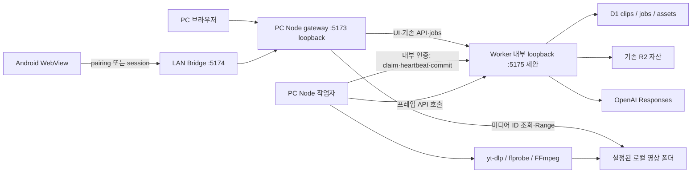
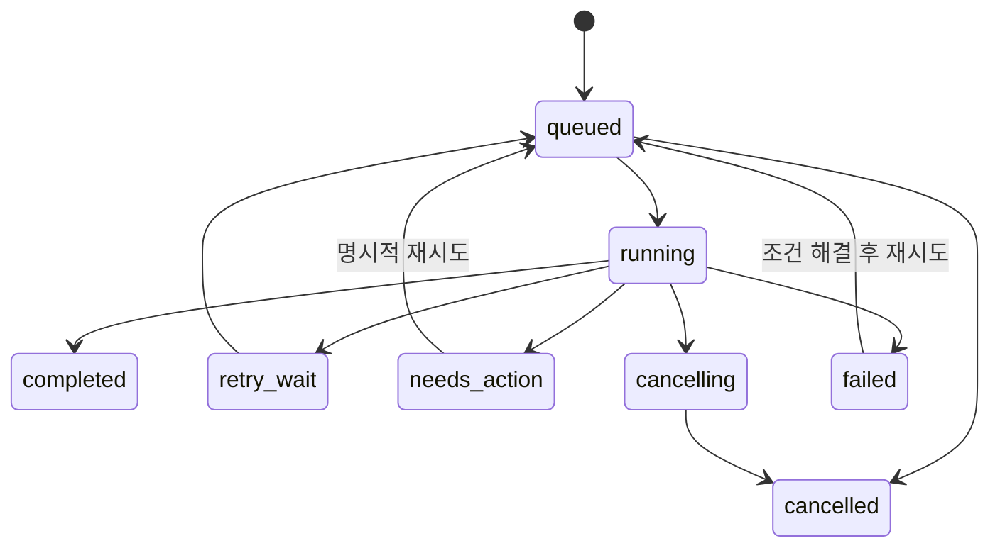

# PC 로컬 영상 수집: 권장 구조와 구현 계획

[기술문서 목록](README.md) · [코드 조사·학습 기록](local-video-ingestion-study.md)

기준일: **2026-10-03, Asia/Seoul** · 기준 코드 `fb2cc9b` · **구현 전 제안의 보존 기록**. 이후 구현 상태·선택 변경은 [구현·검증 기록](local-video-ingestion-progress.md), 실행 방법은 [운영 안내](local-video-ingestion-operations.md)를 따른다.

## 권장 결론

**PC Node 작업자 + D1 영속 작업 원장 + 로컬 자산 저장소 + 기존 OpenAI 프레임 분석**을 권장한다. Android의 `YouTube 공유 → 컷노트 → /mobile` 진입과 LAN pairing은 유지한다. PC와 모바일은 동일한 짧은 작업 접수 API를 사용하고, PC가 접수를 영속 저장한 이후 다운로드·분석·저장은 모바일 연결과 독립적으로 진행한다.

핵심 변경은 downloader 추가보다 **작업 소유권을 화면에서 PC로 옮기는 것**이다. 현재 PC는 분석 후 수동 저장, 모바일은 링크 저장 후 화면이 분석·PATCH를 수행한다. 요청 중복 방지는 있지만 실행 중인 작업의 영속 기록은 없다. 확인 위치와 실제 동작은 [학습 기록 1~4절](local-video-ingestion-study.md)에 설명했다.

초기 범위는 Windows PC, 동일 신뢰 LAN, 공개된 개별 YouTube 영상/Shorts 및 Instagram 영상 게시물이다. 다운로드 가능한 포맷으로 원본을 확보한다는 의미이며 플랫폼 업로더의 원본 마스터 파일 확보를 보장하지 않는다. 로그인 필수·라이브·playlist·carousel 전체 수집·인터넷 원격 접속은 기본 지원에서 제외한다. 제외 입력도 링크만 보관하고 이유를 보여 줄 수 있다.

“Google API/Gemini 비의존”은 신규 수집·분석·구간 재분석에서 Gemini나 Google API 키를 요구하거나 자동 fallback하지 않는 것으로 해석했다. YouTube 자체·CDN 접근은 필요하다. 제품 전체 Gemini 제거는 아래 결정표에서 별도로 구분한다.

## 현재 문제와 변경 목표

| 코드로 확인한 현재 상태 | 필요한 동작 | 재사용할 부분 |
|---|---|---|
| PC 타이핑 후 브라우저 분석, 수동 저장 | 명시적 제출 후 PC 작업 접수 | 편집 폼·수동 메모·태그 검수 |
| Android 공유는 pending shareId로 링크 등록 | 같은 shareId 재전송을 동일 작업으로 조회 | ACTION_SEND alias·연결 재시도·보류 링크 |
| saved URL은 링크 저장만 확인 | durable job ACK 이후 화면 종료 안내 | history 복원 UI, 보관함 polling |
| YouTube 링크 OpenAI 경로에는 원본이 없음 | PC downloader로 원본 확보 후 OpenAI | provider 식별, taxonomy·결과 parser |
| Worker route에는 실제 PC 프로세스/폴더 권한 없음 | Node가 도구·파일 관리 | 기존 Node 실행기·Bridge |
| 업로드/R2 한도 25MiB, Bridge 28MiB | 다운로드는 폰 업로드를 거치지 않고 대용량 재생 가능 | R2 경로·Range 응답 계약 |
| 구간 내보내기·재분석은 화면 수명에 묶임 | 로컬 자산의 구간 작업도 PC에서 처리 | 구간 ID·시간 검증·태그 병합 |
| 작업 재시작 복구가 없음 | checkpoint·lease·취소·단계별 재시도 | revision 충돌 방지 |

## 실행 구조와 신뢰 경계

### 권장 배치

새 `apps/pc/`에 Node gateway·작업자를 둔다. 초기에는 같은 Node 서비스 안의 모듈로 운영하여 중복 실행·설정·종료 관리를 줄이고, downloader/FFmpeg는 별도 자식 프로세스로 실행한다. launcher는 이 PC 서비스와 Worker, Bridge의 상태를 확인한다. Node 작업 루프가 HTTP 요청 callback과 독립적으로 실행되므로 브라우저 연결을 닫아도 job을 취소하지 않는다.

외부에 익숙한 주소 `127.0.0.1:5173`, LAN `:5174`를 유지하기 위해 **5173을 Node gateway가 맡고 Worker를 내부 loopback 5175로 이동**하는 제안이다. 내부 포트는 구현 시 충돌 검사를 포함해 확정한다. PC에서 `npm start`만 실행해도 gateway·작업자가 시작되어야 하며 Android launcher만 실행했을 때만 가능한 기능으로 만들지 않는다. 기존 상태 디렉터리·D1/R2 식별자·키는 그대로 보존한다.

gateway는 UI/기존 API를 Worker로 전달하고, media GET/HEAD는 내부 자산 조회 결과가 local일 때만 직접 스트리밍한다. R2면 기존 Worker API로 전달한다. PC→Worker로 Host/Origin을 변환할 때 **원래 요청의 Host/Origin을 먼저 검증**한다. Worker의 `crossOrigin`만 믿고 모든 외부 Origin을 정상 Origin으로 바꾸면 안 된다.

PC 관리·변경 API에는 로컬 UI 세션/CSRF 검증을 추가한다. Origin 없는 요청을 무조건 신뢰하지 않고, 내부 작업자는 별도 토큰으로 구별한다. gateway/작업자 시작 시 해당 자격 증명을 준비하고 Worker에 안전하게 전달하는 실행 계약을 단계 0에서 검증한다. 공개 웹에는 내부 토큰을 전달하지 않는다. PC 사용자 계정 자체가 장악된 상황까지 방어한다고 주장하지 않는다.

`x-cutnote-client: lan`은 UI 안내용이지 비밀이 아니다. gateway에서 LAN 출처를 신뢰해야 하는 PC 전용 설정 경로에는 Bridge가 gateway에 보내는 별도 내부 인증을 둔다. 사용자 제공 내부 헤더는 제거한다. LAN에서 도구 경로·다운로드 root·쿠키·AI 키 설정은 금지한다. 내부 Worker API는 gateway와 Bridge의 공개 proxy 대상에서 제외하고, Worker 자체도 실행기에서 안전하게 주입한 별도 토큰으로 검증한다. loopback만으로 인증 완료라고 간주하지 않는다. 토큰은 pairing 코드와 분리하고 브라우저·도구 자식 환경·로그에 노출하지 않는다.

Node 작업자는 내부 HTTP로 Worker의 job을 claim한다. **Worker가 Node 서버에 역방향 fetch할 필요가 없는 pull 방식**으로, workerd의 로컬 네트워크 제약을 핵심 경로에서 피한다. 작업자는 D1 SQLite 파일이나 R2 emulator 디렉터리를 직접 열지 않는다. AI 키도 Node에 복사하지 않고 기존 Worker의 `/api/ai/frames` 호출을 활용한다. 이 PC 내부 요청의 수명은 모바일 요청과 별개이며, 작업 취소·분석 단계 타임아웃에는 반응한다.

온라인 배포는 `localIngestAvailable=false`를 반환하고 PC 수집 UI를 비활성화한다. 온라인 사이트가 사용자 PC 폴더를 읽거나 클라우드 D1에 로컬 경로를 동기화하는 기능은 포함하지 않는다. LAN 기기는 연결된 PC의 보관함만 사용한다.

### 주요 대안 비교

| 대안 | 장점 | 선택하지 않는 이유 / 사용 조건 |
|---|---|---|
| **Node 작업자 + 기존 D1/R2 유지** | 현재 분석·메타데이터·데이터 보존 경로 재사용 | gateway/내부 API가 추가되지만 변경 범위를 통제할 수 있어 권장 |
| Bridge 프로세스에 다운로드를 직접 내장 | 새 프로세스 수가 적음 | PC 단독 실행에 Bridge가 필수가 되고 LAN 인증·CPU 작업·파일 소유권이 뒤섞임. Bridge는 전달 책임 유지 |
| Node의 별도 SQLite를 job 원장으로 사용 | Node에서 큐·파일 처리가 쉬움 | clips와 jobs가 다른 DB라 접수/결과 동기화가 추가됨. 선택한다면 outbox·reconciliation부터 설계 필요 |
| 모든 웹 API·DB를 Node/SQLite로 이전 | 파일·프로세스와 DB 경계가 단순 | D1/R2·온라인 배포·기존 테스트의 대규모 이관으로 이번 기능보다 범위가 큼 |
| 브라우저 File System Access·Service Worker | 데스크톱 UI 구현이 가까움 | 모바일 종료·PC 브라우저 종료 후 신뢰할 작업 지속과 외부 명령 실행을 해결하지 못함 |
| Electron/Tauri 패키징 | 폴더 선택·트레이·배포 UX에 유리 | 네이티브 앱 도입은 별도 비용. Node 서비스 계약을 먼저 만들고 이후 포장 가능 |
| 클라우드 큐/서버에서 다운로드 | 기기 전원과 독립된 실행 | PC 지정 폴더 전송·별도 인증·비용·외부 접근 체계가 필요해 현재 목표와 다름 |

## 작업·API·저장 계약 제안

### 접수와 멱등성

1. PC 명시적 제출과 기존 `/mobile?...shareId=...` 화면이 `POST /api/jobs`에 `{requestId, sourceUrl, kind:'ingest', analyze:true}`를 보낸다. 모바일 requestId는 shareId, PC는 제출 시 생성하고 결과가 불명확한 재시도 동안 유지한다.
2. 서버가 길이·영상 유형·canonical URL·요청 payload hash를 확인한다. D1에서 **request receipt + clip 연결 + job**을 원자적으로 만든다. 기존 같은 requestId의 다른 payload는 409다. 다운로드는 이 트랜잭션 안에서 실행하지 않는다.
3. 새 작업은 `202 {jobId, clipId, requestId, state:'queued', acceptedAt}`를 반환한다. 같은 요청 재전송은 기존 ID·현재 상태(완료 포함)를 반환한다. 202는 DB commit 이후만 가능하다. 응답 유실로 다시 제출해도 job은 하나다.
4. 같은 영상의 새 requestId는 기존 asset을 재사용한다. 기본은 동일 PC 보관함에서 기존 클립·활성 수집 job을 안내/연결하고 별도 사본 만들기는 명시 동작으로 둔다. 기존 shareId=clipId 구조와 충돌하지 않도록 신규 receipt 테이블로 매핑한다. 요청 payload hash에는 재시도 의미를 바꾸는 분석 옵션·대상 ID도 포함한다.
5. 모바일은 durable ACK를 확인한 후 `accepted=requestId&job=jobId&saved=clipId` 같은 복원 주소를 사용한다. 네이티브는 동일 출처·보류 requestId 일치를 검증해 pending을 정리한다. **saved=shareId만 비교하는 기존 해제 규칙은 신규 protocol에서 사용하지 않는다.** 구 APK fallback은 다음 절을 따른다.

제안 API는 `/api/jobs/{id}` 조회, `/api/jobs/{id}/cancel`, `/api/jobs/{id}/retry` POST, 페이지네이션 작업 목록이다. 내부 전용 `/api/internal/jobs/...`에는 claim/heartbeat/checkpoint/complete와 자산 조회가 있다. 이름은 제안이며 현재 route가 아니다. query/URL/본문에 로컬 절대 경로·provider cookie를 받지 않는다. 작업 조회는 진행 단계·진행량·오류 코드·허용 후속 행동만 공개한다.

`db.batch()`는 D1의 트랜잭션 단위로 사용할 수 있다. 단, 조건부 UPDATE 0행은 SQL 오류가 아니므로 전체 batch가 자동 rollback된다고 가정하지 않는다. 동일 키·lease·revision 조건과 결과 반영 receipt를 같은 SQL 조건으로 묶고 changes 수를 검증한다. [D1 공식 batch 문서](https://developers.cloudflare.com/d1/worker-api/d1-database/#batch).

### 데이터 모델

| 제안 추가/변경 | 최소 필드와 목적 |
|---|---|
| `ingest_requests` | requestId unique, payloadHash, jobId, clipId, acceptedAt. 응답 유실·중복 공유 복구 |
| `jobs` | id, kind(ingest/analyze/retag/export), clipId, state, phase, attempt, nextAttemptAt, leaseOwner/token/expiresAt, cancelRequested, source canonical identity, source revision/asset version, options snapshot, errorCode, timestamps |
| `job_results` 또는 job checkpoint | jobId+resultVersion unique, report/적용 receipt, source fingerprint, completed phase. AI 결과 재호출 없이 재반영 |
| `media_assets` | assetId, PC/storeId, rootId, 상대경로, provider/mediaId/variant, 원본/재생용 구분, size, mime, codec, duration, dimensions, checksum, state, 도구 버전 |
| clips 확장 | 기존 video_key/poster_key 유지 + local video/poster asset 참조. 클라이언트에는 경로 대신 storageKind·availability·URL |
| segment_media 확장 | R2 object와 local asset 참조 구별, source identity/version·export profile 포함. 기존 fingerprint/정리 SQL도 수정 |
| PC 설정 파일 | rootId→절대경로, 도구 위치/버전, 한도. 사용자 전용 ACL, 저장소 밖. 키/쿠키와 일반 상태를 분리 |

기존 migration 0000~0008을 수정하지 않고 신규 migration을 추가한다. node SQLite와 D1에 같은 job 상태를 이중 기록하지 않는다. 로컬 manifest는 파일 완료를 대조하는 증거이며 D1 job 원장을 대체하지 않는다.

### 상태·취소·복구

running의 phase는 resolve → download → verify → frames → analyze → commit이다. ready asset이 있으면 download를 건너뛴다. 파일 확보 성공과 분석 성공은 별도 필드로 표시한다. `needs_action`은 needs_auth·설정 누락·편집 충돌·유료 분석 결과 불명확 상태를 구별한다.

| 실패 시점 | 복구 동작 제안 |
|---|---|
| 접수 commit 이전 | 접수 실패. pending 요청 키를 유지해 재전송 |
| commit 이후 ACK 유실 | 같은 requestId로 기존 job 조회/반환 |
| 다운로드 중 종료 | lease 만료 후 .part와 manifest 검사, 재개 가능하면 이어받기. 아니면 job 소유 임시 파일만 정리하고 재다운로드 |
| 파일 rename 후 D1 등록 전 | assetId manifest·실제 파일·probe를 대조해 등록 재시도. 이미 완료한 파일을 재다운로드하지 않음 |
| 프레임 생성 이후 종료 | 체크섬·sample profile이 같으면 checkpoint 재사용 |
| OpenAI 호출 중 종료/응답 저장 전 | 비용 발생 여부 불명확을 needs_action으로 표시. 자동 무한 호출 금지 |
| AI 결과 checkpoint 후 PATCH 충돌 | 결과 보관. 최신 클립에 검수 보존 병합 가능한지 검증하고 사용자에게 충돌 안내. 재다운로드/AI 재호출 불필요 |
| 클립 삭제와 작업 완료 경쟁 | 삭제 tombstone/cancel 상태 확인, 완료 반영 금지. 미참조 asset 정리 |
| 취소 요청과 완료가 경쟁 | lease token+state 조건으로 하나의 terminal 결과만 commit. 취소 시 이미 완료된 공유 asset은 삭제하지 않음 |
| PC 재부팅/실행기 재실행 | 단일 작업자 잠금 후 만료 lease 회수. 원본/완료 결과 검증 후 마지막 안전한 단계부터 재개 |

heartbeat는 분석 HTTP 대기 중에도 갱신한다. 초기 제안은 heartbeat 10초, lease 60초, 하나의 활성 다운로드/변환 작업이다. 영구 오류에는 자동 재시도하지 않고, 네트워크/일시 제한에는 최대 3회 지수 backoff와 jitter를 적용한다. 오래된 작업자가 뒤늦게 돌아와도 현재 lease token이 아니면 checkpoint/완료를 쓰지 못한다.

취소는 해당 작업자가 시작한 yt-dlp/FFmpeg/JS runtime 자식 트리를 제한된 유예 시간 후 종료하고 상태를 기록한다. Windows 프로세스 트리 종료와 PID 소유권을 별도 검증한다. 요청한 화면을 닫는 것은 취소가 아니다. PC 앱 종료는 checkpoint 후 정지하고 재실행 복구로 안내한다. PC 절전/전원 꺼짐 동안 실제 처리가 계속되는 것은 보장하지 않는다. 로그인 후 자동 시작·트레이 상주는 후속 개선으로 둔다.

### 파일·중복·정리 기본 정책

PC root는 최초 설정 후 검증한다. 제안 기본 위치는 사용자 Videos/Cutnote이며 OS에서 Videos 경로를 구한다. root 안의 `.staging/jobId`와 `provider/mediaId/assetId`만 앱이 관리한다. 한글 제목은 UI/다운로드 첨부 이름에 사용하고 실제 경로는 제한된 ID로 구성한다. rootId·상대경로를 저장해 다른 드라이브 파일과 구별한다.

동일 원본/선택 포맷 정책은 하나의 다운로드 lease를 공유한다. 재분석은 기존 asset을 쓴다. URL의 `t`, `si`, `list` 등을 요청 의도와 분리하고 단일 영상만 처리한다. 저장 파일이 없어졌으면 DB의 완료 표지만 믿지 않고 missing 표시·사용자 재다운로드를 제공한다. 여러 클립이 같은 asset을 참조하면 마지막 참조 제거 전에는 삭제하지 않는다.

원본은 자동 GC하지 않는 것을 기본으로 한다. 성공·취소 작업의 임시 프레임은 참조 해제 후 정리하고 실패 작업 staging은 24시간 보존 후 정리하는 초기 제안이다. 실행 중 lease의 staging은 삭제하지 않는다. 삭제 실패는 tombstone으로 재시도한다. 영구 파일과 DB를 함께 백업해야 복구할 수 있다. R2 자산을 일괄 로컬 이관하거나 로컬 원본을 R2로 중복 업로드하는 작업은 포함하지 않는다.

### 대용량 재생·썸네일·구간 파일

기존 `/api/media/{clipId}` URL 계약을 유지하면서 gateway가 storageKind를 분기한다. 로컬 응답은 인증·정확한 MIME·HEAD·Content-Length·Accept-Ranges·단일 Range·206/416을 제공한다. If-Range/ETag도 명시적으로 구현하거나 미지원 정책을 정의한다. 전체 파일을 Buffer/Blob으로 모으지 않고 stream/backpressure를 쓴다. Bridge에서 이 경로의 GET/HEAD만 별도의 전송 정책을 적용한다. 제한 없는 임의 파일 프록시로 만들지 않는다.

일반 API는 기존 28MiB/210초 정책을 유지하고, 영상 스트림은 자산 크기 상한·동시 스트림 수·idle timeout으로 제어한다. 재생 시간 전체를 210초로 끊지 않는다. 브라우저 open-ended Range·HEAD의 큰 content-length를 정상 처리해야 한다. 제안 초기 idle timeout은 60초, 동시 스트림은 4개이며 실제 LAN 부하로 조정한다.

다운로드 포맷은 최대 1080p의 재생 호환 MP4(H.264/AAC)를 우선 제안한다. 항상 제공되는 포맷은 아니므로 원본을 보존하고 필요 시 재생용 파생본을 생성한다. 재생용 파생본은 원본과 같은 타임라인임을 검증한다. 포스터는 FFmpeg 추출 JPEG로 저장하므로 새 경로는 ytimg/사이트 썸네일 성공에 의존하지 않는다.

로컬 자산의 `retag`와 `export`는 PC job으로 제출한다. 특히 [segment-library.tsx](../../apps/web/features/segments/segment-library.tsx)는 현재 원본 Blob에 25MiB 제한이 있어 새 파일 URL만 연결해서 해결되지 않는다. 구간 내보내기 초기 프로파일은 기존 0.3초~5분·25MiB 결과 한도를 유지하고 FFmpeg 재인코딩으로 정확한 시작/끝을 검사한다. 원본 길이·선택 구간·source version 변경 시 이전 export를 사용하지 않는다.

Android의 파일 반출(휴대폰 저장)은 현재 동일 출처 route·25MiB 정책을 유지한다. PC 원본이 25MiB보다 큰 경우 모바일에는 “PC에 보관됨, 휴대폰 파일 저장은 25MiB 이하”를 구분 표시하고 재생·분석을 차단하지 않는다. 모바일 대용량 다운로드까지 확장하려면 DownloadPolicy/Transfer·시스템 파일 선택·취소 시 파일 정리를 별도 검증해야 한다.

## Google/Gemini 범위와 OpenAI 재사용

필수 변경은 신규 ingest/retag가 `providers.openai`를 확인하고 OpenAI를 명시 선택하는 것이다. `status.configured`만 검사하면 Gemini만 연결된 상태를 성공 조건으로 오해한다. 전체 2시간·최대 120 JPEG·20MiB/180초의 기존 프레임 API 계약을 우선 유지한다. FFmpeg 추출은 실제 표본 시간과 evidenceMs의 정합성을 맞춘다. 길이 전체의 표본 분석이며 음성은 분석하지 않는다는 표시를 유지한다.

`result.ts`, taxonomy, parseFrameInput/parseFramesResult, mergeTagging/mergeSegmentTagging, revision 검사는 재사용한다. 샘플 시간 계산은 DOM 없는 순수 모듈로 분리한다. AI 결과 commit은 기존 PATCH 규칙을 공통 서버 함수로 추출해 job 완료와 함께 반영하도록 계획한다. 전체 재분석에서 사용자가 만든 구간·태그·즐겨찾기를 덮어쓰지 않는 정책도 기존 `refreshSegmentTags` 동작과 맞춘다.

Gemini의 API/키 UI를 코드 전체에서 제거하는 것은 첫 경로 완료의 필수 조건이 아니다. 제거하기로 하면 이미지·효과 검색의 기본 제공자, 연결/status UI, Google AI Studio 안내, Gemini 전용 analyze API를 함께 변경한다. 과거 `gemini-video-v1` 보고서는 계속 읽는다. AES-GCM additionalData의 기존 문자열도 마이그레이션 없이 바꾸지 않는다. 추천은 이미 공개 YouTube 검색과 선택적 OpenAI 검색이며, Google Data API 키 제거 작업으로 잘못 분류하지 않는다.

## 파일·모듈별 변경 지도

아래 신규 이름은 생성한 코드가 아니라 구현 예정 책임 경계다. 기존 파일은 링크로, 아직 없는 모듈은 코드 표기로 표시했다.

| 구분 | 위치 | 이유/할 일 |
|---|---|---|
| 유지 | [AndroidManifest.xml](../../apps/android/app/src/main/AndroidManifest.xml) | 공유 alias·ACTION_SEND·패키지 진입 계약 유지 |
| 유지/보강 | [LinkPolicy.java](../../apps/android/app/src/main/java/app/cutnote/mobile/LinkPolicy.java), [ShareRequest.java](../../apps/android/app/src/main/java/app/cutnote/mobile/ShareRequest.java), [EntryPolicy.java](../../apps/android/app/src/main/java/app/cutnote/mobile/EntryPolicy.java) | 기존 링크 수신/ID 보존; variant 표본과 복원 protocol 테스트 |
| 수정 | [MainActivity.java](../../apps/android/app/src/main/java/app/cutnote/mobile/MainActivity.java), [ConnectionProbe.java](../../apps/android/app/src/main/java/app/cutnote/mobile/ConnectionProbe.java) | durable ACK 처리, 작업 복원, PC 기능/version 확인. 자동 접수 전후 상태 구분 |
| 수정 | [mobile-share.ts](../../apps/web/lib/mobile-share.ts), [mobile-save.tsx](../../apps/web/features/library/mobile-save.tsx) | 기존 URL 입력 유지, POST job·상태 표시·재시도. 분석 루프 제거 |
| 수정 | [use-library-workspace.ts](../../apps/web/features/library/use-library-workspace.ts), [use-clip-analysis.ts](../../apps/web/features/library/use-clip-analysis.ts), [clip-editor-dialog.tsx](../../apps/web/features/library/clip-editor-dialog.tsx) | 링크 제출 job 전환, PC 다운로드 상태, Gemini 유도 문구 조정 |
| 수정 | [use-library-sync.ts](../../apps/web/features/library/use-library-sync.ts), [library-workspace.tsx](../../apps/web/features/library/library-workspace.tsx) | 기존 polling과 job 요약 통합, 중복 polling/늦은 응답 제어 |
| 수정 | [launcher.mjs](../../apps/android/launcher.mjs), [start-pc.mjs](../../apps/web/scripts/start-pc.mjs) | gateway·작업자·Worker orchestration, 포트·단일 인스턴스·상태 복구·owned child 종료 |
| 수정 | [Bridge server](../../apps/android/bridge/server.mjs) | jobs 경로 허용, 미디어 스트림 정책, 내부 헤더 격리, PC 관리 API 차단 |
| 추가 | `apps/pc/server.mjs`, `jobs/runner.mjs`, `jobs/worker-client.mjs` | Node gateway·D1 작업 claim/lease/checkpoint 클라이언트 |
| 추가 | `apps/pc/media/{download,probe,frames,export,serve}.mjs` | 고정 도구 실행, 자산 검증·stream·정확한 구간 생성 |
| 추가 | `apps/pc/{settings,toolchain,path-policy,process-owner}.mjs` | root·도구 버전·경로·자식 프로세스 생명주기. 네트워크 정책도 책임 분리 |
| 추가 | `apps/web/app/api/jobs/**`, `app/api/internal/jobs/**`, `lib/jobs/**` | 접수/조회/취소/재시도, 내부 worker 인증, 상태 전이·결과 반영 |
| 추가/수정 | [schema.ts](../../apps/web/db/schema.ts), [drizzle 디렉터리](../../apps/web/drizzle) | 신규 jobs/receipts/assets 스키마·migration, 기존 데이터 호환 |
| 수정 | [server.ts](../../apps/web/lib/server.ts), [clips.ts](../../apps/web/lib/clips.ts), [clips API](../../apps/web/app/api/clips/route.ts), [clip PATCH/DELETE](../../apps/web/app/api/clips/%5Bid%5D/route.ts) | local 참조 직렬화·삭제 취소·공통 결과 반영·낙관적 잠금 |
| 수정 | [media API](../../apps/web/app/api/media/%5Bid%5D/route.ts), [media-response.ts](../../apps/web/lib/media-response.ts) | R2 유지, local 메타데이터 조회 계약·Range 테스트 재사용 |
| 수정 | [segment-media.ts](../../apps/web/lib/segment-media.ts), [segment API](../../apps/web/app/api/segment-media/%5Bid%5D/%5BsegmentId%5D/route.ts), [segment-library.tsx](../../apps/web/features/segments/segment-library.tsx) | identity/정리 SQL/파일 유형, PC export/retag job 연결 |
| 유지/분리 | [whole-video.ts](../../apps/web/lib/analysis/whole-video.ts), [retag-segments.ts](../../apps/web/lib/analysis/retag-segments.ts) | 순수 sample 규칙 재사용, local 경로는 DOM 추출·화면 PATCH와 분리 |
| 유지 | [openai.ts](../../apps/web/lib/ai/openai.ts), [result.ts](../../apps/web/lib/ai/result.ts), [tagging.ts](../../apps/web/lib/tagging.ts), [segment-tagging.ts](../../apps/web/features/segments/segment-tagging.ts) | 모델 입력/파싱·evidence·검수 보존. 필요한 orchestration 추출만 수행 |
| 수정 | [ai/status](../../apps/web/app/api/ai/status/route.ts), [workspace-context.ts](../../apps/web/lib/workspace-context.ts), [AI 연결](../../apps/web/features/connections/ai-connection.tsx), [보관함 연결](../../apps/web/features/connections/library-connection.tsx) | local job capability·protocol version·OpenAI 준비 상태·PC 전용 설정 안내 |
| 조건부 후속 | [gemini.ts](../../apps/web/lib/ai/gemini.ts), [ai/analyze](../../apps/web/app/api/ai/analyze/route.ts), [settings.ts](../../apps/web/lib/ai/settings.ts), [image-query](../../apps/web/lib/ai/image-query.ts), [effect-query](../../apps/web/lib/ai/effect-query.ts) | 전역 Gemini 제거를 선택할 때 변경. 과거 결과 parser·암호화 포맷은 보존 |
| 유지/검증 | [VideoPlayer](../../apps/web/components/media/video-player.tsx), [SourcePlayer](../../apps/web/components/media/source-player.tsx), [상세 화면](../../apps/web/features/library/clip-details-sheet.tsx) | local videoUrl 우선 재생, local missing/코덱 오류 UX 보강 |
| 유지/후속 | [DownloadPolicy.java](../../apps/android/app/src/main/java/app/cutnote/mobile/DownloadPolicy.java), [DownloadTransfer.java](../../apps/android/app/src/main/java/app/cutnote/mobile/DownloadTransfer.java), [video-export.ts](../../apps/web/lib/video-export.ts) | 초기 모바일 25MiB·기존 R2 export 유지, local 자산은 PC export로 분기 |
| 추가/수정 | [tests/web](../../tests/web), [Bridge 테스트](../../apps/android/bridge/server.test.mjs), [Android tests](../../apps/android/tests), `tests/pc/` | 아래 테스트 매트릭스 |
| 수정 | [setup](setup.md), [architecture](architecture.md), [android](android.md), [lan](lan.md), [security](security.md), [licenses](licenses.md), [testing](testing.md), [.gitignore](../../.gitignore) | 구현 후 실행/한도/도구 배포·개인 폴더 제외 규칙 반영. 지금은 조사 문서 색인만 추가 |

## 구현 순서와 완료 조건

| 단계 | 작업 | 완료 조건 |
|---|---|---|
| 0. 계약 검증 | disposable 환경에서 gateway→Worker, Node 도구 실행 위치, D1 작업 claim, 네트워크/경로 제한 spike | 기존 PC/LAN URL 유지, 내부 API LAN 차단, 28MiB 초과 streaming 가능성 확인. 실패하면 gateway/저장소 대안을 재결정 |
| 1. 영속 작업 기반 | jobs/receipts/assets migration, 접수·상태·cancel/retry, 가짜 작업자 | 요청 응답 유실·동시 제출에도 한 job, 앱 종료 후 fake job 완료, 재시작 lease 복구. 개인 DB 미사용 |
| 2. 도구·다운로드 | 도구 진단/버전 고정·root 설정·단일 영상 downloader·검증·staging 정리 | 공개 플랫폼 표본 저장, 실패/로그인 상태 구분, 디스크 부족·취소·충돌·재시작 복구, 안전 경계 테스트 통과 |
| 3. OpenAI/결과 commit | FFmpeg 표본·포스터, 기존 frames API, 결과 checkpoint·revision 병합 | Google API 없이 mock E2E, 전체·구간 표본 계약 준수, 수동 태그/거절/즐겨찾기 보존. 실제 AI는 별도 승인된 시험 표본으로 검증 |
| 4. PC·Android 접수 UX | PC 명시적 제출, mobile job 접수·ACK·복원·오류 행동, APK protocol | 실제 YouTube 공유 방식 유지, ACK 후 잠금/종료/강제 중지에도 PC 완료. ACK 전 실패는 같은 키로 복구 |
| 5. 로컬 재생·구간 처리 | asset 분기·Range·Bridge streaming·PC retag/export | 25/28MiB 초과 원본 PC/Android seek, 선택 구간 정확도, 구간 재분석 보존·삭제 race 검사 |
| 6. 배포 준비 | 전체 회귀·실기기·업데이트/롤백·문서·고지·기존 데이터 migration | 신규 설치/기존 설치 모두 통과, no Google API 테스트, 도구 버전/미지원 유형 고지, 복구 시나리오 증거 확보 |

각 단계는 동작·계약 테스트를 먼저 만들고 작은 단위로 구현한다. 의존성 설치·도구 다운로드·migration 실행은 향후 구현 작업에 포함하며 이번 조사에서는 하지 않았다. 기존 개인 D1/R2를 직접 테스트 대상으로 삼지 않는다.

### 구 APK·구 서버 호환

`/api/ai/status`에 protocol/localIngestAvailable을 추가하되 기존 필드는 호환 유지한다. 새 웹은 capability가 있을 때만 job 접수를 쓴다. 구 서버 연결 시 “PC 업데이트 필요”와 링크 저장 fallback을 표시한다. 새 Android는 기존 saved ACK와 새 accepted ACK를 protocol에 맞춰 구별한다.

구 APK의 saved=shareId 규칙을 깨뜨리며 새 clipId를 조용히 반환하지 않는다. 초기에는 구 client 공유를 기존 호환 흐름으로 유지하거나 request receipt를 조회한 뒤 기존 ID 정책을 보존하는 adapter가 필요하다. **ACK 유실 중복 방지는 서버가 담당하므로 네이티브 보류 링크가 남아 재전송되더라도 작업이 중복되면 안 된다.** 기존 서명 키 없는 APK 덮어설치는 불가능할 수 있어 배포 전 확인한다.

## 테스트·실기기 검증 계획

| 계층 | 필수 시나리오 | 합격 근거 |
|---|---|---|
| URL·공유 단위 | watch/shorts/youtu.be, Instagram reel/post, tracking 제거, 잘못된 UUID, same ID/different payload, 다중 링크·share 변형 | Java·웹·서버가 문서화한 결과와 일치. 미지원 주소에서 외부 실행 0회 |
| job/API | 202 이전 commit, ACK 유실, 동일 키 동시 POST, 새 키 동일 영상, 중복 completion, 취소/삭제 경합 | clip/job/asset 수·state·receipt 확인, 부작용 중복 없음 |
| lease·복구 | 매 단계 강제 종료, 오래된 owner heartbeat/complete, 재시작, 응답 저장 전 AI 종료 | 안전 단계에서만 재개, 결과 불명확 상태 식별, 오래된 owner 쓰기 거절 |
| 파일·도구 | fake 프로세스 exit/timeout/잘린 JSON, .part, 디스크 부족, Unicode/긴 경로, junction/UNC/ADS, 악성 옵션·config/plugin | 지정 root 밖 쓰기/읽기 없음, 임의 명령 없음, owned child만 종료, 로그 비밀값 없음 |
| 네트워크·인증 | Host/Origin 위조, no-Origin 로컬 요청, 내부 token 누락/위조, LAN settings, redirect/manifest→사설 주소 | 내부 제어·임의 네트워크 접근 차단; 사용자 ID만으로 파일 경로 지정 불가 |
| 미디어 HTTP | GET/HEAD, 206/416, suffix/open-ended/잘못된·다중 Range, If-Range 정책, 28MiB 초과, 중간 disconnect | byte 정확성·길이·MIME·메모리 bounded·stream 정리, 세션 없으면 접근 거절 |
| 분석 계약 | 0.1초/2시간 경계, 120개, 20MiB, 구간당 2장, VFR·끝 프레임, 잘못된 evidence·incomplete/refusal | 기존 parser 통과/거절 일치, 실패 시 기존 분석/태그 유지 |
| 데이터 회귀 | R2 기존 영상·링크·Gemini 이력·암호화 OpenAI 키·manual/accepted/rejected 태그·정렬·즐겨찾기 | migration 후 동일 의미, 기존 자산 삭제 없음, sourceIdentity SQL 일치 |
| UI 회귀 | PC 입력 중 작업 미생성, 중복 클릭, 접수와 완료 구분, 에러별 행동, online capability 없음 | 예상 버튼/문구/복구 경로, 분석 실패해도 확보한 원본 재사용 |
| 기존 기능 | 웹 12개 suite, lint/type/build, Bridge, JVM/APK, 공개 검사 | 해당 변경 범위에 맞춰 실행 기록. 과거 통과 결과를 신규 결과로 대체 표기하지 않음 |

실기기는 실제 YouTube 앱에서 공유 시트의 **컷노트 · 영상 분석**을 선택하는 것으로 시작한다. YouTube 일반/Shorts와 Instagram 공개 reel/post를 PC 직접 입력과 각각 비교한다. 짧은 영상·28MiB 초과 영상·세로/가로·무음·회전·VFR fixture를 준비한다.

접수 이전 PC 꺼짐/잘못된 pairing/IP 변경, 접수 응답 유실, ACK 직후 홈 이동/잠금/다른 앱/스와이프 종료/강제 중지, Wi-Fi 단절·복구를 각각 시험한다. 폰을 닫은 뒤 PC job이 완료되고 다시 연 폰에서 같은 clipId·결과를 읽어야 한다. PC 종료·재시작·절전 복귀에서도 완료 파일/미완료 파일을 구분해야 한다. 다른 휴대폰이 동시에 같은 URL을 공유해도 다운로드 정책대로 하나의 자산을 만든다.

공식 지원 목록만으로 다운로드 성공을 판정하지 않는다. 선택한 yt-dlp/FFmpeg/JS runtime 버전과 OS/Android/WebView 버전, 공개·로그인 요구·삭제 영상 결과를 기록한다. Google generativelanguage API를 차단한 상태에서 신규 경로가 완료되는지를 별도 합격 조건으로 둔다. YouTube 자체 접속까지 차단한 테스트와 혼동하지 않는다.

## 필수와 후속 개선

**첫 배포 필수:** Android 공유 진입 유지, PC/모바일 공통 durable 접수, OpenAI 명시 경로, 영속 job·cancel/retry·재시작 복구, 로컬 root/자산 관리, 안전한 외부 실행, ID 기반 인증 streaming, 28MiB 한도 분리, 로컬 재생/포스터/구간 재분석, 대용량 원본의 PC 구간 내보내기, 기존 D1/R2·태그 검수 보존, 실패 UX·실기기 검증·버전 진단/수동 안전 업데이트.

**후속 개선:** 시스템 자동 시작·트레이/OS 서비스, macOS/Linux 패키지, 자동 도구 업데이트, 모바일 접수 전 오프라인 여러 요청 큐·자동 전송, PC 전용 선택적 cookie 관리, 모바일 대용량 파일 반출, root 일괄 이관, 장면 전환 기반 표본/음성 분석, 동시 작업 확장, 원격 인터넷 접속·클라우드 동기화, 제품 전체 Gemini 제거. 후속 기능이 없어도 접수된 PC 작업은 화면 종료와 독립적으로 완료되어야 한다.

## 결정이 필요한 사항과 권장 기본값

이번 조사에서 질문으로 중단할 만큼 필수 정보가 없지는 않았다. 아래 값은 구현 전 확인할 **제안 기본값**이며 현재 앱 설정이 아니다.

| 결정 | 권장 기본값 | 달라지면 바뀌는 범위 |
|---|---|---|
| 지원 OS | Windows 우선, 기존 Android 8+/WebView 유지 | 다중 OS면 바이너리·프로세스 트리·ACL·폴더 선택 검증 추가 |
| Google 비의존 범위 | 새 수집·전체/구간 분석을 OpenAI로 고정 | 전역 제거면 이미지/효과 검색·키 UI·기존 analyze API도 변경 |
| 초기 로그인 지원 | 공개 개별 영상만; 로그인 필요는 needs_action | cookie 지원은 PC 전용 보안 저장/관리·배포 책임 확대 |
| 원본/화질 | 다운로드 가능한 최대 1080p, H.264/AAC 우선, 필요 시 재생 파생본 | 최고 화질은 디스크/변환 시간/코덱 부담 증가 |
| 저장 폴더 | OS Videos/Cutnote 제안 후 PC에서 변경 | 네트워크/외장 드라이브는 끊김·rename·권한 별도 검증 |
| 용량/시간 | 초기 원본 2GiB·2시간, 여유 공간 5GiB 이상에서 시작, 작업 중 지속 감시 | 용량 추정 실패도 있으므로 실제 누적 바이트·중간 파일 quota 필수. 표본으로 조정 |
| 시간 제한 | 다운로드 전체 30분·무진행 120초, 분석 180초 유지 | 저속 LAN/긴 영상은 단계별 정책 확장 필요. 상수 근거는 성능 검증으로 확정 |
| 중복 | 동일 PC에서 provider/mediaId/variant 자산 재사용, 새 공유는 기존 클립 안내 | 항상 새 클립이면 receipt→clip 매핑 및 참조 수 처리 강화 |
| 실행 수명 | PC 앱 유지; 재실행 시 자동 복구 | 앱 창/터미널까지 닫아도 실행 요구면 트레이/서비스가 필수로 승격 |
| 동시성·재시도 | 활성 작업 1, 일시 오류 최대 3회, AI 결과 불명확은 수동 | 처리량 증대 시 CPU/디스크/API 비용 제한 추가 |
| 임시 보존 | 실패 staging 24시간, 원본 자동 삭제 안 함 | 장기 보존·자동 GC는 quota/삭제 복구 UI 필요 |
| 구간·모바일 반출 | 구간 0.3초~5분·25MiB, 모바일 파일 반출 25MiB 유지 | 대용량 모바일 반출이면 Android 다운로드 경로 변경 |

도구 배포 라이선스/다운로드 정책, 배포 바이너리 선정, 네트워크 격리 구현의 실효성, 실제 플랫폼 다운로드 성공률, 계정의 OpenAI 모델 접근은 아직 확정하지 않았다. 각각 단계 0/2/6의 검증 게이트로 두며 미확인 상태에서 성공을 보장하는 문구를 쓰지 않는다.

## 이번 조사 산출물과 검증 범위

- [학습 기록](local-video-ingestion-study.md): 14개 조사 항목마다 질문·이유·코드 위치·확인 결과·변경 영향·개념·남은 검증을 기록했다.
- 이 문서: 권장 구조·대안·API/상태/복구 계약·모듈 지도·구현 순서·회귀/실기기 계획·결정 기본값을 정리했다.
- [전체 문서 색인](../README.md), [기술문서 색인](README.md)에 연결했다.

2026-10-03 문서 검증: 수정한 색인 2개와 신규 문서 2개의 상대 링크를 확인하고 `git diff --check`, 격리 인덱스 공개 검사를 수행했다. 공개 후보 271개(텍스트 269개, 해시 검토 이미지 2개)가 통과했으며 실제 Git 인덱스는 변경하지 않았다. 이번 작업에서 기능 구현·도구 설치·개인 DB migration·영상 다운로드·유료 AI 호출·APK/실기기 테스트는 하지 않았다.
