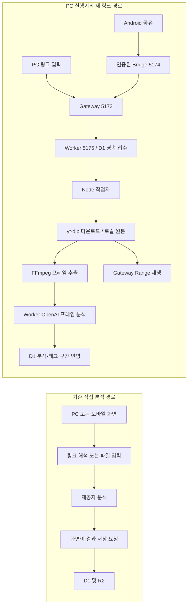
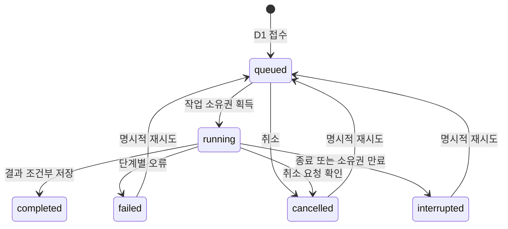

# PC 수집 구조와 API 기준

2026-10-03 최종 소스 기준. [설치](setup.md) → [운영](local-video-ingestion-operations.md) → 이 문서 → [실제 검증 기록](local-video-ingestion-progress.md) 순서로 읽는다. 사전 조사·계획은 당시 판단이며 현재 계약은 이 문서와 코드가 기준이다. 구현은 존재하지만 YouTube 전체 흐름, 실제 OpenAI 완료·구간 재분석, Android 실기기 검증은 끝나지 않았다.

## 작업 수명이 바뀐 지점

접수는 D1에 기록한 후 응답한다. 화면은 작업 상태를 조회할 뿐 작업자를 소유하지 않는다. PC 서버·네트워크는 계속 필요하지만 접수 후 모바일 화면은 닫을 수 있는 구조다. 브라우저와 Worker에서는 외부 실행 파일을 실행하지 않는다. 기존 파일 업로드와 비 PC 직접 분석 경로도 남아 있다.

## 코드별 책임

| 모듈 | 책임 |
|---|---|
| [start.mjs](../../apps/pc/start.mjs), [웹 시작 스크립트](../../apps/web/scripts/start-pc.mjs) | 기존 D1/R2 경로 보존, 내부 Worker·Gateway·작업자 시작/종료, 실행별 내부 인증과 비밀 파일 권한 |
| [settings.mjs](../../apps/pc/settings.mjs) | 폴더 ID 매핑·도구 설정 원자적 저장, 절대 로컬 경로와 symlink/junction 제한 |
| [process.mjs](../../apps/pc/process.mjs), [egress.mjs](../../apps/pc/egress.mjs) | shell 없는 도구 실행·제한·자식 프로세스 종료, 허용 호스트/공개 IPv4에 한정된 다운로드 프록시 |
| [media.mjs](../../apps/pc/media.mjs) | 다운로드·ffprobe 검사·MP4 정규화·썸네일·프레임·구간 파일·임시 파일 정리 |
| [runner.mjs](../../apps/pc/runner.mjs) | 단일 작업 루프, 소유권 갱신·취소·실패 단계 구분, 원본과 분석 checkpoint 재사용 |
| [server.mjs](../../apps/pc/server.mjs) | PC loopback Host/Origin 검사, Worker 프록시, 로컬 파일 GET/HEAD·Range, PC 전용 설정 |
| [jobs/server.ts](../../apps/web/lib/jobs/server.ts), [types.ts](../../apps/web/lib/jobs/types.ts) | URL 정규화, 영속 접수·중복 방지·상태·revision 충돌·검수 보존 |
| [pc-ingest.tsx](../../apps/web/features/library/pc-ingest.tsx), [mobile-save.tsx](../../apps/web/features/library/mobile-save.tsx) | 접수와 3초 상태 조회, 취소·재시도·복원 주소, PC 기능 가용성 분기 |
| [use-library-workspace.ts](../../apps/web/features/library/use-library-workspace.ts), [retag-segments.ts](../../apps/web/lib/analysis/retag-segments.ts) | 기존 링크 저장·전체/구간 재분석을 PC 작업에 연결, 파일 업로드와 수동 편집 유지 |
| [MainActivity.java](../../apps/android/app/src/main/java/app/cutnote/mobile/MainActivity.java), [Bridge](../../apps/android/bridge/server.mjs), [실행기](../../apps/android/launcher.mjs) | 기존 공유 Intent·보류 shareId·연결 복구 유지, 접수 ACK, LAN 인증/허용 API, PC 프로세스 연결 |

## 접수·중복·상태 계약

개별 YouTube watch/shorts/youtu.be와 Instagram p/reel/reels/tv 주소를 정규화한다. 추적 인자는 제거하고 HTTPS 원본 주소로 바꾼다. 자격 정보·포트·프로필·재생목록·미지원 단축 주소는 거부한다. URL 모양이 허용돼도 라이브·로그인 요구·플랫폼 차단까지 다운로드할 수 있다는 뜻은 아니다.

첫 수집은 `requestId = jobId = clipId`인 UUID를 사용한다. Android manifest의 `ACTION_SEND` + `text/*` 공유 진입과 MainActivity의 링크 추출을 유지한다. 보류 공유는 같은 shareId를 다시 전송한다. 같은 ID와 같은 입력은 기존 작업을 반환하고 다른 입력이면 409다. **같은 URL을 새 ID로 제출하면 새 클립이 생긴다.** 접수 후 `accepted`, `saved`, `job` 주소로 상태를 복원하며 기존 APK의 `saved=shareId` ACK도 유지한다. 접수 전에 연결이 끊기면 보류 공유를 복구해 재접수해야 한다.

작업자는 1.5초 간격으로 하나씩 처리하고 5초마다 heartbeat로 60초 lease를 갱신한다. lease는 “이 작업자가 결과를 쓸 수 있는 유효 시간”이다. 조회/다음 claim 때 만료 작업을 중단 상태로 바꾸므로 재시작 시 무조건 유료 분석을 반복하지 않는다. 취소는 즉시 완료 보장이 아닌 요청이며 작업자가 확인 후 자식 프로세스를 중단한다. 진행률은 단계 표시용이고 남은 시간의 정확한 예측값이 아니다.

`revision`은 클립 편집 버전이다. 저장 시 읽었던 버전과 달라졌다면 결과로 최신 편집을 덮지 않고 충돌로 처리한다. 사용자 태그 승인·거절·메모·즐겨찾기는 병합 규칙으로 보존한다. checkpoint는 요청 내용과 원본 크기가 일치할 때 재사용한다. 전체 파일 해시 검증은 아니므로 원본을 외부에서 교체하지 않는다. AI 응답 저장 전에 PC가 꺼지면 재시도에 비용이 다시 발생할 수 있다.

## API와 데이터

| API | 계약·경계 |
|---|---|
| `GET /api/jobs`, `GET /api/jobs?id=<UUID>` | 최근 100개 또는 지정 작업. 미지원 런타임은 `available:false`. 일반 응답에 절대 파일 경로/내부 인증 값 없음 |
| `POST /api/jobs` | JSON 최대 16,000 bytes. 필수 `requestId`, 수집은 `sourceUrl`; `kind` 기본 ingest, analyze/retag/export는 `clipId`, 구간 작업은 `segmentTargets` 필요. 신규 202, 동일 접수 재조회 200 |
| `POST /api/jobs/<UUID>/cancel`, `/retry` | 접수 화면과 인증된 LAN에서 허용. 실패·취소·중단 작업만 재시도; 삭제된 클립은 404 |
| `GET/POST /api/pc/settings` | Gateway의 PC 전용 폴더·도구 설정/점검. LAN에서 차단 |
| `POST /api/internal/jobs` | 내부 Worker의 실행별 Bearer 인증. claim/heartbeat/progress/attach/complete/fail 및 자산 조회. Gateway와 Bridge의 공개 경로에서 차단 |
| `GET/HEAD /api/media/<clipId>` | D1 자산 조회 후 로컬 파일 단일 Range, 206/416·If-Range 지원. 기존 R2 원본은 Worker로 전달 |
| `GET /api/segment-media/<clipId>` 및 구간 파일 URL | 기존 목록 계약 유지. 로컬 export는 job 결과에서 제공; 원본·구간 범위가 바뀌면 이전 결과 숨김 |

정확한 입력 검사는 [jobs API](../../apps/web/app/api/jobs/route.ts)와 jobs/server.ts가 기준이다. 구간 대상은 현재 저장된 구간 ID와 시작/끝 시간이 일치해야 한다. 예시는 실제 값 대신 `<UUID>`, `<영상 주소>`를 채우며 내부 API를 외부 클라이언트에서 직접 호출하지 않는다.

[0009 migration](../../apps/web/drizzle/0009_pc_jobs.sql)은 `clips.local_asset`, `clips.last_job_id`, `pc_jobs`와 인덱스를 추가한다. [스키마](../../apps/web/db/schema.ts)와 [migration journal](../../apps/web/drizzle/meta/_journal.json)을 함께 관리한다. 0000~0009 총 10개이며 `npm run db:init`은 미적용분만 기존 로컬 DB에 적용한다. 이전 DB 삭제나 R2→로컬 대량 이동은 필요 없다.

`local_asset`는 `{root,directory,video,poster,size,duration,mime}` JSON이다. root는 PC 설정의 UUID, directory는 작업 UUID이며 D1에 절대 폴더를 저장하지 않는다. `pc_jobs`는 입력 JSON, 상태/단계/진행률, 시도 횟수, lease, 취소 요청, 오류 코드, 결과 JSON, 시간을 저장한다. 클립 삭제 후에도 접수 ID 기록을 보존해 같은 요청이 새 클립을 만들지 않게 한다. 원본·checkpoint·오래된 export의 자동 삭제는 없다.

## 분석·재생·외부 통신

새 작업은 로컬 MP4에서 JPEG 최대 120장을 추출해 [frames API](../../apps/web/app/api/ai/frames/route.ts)와 기존 OpenAI 분석을 사용한다. frames API 입력 한도는 20MiB, API 시간 제한은 180초다. 원본 파일 전체·음성 대신 샘플 이미지와 시점·길이·분석 지시/태그 체계를 보낸다. 선택 구간도 같은 원본에서 추출한다. Google Data API·Gemini 호출/fallback은 이 경로에 없다. 다운로드는 플랫폼/CDN 웹 접근이며 YouTube의 Google 동의 페이지 접근도 포함될 수 있다.

다른 기능은 별도다. 기존 직접 링크/영상 분석의 Gemini 경로, [사진 검색](../../apps/web/lib/ai/image-query.ts)·[효과 의도 분석](../../apps/web/lib/ai/effect-query.ts)의 Gemini 선택지는 유지한다. [새 YouTube 후보 검색](../../apps/web/lib/ai/youtube-discovery.ts)은 OpenAI 웹 검색과 공개 검색 코드를 사용하며 새 로컬 수집과 다른 기능이다. 앱 전체에서 Google 서비스나 외부 API가 없어졌다고 설명하지 않는다.

로컬 원본 재생은 전체 Blob 다운로드 대신 필요한 바이트를 Range로 읽는다. PC Gateway는 동시 로컬 스트림 4개, 유휴 60초를 제한한다. Android 기기 파일 저장의 25MiB 제한과 최대 2GiB 원본 스트리밍은 별개다. 로컬 구간 내보내기는 FFmpeg 작업(5분 이하·25MiB·최대 360p)이며 기존 업로드 파일의 브라우저 내보내기는 유지한다.

폴더/도구 설치·버전·보관 정책·오류 조치는 [운영 안내](local-video-ingestion-operations.md), LAN 한도·인증은 [LAN](lan.md), 검사 명령과 실제 범위는 [테스트](testing.md), 문서 대조 중 확인한 결함은 [문서 점검 기록](documentation-review-2026-10-03.md)을 따른다.
