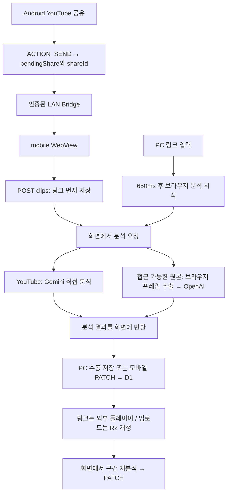
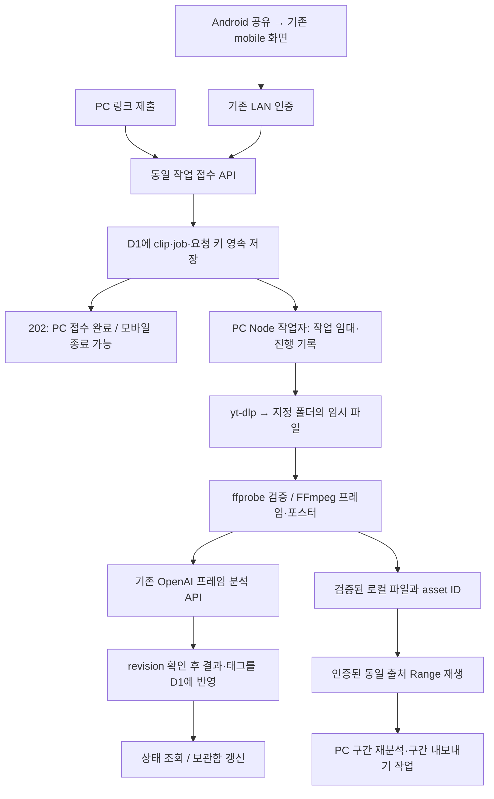

# PC 로컬 영상 수집: 코드 조사와 학습 기록

이 문서는 구현 전 조사 기준을 보존한다. 이후 변경과 실측 결과는 [구현·검증 기록](local-video-ingestion-progress.md)에 있다.

[기술문서 목록](README.md) · [권장 설계와 구현 계획](local-video-ingestion-plan.md)

조사일: **2026-10-03, Asia/Seoul**. 기준 커밋: `fb2cc9b`. 조사 시작 시 작업 트리는 깨끗했다. 이 문서는 구현 완료 안내가 아니다. 소스·실행 설정·공식 자료를 읽고 작성했으며 기능 구현, 의존성 설치, 실제 영상 다운로드, 유료 AI 호출, APK 설치는 수행하지 않았다.

아래에서 **확인**은 코드에서 읽은 동작, **공식 자료**는 해당 일자에 열어 본 외부 문서, **제안**은 앞으로 구현할 설계, **미검증**은 실제 실행으로 확인하지 않은 부분이다. 소스 경로는 이 문서 기준 상대 링크다. 기존 문서의 과거 테스트 통과 기록은 이번 조사 결과와 구별한다.

## 먼저 읽은 저장소 지침과 조사 범위

저장소 및 상위 경로에서 적용할 `AGENTS.md`를 찾지 못했다. [개발 규칙](development.md), [전체 색인](../README.md), [구조](architecture.md), [설치](setup.md), [Android](android.md), [LAN](lan.md), [검증](testing.md)을 기준으로 현재 소스인 `apps/`, `tests/`만 추적했다. 생성물·개인 DB·키·보관용 `main/` 자료는 분석 입력으로 사용하지 않았다.

이번 내용은 현재 설치 설명과 달리 **미구현 기능의 설계 근거**이므로 engineering 안에 독립 학습 문서와 구현 계획을 둔다. 기존 설치 문서를 새 기능이 동작하는 것처럼 고치지 않는다.

## 현재 흐름과 제안 흐름

현재 링크 원본을 PC 지정 폴더에 다운로드하는 단계는 없다. 링크 해석에 성공해 원본을 브라우저로 가져오더라도 그것이 자동으로 R2나 지정 폴더에 보관되는 것은 아니다.

제안 흐름의 접수 응답은 작업 완료 응답이 아니다. PC 전원·작업 프로세스가 살아 있는 동안 모바일과 독립적으로 실행하고, PC 재시작 때는 저장된 상태에서 복구한다.

## 1. PC 링크 입력은 언제 저장되는가?

**조사 질문:** 링크를 붙여넣으면 저장과 분석 중 무엇이 먼저 일어나는가?

**조사 이유:** 모바일과 PC를 같은 작업 접수 API로 바꿀 때 기존 편집·저장 의미를 보존해야 한다.

**확인 위치:** [use-library-workspace.ts](../../apps/web/features/library/use-library-workspace.ts)의 `changeLink`, `save`, `completeAnalysis`; [use-clip-analysis.ts](../../apps/web/features/library/use-clip-analysis.ts)의 `classifyUrl`, `classify`, `stopAnalysis`; [clips POST](../../apps/web/app/api/clips/route.ts).

**확인 결과:** PC는 링크 변경 후 650ms 타이머로 분석을 시작한다. 링크 메타데이터·포스터를 조회하고 AI 상태를 확인한다. YouTube이고 Gemini 키가 있으면 기본 제공자보다 Gemini를 우선한다. OpenAI는 `mediaUrl`을 확보한 경우에만 원본 Blob을 브라우저에서 분석한다. 분석 결과는 편집 폼에 반영되고, 사용자가 저장할 때 FormData로 D1 메타데이터와 선택적 R2 파일·포스터를 등록한다. 분석 중에는 `save`가 반환한다. 분석 취소·화면 해제 시 AbortController가 취소된다. PC 신규 링크 저장에는 모바일용 idempotencyKey가 없다.

**변경 영향:** 제안은 명시적인 “PC에 저장하고 분석” 제출 시 클립과 작업을 함께 만든다. 타이핑할 때마다 다운로드 작업을 만들지 않는다. 기존 파일 업로드·수동 태그 편집·링크만 저장은 유지할 수 있다. 폼 내부 분석 완료와 영속 클립 완료를 구별해야 한다.

**학습 포인트:** React state는 화면의 기억이다. DB에 쓰지 않은 분석 결과는 서버의 작업 기록이 아니며, 창을 닫으면 복원할 근거가 없다.

**남은 의문과 검증 방법:** 자동 분석 시작에 익숙한 사용자를 위해 제출 UI가 적절한지 PC 사용성 검증이 필요하다. 링크 편집 중 취소, 저장 버튼 연타, 다른 링크로 변경한 뒤 늦게 도착한 결과를 회귀 검사한다.

## 2. Android 공유 Intent·정규화·shareId는 무엇을 보장하는가?

**조사 질문:** YouTube 공유 메뉴부터 서버 중복 처리까지 어떤 값이 이어지는가?

**조사 이유:** “YouTube 공유 → 컷노트”를 유지하면서 재전송 때문에 다운로드·분석이 여러 번 실행되는 일을 막아야 한다.

**확인 위치:** [AndroidManifest.xml](../../apps/android/app/src/main/AndroidManifest.xml), [MainActivity.java](../../apps/android/app/src/main/java/app/cutnote/mobile/MainActivity.java)의 `isShare`, `sharedLink`, `receiveShare`, `doUpdateVisitedHistory`; [LinkPolicy.java](../../apps/android/app/src/main/java/app/cutnote/mobile/LinkPolicy.java); [ShareRequest.java](../../apps/android/app/src/main/java/app/cutnote/mobile/ShareRequest.java); [mobile-share.ts](../../apps/web/lib/mobile-share.ts); [provider.ts](../../apps/web/lib/links/provider.ts); [mobile-save.tsx](../../apps/web/features/library/mobile-save.tsx)의 `save`; [clips POST](../../apps/web/app/api/clips/route.ts).

**확인 결과:** `singleTask` MainActivity의 alias가 `ACTION_SEND`, `text/*`를 받는다. `EXTRA_TEXT`, 최대 10개 ClipData의 텍스트·URI, HTML 텍스트, Intent data를 읽는다. 이력에서 재실행된 Intent는 새 공유로 처리하지 않는다. Java는 http(s) 링크를 추출하고 YouTube/Instagram 도메인 링크를 우선하며 끝의 문장부호를 제거한다. 이는 영상 ID 기준 정규화가 아니다.

`ShareRequest.create`는 UUID를 생성해 `/mobile?url=...&start=analyze&shareId=...`로 연결한다. 재시도·Activity 복원은 보류된 ID를 재사용하지만 새 공유 이벤트는 새 UUID를 만든다. Java 복원 검사는 UUID 모양이고 웹 `shareLaunch`는 v4 UUID까지 검사한다. 웹 `sharedUrl`은 첫 유효 http(s) 링크를 택하고 길이를 2,000자로 제한한다. Java의 플랫폼 우선 선택과 완전히 같은 함수가 아니다.

자동 공유는 `idempotencyKey=shareId`로 `POST /api/clips`한다. 서버는 이를 **clip.id**로 쓰고 `ON CONFLICT(id) DO NOTHING` 처리한다. 동일 ID라도 저장된 `source_url`이 정확히 같지 않거나 기존 영상 파일이 있으면 409다. 같은 영상이라도 다른 shareId, `youtu.be`와 `watch?v=`, 추적 query 차이는 영상 단위 중복 방지 대상이 아니다. `videoProvider`는 YouTube ID·Instagram shortcode를 추출하지만 저장 API는 이 canonical URL을 강제하지 않는다.

**변경 영향:** Intent 필터·alias·기존 앱 진입 URL을 유지한다. 요청 중복 키와 원본 식별자를 분리한다. 제안: `shareId → jobId, clipId` 접수 기록과 `provider + mediaId + variant` 자산 중복 키. 신규 요청 키의 서로 다른 payload는 409, 같은 payload 재전송은 기존 작업을 반환한다. 원본 URL도 보존하되 다운로드에는 서버가 생성한 canonical URL만 쓴다. 기존 ID 기반 공유 저장은 호환 경로를 둔다.

**학습 포인트:** 멱등성은 “같은 요청을 두 번 보내도 결과가 하나”라는 성질이다. “서로 다른 요청이 같은 영상을 가리킴”을 찾는 콘텐츠 중복 제거와 다르다.

**남은 의문과 검증 방법:** Instagram 앱이 보내는 `/share/...` 등 변형·여러 링크·carousel은 실기기 표본이 없다. canonical parser를 엄격하게 만들고 모호한 공유 링크는 오류 안내 또는 제한된 redirect 해석으로 처리한다. Shorts/live/watch·대문자 host·사용자 정보·중복 query·추적 query·동일 ID 다른 URL을 Java/웹/API 공통 표본으로 검사한다.

## 3. 연결 실패·재시도·화면 종료 후에는 무엇이 남는가?

**조사 질문:** 접수 전과 후, 화면 종료와 프로세스 종료가 각각 어떤 영향을 주는가?

**조사 이유:** 모바일 종료 가능 시점을 정확히 정의하지 않으면 링크만 저장하고 분석은 사라지는 문제가 남는다.

**확인 위치:** [MainActivity.java](../../apps/android/app/src/main/java/app/cutnote/mobile/MainActivity.java)의 `persistPendingShare`, `verifyConnection`, `onPause`, `onDestroy`; [ConnectionProbe.java](../../apps/android/app/src/main/java/app/cutnote/mobile/ConnectionProbe.java); [EntryPolicy.java](../../apps/android/app/src/main/java/app/cutnote/mobile/EntryPolicy.java); [MobileSaveSession](../../apps/web/features/library/mobile-save.tsx); [Bridge](../../apps/android/bridge/server.mjs)의 응답 `close` 처리; [frames API](../../apps/web/app/api/ai/frames/route.ts).

**확인 결과:** pendingLink/pendingShareId는 SharedPreferences와 savedInstanceState에 보존된다. 일반 아이콘 실행은 보류 공유를 자동 재분석하지 않고 사용자가 이어보기 안내를 눌러야 한다. 연결 확인은 `/api/ai/status`와 인증된 `/api/clips`를 읽고, 연결 6초·읽기 12초 제한을 둔다. 실패 시 다시 연결 버튼과 링크 보존 안내가 나온다. 만료 401은 한 번 자동 재연결을 시도한다.

모바일은 링크 저장 직후 `history.replaceState('/mobile?saved='+clip.id...)`한다. 네이티브 `doUpdateVisitedHistory`는 saved 값이 pendingShare.id와 같으면 보류 공유를 지운다. **현재 이는 분석 완료나 영속 작업 접수 ACK가 아니라 링크 저장 ACK다.** 재사용된 미분석 클립에는 자동 중복 분석을 하지 않고 10초 뒤 재시도 버튼을 활성화하며, 미완료 클립 결과는 10초 간격으로 확인한다.

React cleanup은 분석 컨트롤러를 취소하고 Android는 onPause에서 WebView를 pause, onDestroy에서 파괴한다. Bridge는 응답 연결이 닫히면 upstream을 파괴한다. AI API도 요청 signal과 180초 제한을 합친다. 순간적인 화면 가림이 언제나 즉시 분석을 취소한다고 단정할 수는 없지만, 지속 실행을 보장하는 작업자는 없다. AI 응답이 생성되어도 후속 PATCH를 모바일이 실행하지 못하면 저장되지 않을 수 있다. “분석이 끝날 때까지 앱을 열어두세요”가 현재 UI다.

**변경 영향:** PC에서 작업을 durable commit한 다음에만 “PC 접수 완료, 앱을 닫아도 처리”를 표시한다. saved/accepted/shareId/jobId 의미를 분리하여 중복 영상 재사용 시 clipId가 shareId와 달라도 보류 공유를 정확히 해제한다. ACK 유실은 같은 키 재전송으로 복구한다. 접수 전에는 보류 링크를 유지하고 PC가 꺼진 동안 다운로드된 것처럼 표시하지 않는다.

**학습 포인트:** 휴대폰 백그라운드 서비스와 PC 백그라운드 작업은 별개다. 접수 후 PC가 일을 맡는 구조라면 Android WorkManager를 도입하지 않아도 목표를 달성한다. 접수 전 자동 재전송까지 보장하려면 별도 모바일 큐 설계가 필요하다. Android 공식 [공유 수신](https://developer.android.com/develop/ui/compose/sharing/receive)과 [Activity 생명주기](https://developer.android.com/guide/components/activities/activity-lifecycle)도 수신 UI와 프로세스 생존을 구별한다.

**남은 의문과 검증 방법:** replaceState의 WebView history callback, 앱 스와이프 종료·강제 중지·화면 잠금·프로세스 회수는 실제 기기 검증이 필요하다. 접수 직전/commit 직후/응답 도착 직후 네트워크를 끊어 작업 수와 보류 상태를 확인한다.

## 4. LAN Bridge의 인증과 전송 한도는 재사용 가능한가?

**조사 질문:** 어떤 요청이 PC까지 전달되고 얼마나 큰 응답을 허용하는가?

**조사 이유:** 새 작업 API나 대용량 영상 경로를 추가하면서 기존 신뢰 경계를 우회하면 안 된다.

**확인 위치:** [server.mjs](../../apps/android/bridge/server.mjs)의 `createBridge`, `allowedPath`, `readBody`, `issueSession`; [launcher.mjs](../../apps/android/launcher.mjs); [Bridge 테스트](../../apps/android/bridge/server.test.mjs).

**확인 결과:** 사설 IPv4 publicOrigin의 Host·Origin·Referer와 cross-site 요청을 검사한다. 최초 pairing 헤더 또는 정확한 `POST /pair`로 인증하고 HttpOnly·SameSite=Strict 쿠키를 발급한다. 세션은 메모리 저장, 8시간, 최대 32개이며 재시작 시 사라진다. pairing 폼은 1KiB·최대 10초, IP별 60초에 8회 제한이다. 실행기는 pairing 파일을 권한 보호해 보존한다. TLS 없는 신뢰 LAN 전용이다.

클립 GET/HEAD/POST, 개별 클립 GET/HEAD/PATCH/DELETE, media GET/HEAD/POST, segment-media 조회·등록, 정렬 PATCH, 추천·검색·링크 해석·AI 분석의 명시된 경로/메서드만 통과한다. `/api/ai/connect`는 허용하지 않는다. `/api/jobs`와 로컬 파일 전용 API는 없다. 클라이언트 인증 헤더를 전달하지 않고 `x-cutnote-client: lan`을 고정한다.

본문은 읽어 메모리에 모으며 요청·응답 모두 **28MiB**, 전체 요청 타이머 **210초**, headersTimeout **15초**, 동시 변경 요청 **4개**다. 응답은 pipe하지만 content-length와 누적 바이트를 제한한다. `Range`, `If-Range` 헤더가 전달된다고 대용량 재생이 가능한 것은 아니다. `bytes=0-` 응답도 28MiB를 넘으면 실패하고 큰 파일 HEAD의 content-length도 현재 제한에 걸린다.

**변경 영향:** 작업 제출·조회·취소·재시도만 명시적으로 allowlist에 추가한다. 다운로드 작업은 짧은 202 응답 뒤 실행한다. 미디어 GET/HEAD는 파일 자산에 한정한 별도 스트리밍 정책이 필수다. 작은 API 한도를 전역 해제하지 않는다. 프레임 분석은 PC 내부 요청이므로 모바일 Bridge를 경유할 이유가 없다.

**학습 포인트:** 인증(누구인가), 인가(어떤 API인가), 자원 제한(얼마나 사용할 수 있는가)은 서로 다른 방어다. Range는 파일 일부만 요청하는 HTTP 규약이며 인증을 대신하지 않는다.

**남은 의문과 검증 방법:** 인증 세션 만료 중 seek, 장시간 열린 영상, 다중 기기 동시 재생, HEAD와 suffix/open-ended Range를 28MiB 초과 파일로 시험한다. 기존 pairing·호스트 위조·키 관리 차단 테스트를 유지한다.

## 5. PC 실행기와 웹 런타임의 차이는 무엇인가?

**조사 질문:** 어느 프로세스가 yt-dlp·FFmpeg와 실제 PC 폴더를 사용할 수 있는가?

**조사 이유:** React/Next 형태의 route라고 해서 Node의 OS 기능을 쓸 수 있다고 가정하면 구현 방향이 틀어진다.

**확인 위치:** [start-pc.mjs](../../apps/web/scripts/start-pc.mjs), [vite.config.ts](../../apps/web/vite.config.ts), [sites-worker.ts](../../apps/web/build/sites-worker.ts), [server.ts](../../apps/web/lib/server.ts), [launcher.mjs](../../apps/android/launcher.mjs), [package.json](../../apps/web/package.json).

**확인 결과:** 실행기는 Node `spawn`, fs, http를 사용한다. 웹은 `wrangler dev --local --persist-to .wrangler/state --ip 127.0.0.1 --port 5173`로 운영 빌드의 Worker를 실행한다. `lib/server.ts`는 `cloudflare:workers`의 DB/BUCKET을 쓴다. `nodejs_compat`가 있어도 일반 Node 서버가 되지는 않는다. 공식 [Workers 호환성](https://developers.cloudflare.com/workers/runtime-apis/nodejs/)과 [호환성 플래그](https://developers.cloudflare.com/workers/configuration/compatibility-flags/#enable-nodechild_process-module)는 child_process를 non-functional stub으로 설명한다. [Workers fs](https://developers.cloudflare.com/workers/runtime-apis/nodejs/fs/)는 메모리 VFS이며 PC 지정 폴더 접근 기능이 아니다.

실행기는 기존 서버 정체를 검사해 재사용하고 자신이 시작한 서비스만 종료한다. PC child 종료 시 Bridge도 닫는다. 시스템 서비스·자동 시작 등록은 없다. 브라우저 닫기와 실행기 종료는 서로 다르다.

이번 환경 관찰은 Windows/PowerShell, Node **24.14.0**이다. `Get-Command` 기준 yt-dlp·ffmpeg·ffprobe·deno·adb는 PATH에서 발견되지 않았다. Python·Java 명령은 발견했지만 버전·SDK 조합은 검사하지 않았다. PATH 미발견을 디스크 전체 미설치로 단정하지 않는다. 개인 서버·DB를 열어 보는 실행 검증은 하지 않았다.

**변경 영향:** 외부 실행과 파일 I/O는 별도 PC Node 구성요소에 둔다. D1/R2 내부 파일을 Node가 직접 수정하지 않는다. 브라우저 폴더 선택 권한만으로 PC 무화면 처리를 구현하지 않는다. 상세 포트·인증·데이터 소유권은 [설계](local-video-ingestion-plan.md)에 정의한다.

**학습 포인트:** “로컬에서 실행”과 “OS 권한이 있는 Node 런타임”은 다르다. workerd는 PC에서 실행해도 Worker API 경계를 유지한다.

**남은 의문과 검증 방법:** 제안 gateway 앞단 도입 시 Vinext RSC·정적 파일·Origin 변환, 개발 서버/HMR 연결을 비개인 테스트 환경에서 검증한다. 운영 포트는 고정하고 개발 모드는 별도로 정리한다.

## 6. yt-dlp·FFmpeg는 무엇을 제공하며 어떻게 배포하는가?

**조사 질문:** 두 플랫폼 다운로드 지원, 필수 실행 환경, 업데이트의 관리 주체는 무엇인가?

**조사 이유:** 라이브러리 설치 하나로 영구 지원된다고 가정하면 운영 실패와 배포 누락이 발생한다.

**확인 위치:** 저장소 [package.json](../../apps/web/package.json)과 [launcher.mjs](../../apps/android/launcher.mjs)에는 downloader 실행 경로가 없다. 공식 자료: [yt-dlp README](https://github.com/yt-dlp/yt-dlp), [지원 목록](https://github.com/yt-dlp/yt-dlp/blob/master/supportedsites.md), [EJS](https://github.com/yt-dlp/yt-dlp/wiki/EJS), [Extractor 안내](https://github.com/yt-dlp/yt-dlp/wiki/Extractors), [FFmpeg 다운로드](https://ffmpeg.org/download.html), [FFmpeg 설명서](https://ffmpeg.org/ffmpeg.html).

**확인 결과:** 공식 지원 목록에 YouTube·Instagram이 있으나 작동 보장은 아니다. Instagram 사용자 프로필 extractor는 현재 broken 표시도 있다. 제품 입력 범위를 개별 영상으로 한정할 이유다. Windows x64 standalone yt-dlp.exe가 제공된다. ffmpeg/ffprobe는 스트림 결합·검증에 필요하며 YouTube에는 EJS와 외부 JS 런타임도 준비해야 한다. EJS 문서의 Node 최소 버전은 22, Node는 명시적 활성화가 필요하다. Deno가 공식 권장·기본 활성화 런타임이다. 현재 프로젝트 Node 24는 버전 조건을 만족하지만 실제 YouTube 성공은 미검증이다.

FFmpeg 공식 사이트는 소스와 외부 OS 빌드 링크를 제공한다. “공식 Windows FFmpeg 바이너리가 앱에 자동 포함된다”는 전제는 잘못이다. yt-dlp release 실행 파일 업데이트 기능과 채널은 존재하지만 앱의 검증·롤백 정책은 별도로 필요하다.

**변경 영향:** 제안은 Windows 우선, PC 전용 도구 디렉터리의 버전 고정 바이너리·EJS를 사용한다. Node는 기존 절대 경로로 지정하고 필요 시 Deno를 대안으로 검증한다. 시작 전 version·실행 가능 여부·codec·출력 폴더 쓰기·여유 공간을 진단한다. 도구 버전·OS/arch·해시를 작업에 기록한다. 다운로드 소스와 체크섬/가능한 서명 확인, 임시 설치→검증→대기 중 교체→이전 버전 복구를 제품 업데이트 과정에 둔다. npm install 때 임의 최신 도구를 내려받지 않는다.

배포 구성에 따른 고지는 [yt-dlp 라이선스 설명](https://github.com/yt-dlp/yt-dlp#licensing)과 [FFmpeg 라이선스](https://ffmpeg.org/legal.html)를 확인한다. yt-dlp 소스의 Unlicense만 보고 bundled exe도 동일하다고 판단하지 않는다. FFmpeg는 선택한 빌드 옵션에 따라 조건이 달라진다. 이번 조사에서는 배포 파일 선정·법적 적합성 확정을 하지 않았다.

**학습 포인트:** yt-dlp는 사이트에서 미디어 주소·형식을 찾아 다운로드한다. FFmpeg는 받은 영상·음성을 합치고 변환하며, ffprobe는 길이·코덱·해상도를 읽는다. 어느 하나가 모든 단계를 대신하지 않는다.

**남은 의문과 검증 방법:** 실제 배포 버전을 고른 후 공개 YouTube 일반/Shorts와 Instagram reel/post 표본으로 검증한다. 라이브·예약 영상·playlist·이미지만 있는 게시물·다중 영상은 초기 지원 밖으로 판정한다. 공개 영상도 계정·지역·PO token 요구로 실패할 수 있으므로 성공률을 별도 기록한다.

## 7. 저장 폴더·파일명·중복·임시 파일은 어떻게 관리하는가?

**조사 질문:** 현재 영상의 물리적 위치와 새 로컬 파일의 소유권을 어떻게 구별하는가?

**조사 이유:** 중복 다운로드, 디스크 고갈, 잘못된 폴더 삭제를 방지해야 한다.

**확인 위치:** [clips API](../../apps/web/app/api/clips/route.ts), [media API](../../apps/web/app/api/media/%5Bid%5D/route.ts), [schema.ts](../../apps/web/db/schema.ts), [segment-media.ts](../../apps/web/lib/segment-media.ts), [.gitignore](../../.gitignore).

**확인 결과:** 업로드 영상은 `clips/{id}/video` 같은 R2 object key로 관리한다. 로컬 실행에서는 Wrangler의 로컬 상태이지만 사용자가 지정하는 일반 영상 폴더가 아니다. 다운로드 폴더 설정, 원본 다운로드 이력, 로컬 자산 경로, 디스크 할당량은 없다. 구간 파일에만 pending/ready/deleting과 15분 지난 pending 정리·실패 삭제 재시도 로직이 있다. 이는 다운로드 작업 큐가 아니다. `.gitignore`가 모든 mp4나 cookies.txt를 자동 제외하지 않으므로 새 저장 위치를 저장소 밖으로 두어야 한다.

**변경 영향:** PC 전용 설정으로 root를 지정한다. 제안 기본은 사용자 Videos/Cutnote, 최초 쓰기 검사 후 확정. 실제 파일은 `root/provider/mediaId/assetId/original.ext`, 임시는 같은 root의 `.staging/jobId/`에 둔다. 제목은 표시용 메타데이터로 보존하고 파일 경로 키로 신뢰하지 않는다. `.part`, 분리 음성/영상, 프레임, 포스터, 변환 파일까지 quota에 포함한다. 완료 후 ffprobe·크기 검증과 같은 볼륨 rename으로 확정하고 manifest를 남긴다. 원본 식별자+포맷 정책별 unique 자산/임대로 동시 다운로드를 합친다. yt-dlp archive는 보조 기능일 뿐 DB 상태·취소·재분석 기록을 대신하지 않는다.

**학습 포인트:** 임시 파일과 완료 파일을 구별하면 중단된 결과가 정상 영상으로 보이지 않는다. atomic rename은 파일 이름 전환을 원자적으로 만들지만 DB 반영까지 하나의 트랜잭션으로 만드는 것은 아니다.

**남은 의문과 검증 방법:** 한글·긴 경로·Windows 예약명·외장 드라이브 해제·디스크 부족·사용자의 수동 파일 이동을 시험한다. root 변경은 신규 작업에만 적용하고 기존 asset의 rootId는 유지하는 것을 기본으로 제안한다. 자동 대량 이동은 후속 기능이다.

## 8. 작업 영속화·취소·재시도·재시작 복구는 어디에 필요한가?

**조사 질문:** 서버가 작업을 책임진다는 사실을 어떻게 저장하고 복구하는가?

**조사 이유:** 접수 ACK 유실, PC 강제 종료, AI 응답 직후 오류가 중복 실행이나 유실로 이어지면 안 된다.

**확인 위치:** [schema.ts](../../apps/web/db/schema.ts), [mobile-save.tsx](../../apps/web/features/library/mobile-save.tsx), [use-library-sync.ts](../../apps/web/features/library/use-library-sync.ts), [clips PATCH](../../apps/web/app/api/clips/%5Bid%5D/route.ts). DB에는 clips, ai_settings, library_order, youtube_discovery, segment_media, recommendation_feedback가 정의되어 있다.

**확인 결과:** 다운로드/분석 job 테이블·lease·cancel 요청·attempt·작업 로그는 없다. 분석은 요청 수명에 묶이며 성공 보고서만 클립에 남긴다. 보관함의 5초 visible-only polling과 모바일 10초 polling은 결과를 읽을 뿐 서버 작업을 이어서 실행하지 않는다. 기존 revision/expected 비교와 조건부 UPDATE는 다른 화면 편집을 덮어쓰지 않도록 한다.

**변경 영향:** D1을 단일 작업 원장으로 삼아 clip·idempotency·job을 함께 영속화한다. PC 작업자가 주기적으로 claim하고 lease/heartbeat/attempt를 기록한다. 재시작 시 만료 lease를 회수하되 단계 산출물을 검사한다. 다운로드 완료·AI 결과 보관·클립 반영을 각각 checkpoint한다. 취소는 DB에 요청하고 작업자가 자식 프로세스와 분석 요청을 종료한 뒤 확정한다. 종료된 화면의 AbortSignal을 작업 취소로 사용하지 않는다. [계획의 상태·복구 계약](local-video-ingestion-plan.md)에 상태 전이를 구체화했다.

**학습 포인트:** “최소 한 번 실행 + 결과 반영 중복 방지”가 현실적인 기본이다. AI가 응답했는데 PC가 저장 전에 꺼진 경우 제공자 비용까지 정확히 한 번으로 보장할 수 없다. lease는 일정 시간만 작업 소유권을 빌려주는 장치다.

**남은 의문과 검증 방법:** 파일 확정 직후·D1 commit 직전·OpenAI 응답 직후에 프로세스를 강제로 종료하는 fault injection이 필요하다. 유료 요청 결과가 불명확한 상태는 자동 무한 재호출하지 않고 사용자 재시도를 요구하는 기본값을 제안한다.

## 9. D1/R2와 로컬 파일을 어떻게 연결해 재생·내보내는가?

**조사 질문:** videoUrl과 구간 파일의 출처가 R2라는 가정을 얼마나 바꿔야 하는가?

**조사 이유:** 로컬 경로를 문자열로 저장하는 것만으로 브라우저 재생·구간 캐시가 작동하지 않는다.

**확인 위치:** [serialize](../../apps/web/lib/server.ts), [Clip 타입](../../apps/web/lib/clips.ts), [mediaResponse](../../apps/web/lib/media-response.ts), [clip-details-sheet.tsx](../../apps/web/features/library/clip-details-sheet.tsx), [source-player.tsx](../../apps/web/components/media/source-player.tsx), [video-player.tsx](../../apps/web/components/media/video-player.tsx), [video-export.ts](../../apps/web/lib/video-export.ts), [segment-media.ts](../../apps/web/lib/segment-media.ts), [구간 API](../../apps/web/app/api/segment-media/%5Bid%5D/%5BsegmentId%5D/route.ts), [DownloadPolicy.java](../../apps/android/app/src/main/java/app/cutnote/mobile/DownloadPolicy.java), [DownloadTransfer.java](../../apps/android/app/src/main/java/app/cutnote/mobile/DownloadTransfer.java).

**확인 결과:** `serialize`는 video_key가 있어야 `/api/media/{clipId}`를 만든다. 상세 화면은 videoUrl을 우선하고 없으면 YouTube IFrame API/Instagram embed를 쓴다. R2 응답은 단일 bytes Range, HEAD, 206/416, Content-Range/Length, download filename을 처리한다. If-Range는 Bridge가 전달해도 mediaResponse에서 해석하지 않는다.

구간 화면의 [segment-library.tsx](../../apps/web/features/segments/segment-library.tsx)는 비 YouTube 링크에서 접근 가능한 원본을 수동으로 가져와 R2에 보관하거나 파일을 첨부할 수 있다. `videoBlob`은 원본도 25MiB로 제한한다. 구간 내보내기는 브라우저가 원본 Blob을 가져와 Canvas+MediaRecorder로 녹화한다. 0.3초~5분, 최대 25MiB, 24fps·최대 긴 변 640/짧은 변 360 규모이며 화면이 hidden이면 명시적으로 취소한다. 구간 fingerprint는 `video_key || source_url`, 구간 ID·시간·`360p-v1`로 계산한다. SQL 정리와 구간 업로드 완료 처리도 `coalesce(video_key,source_url)`을 전제로 한다. 로컬 asset 도입 시 JS 함수만 고치면 정리 SQL이 정상 자산을 폐기할 수 있다. Android 파일 저장은 인증된 동일 출처 `/api/media/...`와 `/api/segment-media/...`만 허용하고 최대 25MiB다.

**변경 영향:** storageKind와 local asset 참조를 추가하고 기존 URL 계약을 가능하면 유지한다. Node gateway가 ID로 로컬 파일을 찾아 streaming하고 R2 자산은 기존 Worker API로 전달한다. 파일 경로를 LAN 응답이나 URL에 넣지 않는다. sourceIdentity와 SQL, fingerprint의 원본 버전·export profile을 함께 확장한다. FFmpeg가 로컬 포스터·프레임·구간 파일을 생성하도록 한다. 서버 구간 내보내기 전환 시 타임라인 정확도 검증이 필수다. FFmpeg [seek 설명](https://ffmpeg.org/ffmpeg.html#Main-options)에 따라 stream copy는 키프레임 경계 때문에 정확한 구간을 보장하지 않으므로 초기 정확도 우선 프로파일은 재인코딩한다.

**학습 포인트:** asset ID는 파일을 가리키는 이름표이며 파일 경로 자체가 아니다. 같은 API URL 뒤에 R2 또는 로컬 어댑터를 둘 수 있다. 코덱과 컨테이너도 다르므로 확장자 mp4만으로 Android 재생을 보장하지 않는다.

**남은 의문과 검증 방법:** H.264/AAC MP4와 실제 Android WebView 재생, 무음 영상, 회전 메타데이터, 가변 프레임률, 긴 영상 seek, 25MiB 초과 원본을 검사한다. 초기 Android “휴대폰에 파일 저장” 25MiB 제한은 유지하되 PC 원본 저장·스트리밍 한도와 UI에서 구별한다. 모바일 대용량 파일 반출은 별도 변경이다.

## 10. 기존 OpenAI 분석·태그·구간 재분석은 얼마나 재사용 가능한가?

**조사 질문:** 브라우저 의존 부분과 서버에서 그대로 쓸 수 있는 규칙은 무엇인가?

**조사 이유:** 다운로드 기능을 추가하면서 태그 검수·시간 근거·사용자 편집 보호를 잃지 않아야 한다.

**확인 위치:** [whole-video.ts](../../apps/web/lib/analysis/whole-video.ts)의 `sampleTimes`, `targetSampleTimes`, `extractWholeVideo`; [openai.ts](../../apps/web/lib/ai/openai.ts)의 `parseFrameInput`, `framesRequest`, `parseFramesResult`, `generateFrames`; [frames API](../../apps/web/app/api/ai/frames/route.ts); [result.ts](../../apps/web/lib/ai/result.ts); [retag-segments.ts](../../apps/web/lib/analysis/retag-segments.ts); [segment-tagging.ts](../../apps/web/features/segments/segment-tagging.ts); [tagging.ts](../../apps/web/lib/tagging.ts); [clips PATCH](../../apps/web/app/api/clips/%5Bid%5D/route.ts).

**확인 결과:** 전체 분석은 0.1초~2시간, 2~120개 균등 프레임을 선택한다. 최대 120개라서 긴 영상에서 항상 2fps가 아니다. 브라우저 video seek·Canvas JPEG 추출(긴 변 최대 640, 품질 .7)은 DOM 의존이다. 구간 분석은 선택 구간 안에서만 표본을 뽑는다.

프레임 API는 20MiB·180초 제한이다. 입력 검사는 JPEG data URL, 이미지 문자열 600,000자 이하, 시간 순서, 시작/끝 범위·간격, 구간당 최소 2프레임을 확인한다. OpenAI Responses 요청은 코드상 `gpt-6-sol`, `store:false`, JSON schema를 사용한다. 관찰·evidenceMs가 실제 전달된 표본 시간과 일치하는지도 검증한다. [공식 이미지 입력](https://developers.openai.com/api/docs/guides/images-vision)은 여러 이미지와 base64 data URL을 지원하고, [Structured Outputs](https://developers.openai.com/api/docs/guides/structured-outputs)는 schema 응답 및 refusal/incomplete 처리를 설명한다. 해당 계정의 모델 접근·비용·품질은 호출하지 않아 미확인이다.

구간 재분석은 결과 구간 ID·시간을 검증하고 `mergeSegmentTagging`으로 사용자 수동 효과·승인·거절을 보존한 뒤 revision으로 저장한다. 전체 보고서 PATCH는 전역 mergeTagging과 최대 최근 10개 분석 이력을 다룬다. 구간 전용 재분석은 현재 segments만 PATCH하므로 전역 analysisHistory에 새 보고서가 자동 추가되지는 않는다.

**변경 영향:** 표본 시간 계산은 DOM 없는 순수 모듈로 분리해 재사용하고 추출기만 FFmpeg로 교체한다. 초기에는 기존 PC 내부 `/api/ai/frames`를 사용해 API 키 저장·복호화를 Worker에 남긴다. 결과 파서·taxonomy·태그 병합·낙관적 잠금은 재사용한다. 작업 결과 반영 API는 전체/구간 목적을 구별하고 모든 대상이 유효할 때만 반영한다. FFmpeg 실제 PTS와 전달 evidenceMs를 맞추며 JSON 전체 20MiB를 넘으면 이미지 크기/품질을 조정한다.

**학습 포인트:** 프레임 기반 분석은 영상 전체 길이를 골고루 참고하지만 연속 동작·음성을 본 것이 아니다. 다운로드가 성공해도 분석 품질이 Gemini 영상+음성 분석과 동일해지는 것은 아니다. schema 검증과 의미 검증도 다르다.

**남은 의문과 검증 방법:** 동일 영상의 기존 브라우저 표본과 FFmpeg 표본을 비교하고 마지막 프레임 seek·VFR 타임스탬프 오차를 측정한다. 빠른 전환·슬로모션·음악 의존 효과의 누락을 품질 표본으로 기록한다. 취소·409 충돌 시 AI를 재호출하지 않고 저장된 결과를 다시 적용할 수 있어야 한다.

## 11. Google/Gemini 의존성은 어디에 남는가?

**조사 질문:** 분석 제공자만 바꾸면 Google 관련 의존성이 모두 없어지는가?

**조사 이유:** “Google API 키 없이 처리”와 “YouTube 네트워크 접속도 없음”은 전혀 다른 요구다.

**확인 위치:** [Gemini 구현](../../apps/web/lib/ai/gemini.ts), [analyze API](../../apps/web/app/api/ai/analyze/route.ts), [AI 설정](../../apps/web/lib/ai/settings.ts), [AI 연결 UI](../../apps/web/features/connections/ai-connection.tsx), [편집 UI](../../apps/web/features/library/clip-editor-dialog.tsx), [이미지 검색](../../apps/web/app/api/ai/image-query/route.ts), [효과 검색](../../apps/web/app/api/ai/effect-query/route.ts), [추천](../../apps/web/lib/ai/youtube-discovery.ts), [공개 검색](../../apps/web/lib/ai/youtube-public-search.ts), [링크 해석](../../apps/web/lib/links/resolve.ts), [키 암호화](../../apps/web/lib/ai/crypto.ts).

**확인 결과:** `/api/ai/analyze`는 Gemini 전용이며 generateContent·Google Files 업로드/삭제를 호출한다. PC/모바일/retag 코드에 YouTube Gemini 우선 분기가 있고 실패 UI에도 Gemini 연결 안내가 있다. `aiStatus`는 최근 저장한 제공자 또는 환경변수로 기본 제공자를 정하므로 OpenAI 키가 있어도 Gemini가 선택될 수 있다. 이미지·효과 검색 역시 기본 제공자에 따라 Gemini를 호출한다.

YouTube 추천은 공개 검색 HTML 파싱을 먼저 사용하고 필요할 때 OpenAI web_search를 사용한다. oEmbed로 후보를 확인하고 ytimg 썸네일을 쓴다. 조사한 현재 실행 소스에서 YouTube Data API 키를 쓰는 추천 경로는 확인되지 않았다. 링크 미리보기·IFrame API·YouTube 페이지/CDN 접속은 여전히 Google 운영 서비스다. 다운로드 역시 YouTube 접속 자체를 없앨 수 없다.

기존 분석 보고서의 `gemini-video-v1` 타입·표시는 저장 데이터 호환을 위해 남겨야 한다. `crypto.ts`의 AES-GCM additionalData 문자열 `cutnote-gemini-v1`은 OpenAI 저장 키에도 쓰이는 암호화 포맷이다. 이름만 바꾸면 기존 키 복호화가 깨진다.

**변경 영향:** 필수 범위는 신규 수집·재분석에서 OpenAI를 명시 선택하고 Gemini로 자동 우회하지 않는 것이다. Google API가 실패/차단돼도 새 경로가 완료되는지 검증한다. 제품 전체 Google API 제거를 선택한다면 connect/status/UI·이미지/효과 검색도 OpenAI로 고정하고 Gemini 쓰기 경로를 제거한다. 과거 보고서 읽기와 암호화 포맷은 보존한다. 로컬 자산이 있으면 IFrame API 대신 VideoPlayer를 사용한다.

**학습 포인트:** 런타임 의존성 제거와 과거 데이터 형식 삭제는 다르다. 공급자 이름이 들어간 모든 문자열을 일괄 삭제하면 데이터 호환성이 깨질 수 있다.

**남은 의문과 검증 방법:** 요구는 우선 “새 처리 경로가 Google API/Gemini에 의존하지 않음”으로 해석했다. 전역 제공자 제거는 후속 결정이다. 네트워크 mock에서 generativelanguage.googleapis.com 요청을 실패시키고 OpenAI만 연결해 새 작업·구간 재분석·로컬 재생을 끝까지 검사한다. YouTube 사이트/API 접속 구분을 테스트 이름에도 표시한다.

## 12. URL·경로·명령·인증의 새 경계는 무엇인가?

**조사 질문:** 외부 링크가 PC 명령 실행·임의 파일 읽기로 확장되지 않게 어떻게 제한하는가?

**조사 이유:** 지금까지 제한된 fetch였던 입력이 OS 프로세스와 로컬 디스크를 다루게 된다.

**확인 위치:** [links/fetch.ts](../../apps/web/lib/links/fetch.ts)의 `publicUrl`, `fetchPublic`; [clips POST](../../apps/web/app/api/clips/route.ts); [Bridge](../../apps/android/bridge/server.mjs); [server.ts](../../apps/web/lib/server.ts)의 `crossOrigin`; [Node 24 child_process 공식 문서](https://nodejs.org/docs/latest-v24.x/api/child_process.html).

**확인 결과:** 링크 저장은 http(s)를 허용하지만 자동 fetch는 https, 사용자 정보/비표준 포트 배제, 제공자 도메인 allowlist, 매 redirect 검증(최대 4회), 각 fetch 20초를 사용한다. 이 검증은 yt-dlp 내부 네트워크 요청에 자동 적용되지 않는다. `crossOrigin`은 Origin이 있을 때 비교하며 일반 사용자 인증 시스템은 아니다. Bridge pairing은 LAN 진입 방어이고 로컬 실행기/내부 작업자 인증과는 별도다.

**변경 영향:** 개별 YouTube/Instagram 영상 URL만 서버에서 파싱해 canonical URL을 구성한다. 임의 URL·generic extractor·playlist·사용자 제공 옵션·실행 파일 경로·출력 템플릿·cookies 경로는 LAN 입력으로 받지 않는다. Node `spawn(고정 절대경로, 인자 배열, {shell:false, windowsHide:true})`를 사용하고 URL 앞 `--`, 설정/플러그인 자동 로딩 차단, 원격 EJS 자동 다운로드 차단을 검토한다. 자식 env에는 AI 키·내부 토큰을 넘기지 않는다.

출력은 등록된 root의 job 디렉터리 아래로만 생성하며 realpath·상대경로 탈출·Windows junction/symlink·UNC·예약명·ADS를 검사한다. 파일 제공도 asset ID→검증된 경로 방식으로 제한한다. FFmpeg 입력은 완성된 로컬 파일로 한정하고 필요한 로컬 프로토콜만 허용한다. 취소 시 프로세스 트리를 종료하며 PID 재사용으로 타 프로세스를 종료하지 않도록 소유권을 추적한다.

yt-dlp는 자체 redirect·manifest·CDN fetch를 수행하므로 최초 URL allowlist만으로 SSRF 방어 완료라고 쓰지 않는다. 가능한 outbound 통제 또는 검사 가능한 네트워크 중계의 실효성을 검증하고, 최소한 provider 고정·generic 차단·비관리자 권한·로컬/사설 주소 접근 차단 방안을 배포 게이트로 둔다. 셸을 쓰지 않는 것만으로 네트워크·파일 권한까지 격리되지는 않는다.

**학습 포인트:** `shell:false`는 문자열을 명령어 문법으로 해석하는 경로를 줄인다. 실행된 프로그램 자체의 옵션·플러그인·네트워크 동작까지 안전하게 만드는 옵션은 아니다.

**남은 의문과 검증 방법:** 허용 플랫폼에서 다른 호스트로 redirect되는 경우, 악성 manifest, 경로 교체 경쟁, URL 안 줄바꿈·옵션 형태 문자열을 가짜 프로세스/로컬 시험 서버로 검사한다. 실제 도구 버전의 네트워크 제한 방법은 설치 없이 확인할 수 없으므로 구현 전 spike와 보안 검토가 필요하다.

## 13. 로그인 요구·다운로드 실패를 어떻게 보여 주는가?

**조사 질문:** PC 연결 실패, 사이트 로그인 필요, 다운로드 실패, AI 실패를 구분하는가?

**조사 이유:** 모두 “다시 시도”로 표현하면 해결 불가능한 재시도와 불필요한 비용을 만든다.

**확인 위치:** [mobile-save.tsx](../../apps/web/features/library/mobile-save.tsx), [use-clip-analysis.ts](../../apps/web/features/library/use-clip-analysis.ts), [source-player.tsx](../../apps/web/components/media/source-player.tsx), 공식 [yt-dlp FAQ](https://github.com/yt-dlp/yt-dlp/wiki/FAQ#how-do-i-pass-cookies-to-yt-dlp), [YouTube extractor 안내](https://github.com/yt-dlp/yt-dlp/wiki/Extractors#youtube).

**확인 결과:** 현재 원본 접근 실패는 파일 업로드/Gemini 연결/원본 사이트 열기를 안내하고, 모바일은 “링크는 저장됨”과 분석 오류를 표시한다. 사이트 로그인 연동·cookie 관리 기능은 없다. 공식 자료에는 cookie 입력이 있지만 브라우저 로그인만 하면 downloader에 자동 전달된다는 보장은 없다. YouTube에는 PO token 요구·계정 제한 등 별도 실패 원인이 있다.

**변경 영향:** 초기 기본은 로그인 없는 공개 개별 영상이다. `needs_auth`, `unavailable`, `unsupported`, `rate_limited`, `tool_missing`, `disk_full`, `download_failed`, `analysis_failed`, `conflict`를 사용자 행동으로 연결한다. 로그인 필요 시 PC에서 원본 열기·소유한 파일 첨부·링크만 보관을 제공한다. 쿠키 자동 추출을 조용히 수행하지 않는다. 선택적 쿠키 지원은 PC 전용 관리·사용자 명시 동작·권한 보호·로그 마스킹·삭제 기능이 갖춰진 별도 단계로 둔다. 모바일 WebView 로그인 쿠키를 PC로 넘기는 설계는 기본에서 제외한다.

**학습 포인트:** 다운로드 성공과 분석 성공은 별개다. 원본을 확보했으면 AI 오류 때문에 다시 내려받을 필요가 없다. “완료” 대신 단계별 성공 여부를 보여 주면 복구 동작이 명확해진다.

**남은 의문과 검증 방법:** 한국 네트워크의 실제 YouTube/Instagram 표본에서 공개 영상도 로그인 요구가 얼마나 발생하는지 미확인이다. 도구 stderr 문구에만 의존하는 오류 분류는 취약하므로 exit code·구조화 메타데이터·bounded stderr를 함께 검증한다. 쿠키·토큰·서명 CDN URL은 진단 로그에서 제거한다.

## 14. 어떤 테스트가 완료의 근거가 되는가?

**조사 질문:** 기존 테스트가 새 비동기·파일·실기기 동작을 얼마나 검증할 수 있는가?

**조사 이유:** mock 통과와 실제 다운로드/Android 종료 후 완료는 서로 다른 증거다.

**확인 위치:** [tests README](../../tests/README.md), [tests/run-web.mjs](../../tests/run-web.mjs), [full-video.test.ts](../../tests/web/full-video.test.ts), [clip-analysis.test.ts](../../tests/web/clip-analysis.test.ts), [segment-media.test.ts](../../tests/web/segment-media.test.ts), [segment-tagging-current.test.ts](../../tests/web/segment-tagging-current.test.ts), [sync-polling.test.mjs](../../tests/web/sync-polling.test.mjs), [Bridge tests](../../apps/android/bridge/server.test.mjs), [Android tests](../../apps/android/tests/ShareRequestTest.java).

**확인 결과:** 기존 웹 테스트는 mock 제공자·메모리 저장소 기반이며 실제 API 비용·다운로드·코덱·Android 생명주기를 검증하지 않는다. JVM 테스트는 링크/공유/진입/연결/파일 정책을 검증하지만 실제 공유 시트와 WebView 실행을 대신하지 않는다. 이번 문서 조사에서는 기능 테스트 결과를 새로 주장하지 않는다.

**변경 영향:** 기존 회귀를 유지하며 job 상태 전이·중복 접수·lease·복구·경로/명령 제한·Range streaming·데이터 호환 테스트를 추가한다. downloader/ffmpeg는 가짜 실행 파일 계약 테스트와 작은 실제 fixture 검증을 나눈다. 상세 매트릭스·단계별 완료 조건은 [구현 계획](local-video-ingestion-plan.md)에 있다.

**학습 포인트:** 테스트 더블은 실패 조건을 반복해서 만들기 좋다. 하지만 실제 서비스의 로그인 정책이나 휴대폰 코덱 지원까지 증명하지는 못한다.

**남은 의문과 검증 방법:** 신규 APK 서명·기존 설치 업데이트 가능 여부, 실제 기기 모델/WebView 버전, 개인 보관함을 복제하지 않는 fixture 데이터 준비가 필요하다. 통과 기록은 날짜·도구 버전·표본 URL의 종류·PC/폰 환경과 함께 남긴다.

## 공식 자료를 읽을 때의 주의점

위 외부 링크는 2026-10-03에 열어 확인한 자료다. 최신 branch/wiki 내용은 바뀔 수 있으므로 실제 배포 시 선택한 버전의 release notes·지원 조건을 다시 확인한다. 특히 yt-dlp 지원 목록은 지원 보증서가 아니고, OpenAI 이미지 입력 문서는 특정 계정의 `gpt-6-sol` 사용 권한을 증명하지 않는다. 다운로드·분석 권한이 있는 시험 영상으로 실제 기기 검증을 수행한다.
