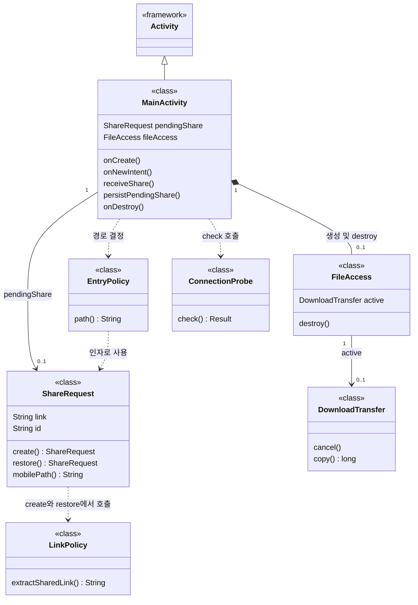
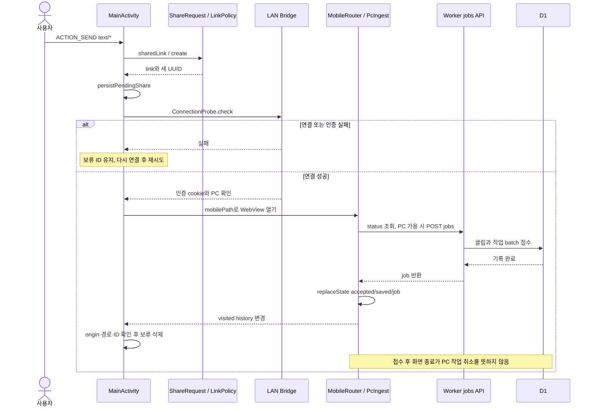

# Android 실제 클래스와 공유 수명

[전체 안내](README.md)

## 무엇을 왜 조사하는가

보류 shareId를 누가 보관하고 언제 지우는가? Android의 파일 다운로드와 PC 작업을 혼동하면 화면 종료 동작을 잘못 설명하게 된다. Java 클래스와 웹/PC 요청 경계를 함께 조사한다.

## 확인한 파일·심볼과 조사 결과

| 관계·동작 | 코드 근거 | 결과 |
|---|---|---|
| MainActivity extends Activity | [MainActivity](../../../apps/android/app/src/main/java/app/cutnote/mobile/MainActivity.java) 선언 | 실제 상속 |
| MainActivity → ShareRequest | `pendingShare`, `receiveShare`, `persistPendingShare`, `onCreate` | 현재 객체 참조와 SharedPreferences/Bundle 복원. 단순 Activity 종료와 공유 데이터 삭제는 다름 |
| ShareRequest → LinkPolicy | [ShareRequest](../../../apps/android/app/src/main/java/app/cutnote/mobile/ShareRequest.java) `create`, `restore` | 실제 `extractSharedLink` 호출 후 ID 생성/복원 |
| MainActivity → FileAccess | `onCreate`의 new, `onDestroy`의 destroy; [FileAccess](../../../apps/android/app/src/main/java/app/cutnote/mobile/FileAccess.java) | 객체 생성·정리를 Activity가 관리 |
| FileAccess → DownloadTransfer | `active`, `new DownloadTransfer`, `destroy`; [DownloadTransfer](../../../apps/android/app/src/main/java/app/cutnote/mobile/DownloadTransfer.java) `cancel`, `copy` | Android 파일 선택기로 저장하는 전송. PC yt-dlp와 별개 |
| MainActivity → ConnectionProbe | `verifyConnection`/`ConnectionProbe.check`; [ConnectionProbe](../../../apps/android/app/src/main/java/app/cutnote/mobile/ConnectionProbe.java) | HTTP 연결·cookie 검증, 실패 시 보류 공유 유지 |
| EntryPolicy → ShareRequest | [EntryPolicy](../../../apps/android/app/src/main/java/app/cutnote/mobile/EntryPolicy.java) `path` | 인자로 받은 요청의 mobilePath 호출. 소유 필드 아님 |
| ACK → 보류 삭제 | MainActivity `doUpdateVisitedHistory` | 같은 origin 및 허용 경로에서 accepted/saved가 pending ID와 같을 때만 삭제 |

## 실제 클래스 그림

인자·UI 필드를 생략했다. 정적 factory(create/restore)도 생성자 상속으로 그리지 않는다. FileAccess의 합성은 Activity가 생성·destroy를 호출하는 **생명주기 해석**이다. 초기화 전에는 null이므로 0..1로 표시했다. DownloadTransfer는 cancel 호출 후 스레드가 즉시 종료한다고 보장할 수 없어 단순 참조로 둔다. 익명 FileAccess.Connection 구현은 존재하지만 그림을 작게 유지하기 위해 생략했다.

## 공유 실행 순서

UI→API는 Bridge→Gateway→Worker 경유를 간략화했다. [manifest](../../../apps/android/app/src/main/AndroidManifest.xml)의 share alias는 `text/*`이며 영상 파일 공유를 받는 구조는 아니다. [MobileRouter](../../../apps/web/features/library/mobile-save.tsx)는 status의 localIngestAvailable이 거짓이면 기존 화면 처리로 분기한다. [PcIngest.submit](../../../apps/web/features/library/pc-ingest.tsx)는 같은 요청 재시도 ID를 유지하고 응답 후 주소를 바꾼다.

## 판단·학습 포인트와 미확인

ACK는 분석 완료가 아니라 영속 접수 확인이다. 새 공유 Intent는 새 UUID이고 Activity 복원은 기존 UUID를 재사용한다. Android ShareRequest.restore의 ID 검사는 웹 shareLaunch의 UUID v4 검사보다 넓다. 실제 생성은 UUID.randomUUID이며 외부의 비정상 복원 값까지 같게 처리한다고 가정하지 않는다.

[Android 운영](../android.md), [상태 전이](jobs.md), [ShareRequestTest](../../../apps/android/tests/ShareRequestTest.java)가 관련 근거다. JVM 테스트는 공유 시트·WebView history 콜백·실제 강제 종료를 대신하지 않는다. 최신 APK/실기기 흐름은 이 조사에서도 미검증이다.
