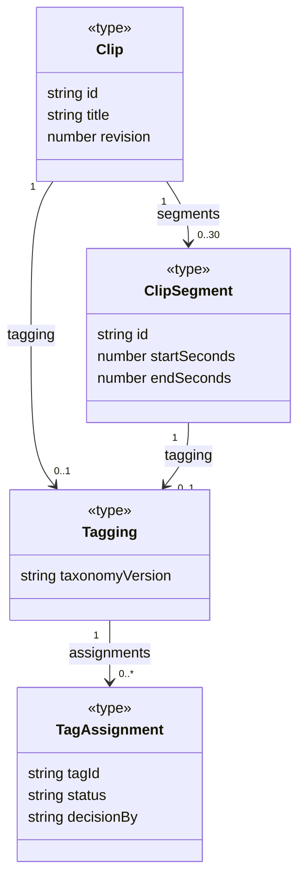
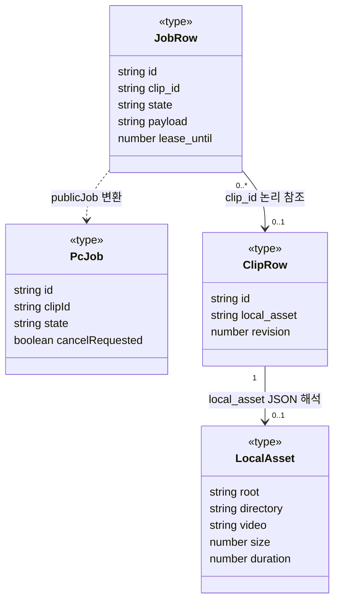
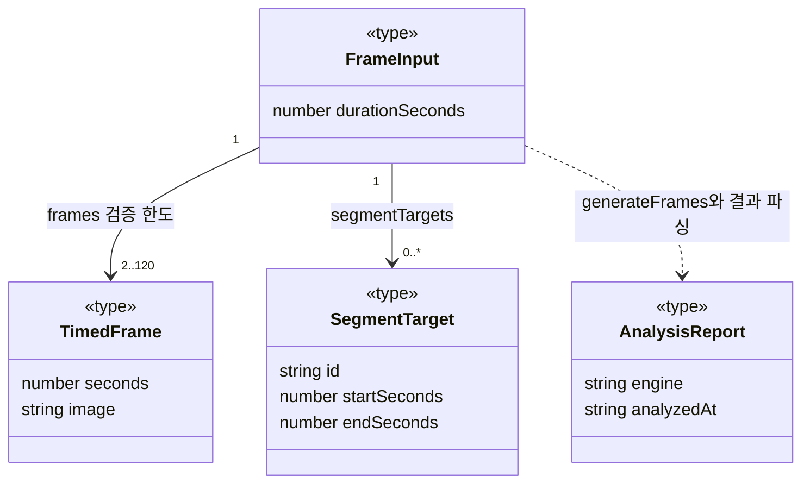
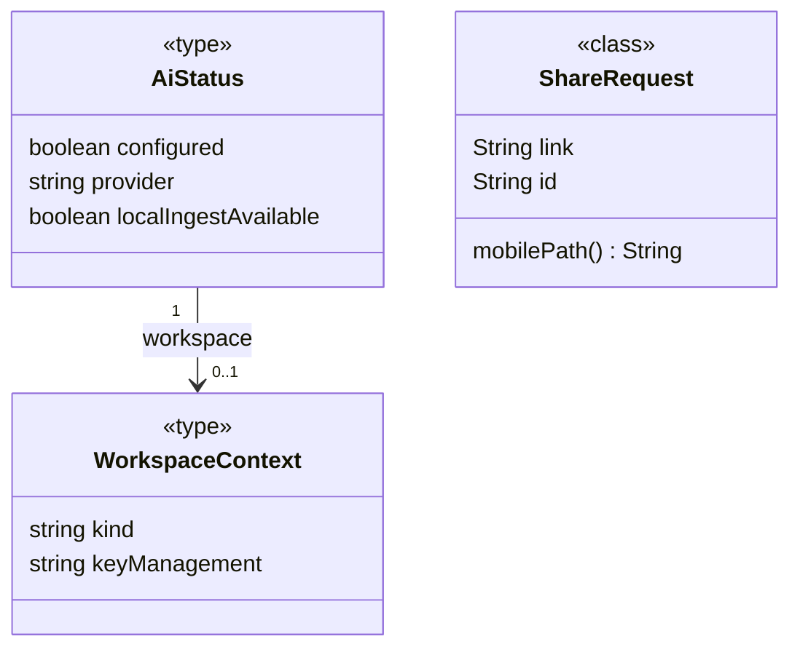

# 핵심 타입 classDiagram 초안

[선언 목록](README.md) · [기존 타입 UML](../types.md)

## 조사 목적·표기

전수 항목을 한 장에 넣지 않고 도메인·작업/저장·분석·연결 네 장으로 나눈다. `<<type>>`는 TS 별칭, `<<class>>`는 실제 Java class다. 속성은 일부만 발췌하며 optional/null은 본문에 명시한다. 실선 `-->`는 필드/논리 참조, 점선 `..>`는 타입 변환·의존이다. 합성·상속은 이 초안에서 사용하지 않는다. 함수 이름은 변환 선의 라벨일 뿐 클래스 메서드로 발명하지 않는다.

## 1. 도메인과 검수

근거: [Clip](../../../../apps/web/lib/clips.ts), [ClipSegment/parseSegments](../../../../apps/web/lib/segments.ts), [Tagging/TagAssignment](../../../../apps/web/lib/tagging.ts). segments/tagging/revision은 optional일 수 있다. 30은 배열 타입의 상한이 아니라 입력 validator 제약이다. TagAssignment.status는 실제 union이지만 그림의 속성 칸은 간략히 string으로 썼다. 가능한 값은 [상태 계약](states.md)을 따른다.

## 2. 작업 레코드·공개 DTO·로컬 자산

근거: [JobRow/publicJob/workerAction](../../../../apps/web/lib/jobs/server.ts), [PcJob/LocalAsset](../../../../apps/web/lib/jobs/types.ts), [ClipRow](../../../../apps/web/lib/server.ts). local_asset는 nullable/optional JSON 문자열이지 LocalAsset 객체 필드 선언이 아니다. 화살표는 해석 후 구조를 설명한다. pc_jobs.clip_id에는 FK가 없어 클립 삭제 후 0개 참조가 가능하다. PcJob.state/kind/phase는 실제로 string이며 타입 수준의 JobState enum이 없다. 원본 파일의 삭제 수명과 이 DTO 관계는 별개다.

## 3. 분석 입력과 결과

근거: [FrameInput/parseFrameInput/generateFrames](../../../../apps/web/lib/ai/openai.ts), [TimedFrame](../../../../apps/web/lib/analysis/whole-video.ts), [SegmentTarget](../../../../apps/web/features/segments/segment-tagging.ts), [AnalysisReport](../../../../apps/web/lib/analysis/types.ts). `SegmentTarget`은 Pick 타입이지 ClipSegment의 하위 클래스가 아니다. `AnalysisReport`는 ReportBase와 engine 판별 union의 교차 타입이다. 세 engine을 실제 상속 클래스로 그리지 않았다. frames의 2~120은 validator의 조건이며 TS 배열 자체의 고정 길이가 아니다. 점선은 함수의 입출력 관계로 해석한 것이며 입력 객체가 결과를 소유하지 않는다.

## 4. 연결과 공유

근거: [AiStatus](../../../../apps/web/features/connections/ai-connection.tsx), [WorkspaceContext](../../../../apps/web/lib/workspace-context.ts), [ShareRequest](../../../../apps/android/app/src/main/java/app/cutnote/mobile/ShareRequest.java). localIngestAvailable/workspace는 optional이다. ShareRequest는 Java의 실제 불변 필드를 가진 class이며 웹 AiStatus와 직접 필드 관계가 없어 선을 연결하지 않았다. shareId를 URL로 전달하는 순서는 [Android sequence](../android.md)가 설명한다.

## 표시·생략 판단과 미확인

전수 표에서 표시한 **15개 선언**만 위에 등장한다. 상수·지역 상태·함수·익명 callback·DB 컬럼·설치 도구 클래스·호스팅 보조 타입은 목록으로 남겼다. 각각은 state/sequence 또는 별도 테이블이 더 적절하며 소유 관계를 추가하지 않았다. Java의 나머지 관계는 기존 Android 문서에서 유지한다.

수동으로 선언명·속성·관계·다중성을 대조했다. Mermaid 실제 렌더링은 미검증이다. 이 초안은 코드 구조의 학습 모델이며 외부 AI 완료나 실제 기기 동작을 검증한 증거는 아니다.
