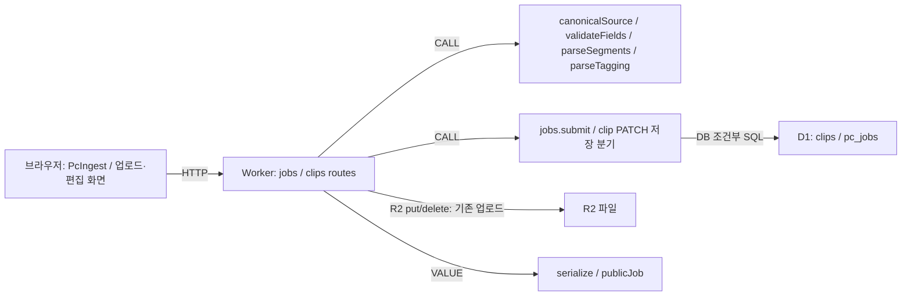
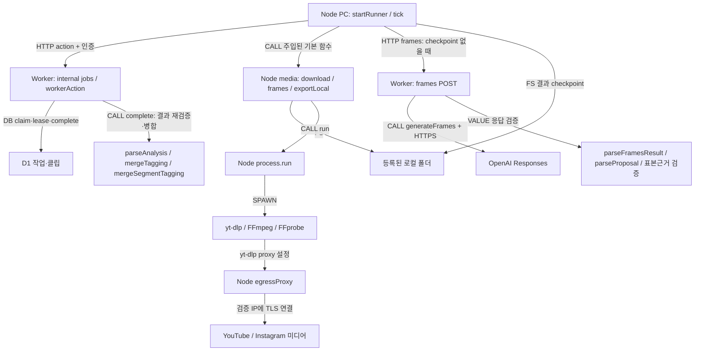
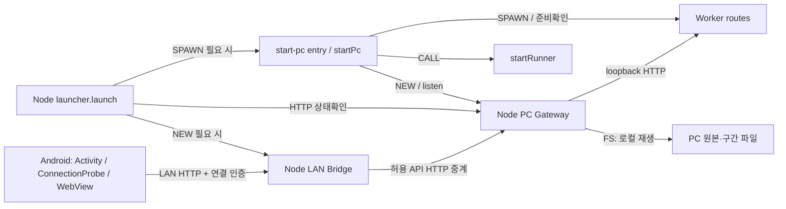

# 서비스·모듈 의존 구조와 경계 점검

[6단계 안내](README.md) · [주요 의존 관계 표](calls.md)

## 무엇을 왜 조사했는가

기능 폴더가 같다는 이유로 같은 프로세스로 묶거나, 타입 import를 실행 호출로 그리지 않기 위한 조사다. 아래 그림은 앞 문서의 실행 근거를 압축한다. 화살표는 사용 주체에서 대상으로 향한다. 반대 방향의 반환이나 수명 소유는 표시하지 않는다. 테스트 서버/모의 제공자는 운영 구성요소에서 제외했다.

## 웹 요청·값 변환·저장

그림은 폴더를 서비스 클래스로 승격하지 않는다. 검증 helper는 입력에 따라 실행되며 DB 쓰기 전에 실패할 수 있다. R2 업로드와 D1 저장은 별도 경계여서 실패 보상 코드가 필요하다. schema.ts의 sqliteTable 선언을 실행 ORM으로 그리지 않았다. 근거: [jobs route](../../../../apps/web/app/api/jobs/route.ts), [submit](../../../../apps/web/lib/jobs/server.ts), [clips route](../../../../apps/web/app/api/clips/route.ts), [server](../../../../apps/web/lib/server.ts).

## 다운로드·프레임·AI 결과 저장

순서도나 sequence가 아니므로 OpenAI→Runner 반환선을 덧붙이지 않았다. 실제 순서는 frames 응답을 받은 runner가 checkpoint를 저장하고 내부 complete를 호출한다. complete는 merge 결과를 이용해 D1을 갱신한다. 다운로드·분석·완료가 한 HTTP 요청의 자식 작업이 아니므로 모바일 연결 종료 후에도 Node poll이 진행된다. 근거: [runner](../../../../apps/pc/runner.mjs), [media](../../../../apps/pc/media.mjs), [process](../../../../apps/pc/process.mjs), [frames route](../../../../apps/web/app/api/ai/frames/route.ts), [OpenAI 변환](../../../../apps/web/lib/ai/openai.ts), [완료](../../../../apps/web/lib/jobs/server.ts).

## Android·Bridge·실행기

인증은 Bridge의 session/연결 코드, Gateway의 Host/Origin·LAN설정 제한, Worker 내부jobs Bearer 검증으로 나뉜다. Bridge는 외부 Origin을 그대로 통과시키지 않고 자신이 검증한 요청을 upstream용 헤더로 바꾼다. 따라서 Worker의 crossOrigin만으로 LAN 클라이언트 인증을 설명하면 틀리다. 종료는 launcher가 직접 시작한 PC/Bridge만 대상으로 하고 startPc.close가 runner·Gateway·Worker를 정리한다. 근거: [Android 연결](../../../../apps/android/app/src/main/java/app/cutnote/mobile/ConnectionProbe.java), [Bridge createBridge](../../../../apps/android/bridge/server.mjs), [Gateway](../../../../apps/pc/server.mjs), [launcher](../../../../apps/android/launcher.mjs), [startPc](../../../../apps/pc/start.mjs).

## import와 실제 사용을 구분한 결과

| 사용 주체 | 대상 | 사용 위치 | 호출/생성/변환 방식 | 프로세스 경계 | UML 표시 여부 | 이유 |
|---|---|---|---|---|---|---|
| openai.ts | whole-video.ts의 TimedFrame | [openai.ts](../../../../apps/web/lib/ai/openai.ts) import type | [TYPE] FrameInput 필드 타입 참조 | 실행 경계 없음 | 표만 | Worker가 브라우저 video/canvas 추출을 호출한다는 뜻 아님 |
| clips.ts | segments.ts/tagging.ts | [clips.ts](../../../../apps/web/lib/clips.ts) displayTags/clipTagIds | [CALL] segmentTags/withLegacyStatus/acceptedTags/projectedTags | 동일 JS 실행환경 | 분기 | imported symbol의 실제 함수 호출 있음 |
| segments.ts/tagging.ts | clips.ts의 Tags | [segments.ts](../../../../apps/web/lib/segments.ts), [tagging.ts](../../../../apps/web/lib/tagging.ts) import type | [TYPE] 반환/필드 구조 표현 | 실행 경계 없음 | 표만 | 역방향 runtime 호출을 만들지 않음 |
| youtube-discovery.ts | youtube-public-search.ts | [youtube-discovery.ts](../../../../apps/web/lib/ai/youtube-discovery.ts) discoverYouTube | [CALL] publicYouTubeCandidates | Worker; 함수 내부 외부검색 별도 | 분기 | 활성 추천 실행 경로 |
| youtube-public-search.ts | DiscoveryFormat/YouTubeSuggestion | [youtube-public-search.ts](../../../../apps/web/lib/ai/youtube-public-search.ts) import type | [TYPE] 반환/인자 타입 | 실행 경계 없음 | 표만 | 추천 모듈로 runtime 재진입하는 호출 아님 |
| 사이트 Worker entry | runWithConnectorBinding/handler.fetch | [sites-worker.ts](../../../../apps/web/build/sites-worker.ts) fetch | [CALL] request-scoped AsyncLocalStorage.run 내부에서 handler.fetch | Worker 내부 | 표만 | wrapper 실행은 확인되나 모든 route가 connector invoke를 사용한다는 뜻 아님 |
| 활성 앱 경로 검색 | getDb/connectorsForRequest/analyzeLink/analyzeVideo | [db/index.ts](../../../../apps/web/db/index.ts), [connectors.ts](../../../../apps/web/lib/connectors.ts), [link.ts](../../../../apps/web/lib/analysis/link.ts), [video.ts](../../../../apps/web/lib/analysis/video.ts) | 선언은 존재, 검색한 현재 앱 소스에서 외부 호출자 미발견 | 미확인/보조 | 표만 | 이름/존재만으로 현재 처리 서비스에 편입하지 않음; 저장소 밖 동적 사용 부재까지 증명하지 않음 |

## 순환 의존 판정

선정125개 소스의 내부 정적 import/export 간선361개를 검사했다. type-only 간선을 제외한 그래프에는 여러 모듈로 이루어진 순환이 없었다. **실행 의존이 전혀 순환하지 않는다는 전체 시스템 증명은 아니다.** HTTP callback·함수 인자 주입·동적 모듈 로딩·패키지 내부는 이 정적 그래프와 별개다.

타입을 포함하면 다음 두 묶음이 나온다.

1. `clips → segments/tagging → clips`: 정방향은 실제 함수 사용, 역방향은 Tags의 import type. segments→tagging의 함수 사용도 존재한다. 타입 모델의 결합이며 runtime 초기화 순환으로 분류하지 않는다.
2. `youtube-discovery → youtube-public-search → youtube-discovery`: 정방향은 publicYouTubeCandidates 호출, 역방향은 DiscoveryFormat/YouTubeSuggestion의 import type이다.

단순 import 목록만 그리면 두 묶음을 runtime 순환으로 오진할 수 있다. 반대로 타입 순환을 제거했다고 네트워크 요청이나 상태 갱신 feedback loop가 사라지는 것도 아니다. [3단계 sequence용 목록](../contracts/calls.md)은 시간/상태 흐름의 별도 근거다.

## 경계 결합·주의점과 판단 근거

| 관찰 | 코드로 확인한 사실 | 해석 및 영향 | 후속 검증 |
|---|---|---|---|
| lib/server 쪽이 features를 사용 | [jobs/server.ts](../../../../apps/web/lib/jobs/server.ts), [ai/openai.ts](../../../../apps/web/lib/ai/openai.ts), [ai/result.ts](../../../../apps/web/lib/ai/result.ts)가 features/segments/segment-tagging의 검증·병합 호출 | 계층 이름상 역방향 결합은 존재. 대상은 use client/JSX 없는 순수 TS 함수이므로 브라우저 UI를 Worker에서 실행하는 위반이라고 단정하지 않음 | helper에 DOM/React/클라이언트 의존을 추가하면 Worker·브라우저 양쪽 영향 확인. 위치 재배치는 후속 결정 |
| Node start가 Android 디렉터리 도구 사용 | [start.mjs](../../../../apps/pc/start.mjs)가 bridge/server.mjs의 protectConnectionFile을 실제 호출 | 코드 공유 결합이며 Android Java runtime 호출이 아님. PC 배포 시 해당 Node 모듈 필요 | 배포 패키지에서 파일 누락 여부 검사 |
| 관리 API 보안이 앞단 경계에 의존 | [Gateway](../../../../apps/pc/server.mjs)가 internal 차단/PC설정 LAN차단; [startPc](../../../../apps/pc/start.mjs)가 Gateway/Worker를 loopback bind; runner는 Worker 직접호출 | 정상 구조에서 의도된 분리. Worker를 임의로 LAN노출하면 Bridge 정책 전체가 적용된다고 보장할 수 없음. 이번에 실제 노출 위반을 발견한 것은 아님 | 서비스 bind/방화벽/허용 API 통합 검사; 개인 환경은 이번에 조사 안 함 |
| provider 경계 | PC tick은 [frames API](../../../../apps/web/app/api/ai/frames/route.ts)만 사용; 기존 [retag](../../../../apps/web/lib/analysis/retag-segments.ts)/[analyze](../../../../apps/web/app/api/ai/analyze/route.ts)에는 Gemini 분기 | 새 수집의 Google API/Gemini 미사용과 앱 전체 의존성 제거를 구분. YouTube 웹 호스트 요청은 Google Data API 호출과 다름 | 실제 서비스 요청 검증은 기존 구현 기록의 미검증을 유지 |
| 저장 트랜잭션 경계 | runner checkpoint FS와 complete D1 batch, 업로드 R2 put과 D1 INSERT가 분리 | 프로세스/저장소를 넘는 원자성 없음. 실패 보상·receipt·revision은 각 경계에서 처리 | 실패 주입 계획은 [수명 조사](../lifetime/README.md). 이번 단계 제품 수정 없음 |

위 표는 사실과 설계상 주의점을 분리한다. 현재 근거로 확인된 runtime import 순환이나 브라우저의 직접 OS 실행 위반을 임의로 추가하지 않았다. 외부 실행 환경을 조사하지 않았으므로 실제 포트 노출·패키지 누락을 확정하지도 않는다.

## 학습 포인트와 미확인

주입된 함수는 import 문이 없는 호출부에서도 dependency가 된다. 생성된 timer callback은 초기 함수가 반환한 뒤 실행된다. HTTP 호출은 같은 PC 안에서도 JS 직접 호출이 아니며 인증·크기·timeout·오류 변환을 거친다. 반대로 type-only import는 네트워크나 런타임 자원을 요구하지 않는다.

세 그림은 소스와 선 방향을 수동 대조했으며 자동 Mermaid 렌더링은 미검증이다. 실제 동시 호출·동적 import·환경별 번들·Android callback 순서는 실행 실험으로 추가 확인해야 한다. 이번 단계에서는 사용자 데이터·프로세스·배포 설정을 변경하지 않았다.
