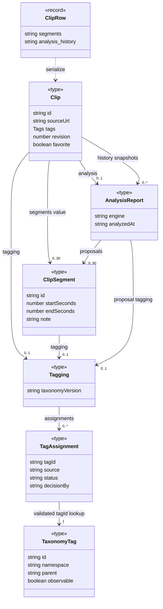

# 8단계: 핵심 도메인과 저장 모델

2026-10-03 작업 트리 기준. [UML 안내](../README.md) · [공개 DTO 경계](../layers/data-boundaries.md)

## 무엇을 왜 조사했는가

Clip의 필드가 어디서 만들어지고 검증·수정·저장되는지, JSON 내부 관계와 DB 제약이 어떻게 다른지 조사했다. 타입을 DB 테이블이나 클래스와 동일시하지 않는다. 기존 자료는 탐색에 사용하고 최종 타입·route·SQL을 근거로 했다. 제품 코드는 수정하지 않았다.

- 이 문서: 핵심 관계·필드 변경 지점·classDiagram·분석 엔진.
- [실제 저장 구조와 ER](storage.md): 별도 테이블, JSON 컬럼, DB 제약과 앱 책임.
- [확장 영향 파일 표](extension-impact.md): 태그·엔진·미디어 유형 추가의 수정 경계.

## 핵심 관계 표

| 요소 A | 요소 B | 관계 | 저장 형태 | 사용·검증 위치 | UML 표시 여부 | 근거 |
|---|---|---|---|---|---|---|
| Clip | ClipSegment | 선택 구간 배열 값 | clips.segments TEXT JSON; 구간 테이블 없음 | parseSegments,POST/PATCH,worker complete | 표시 | [clips.ts](../../../../apps/web/lib/clips.ts) Clip; [segments.ts](../../../../apps/web/lib/segments.ts) |
| Clip/ClipSegment | Tags | color/shot/effect별 문자열 값 | tags 컬럼 또는 구간 JSON 내부 | validateFields/parseSegments; displayTags/segmentTags는 표시값 파생 | 속성 | [clips.ts](../../../../apps/web/lib/clips.ts),[segments.ts](../../../../apps/web/lib/segments.ts) |
| Clip/ClipSegment | Tagging | 현재 검수값 포함 | clips.tagging 또는 segments 내부 JSON | parseTagging/mergeTagging/mergeSegmentTagging | 표시 | [tagging.ts](../../../../apps/web/lib/tagging.ts),[segment-tagging.ts](../../../../apps/web/features/segments/segment-tagging.ts) |
| Tagging | TagAssignment | assignments 값 배열 | 같은 JSON 내부; join 테이블 없음 | 중복tagId·source/status/score/evidence 검증 | 표시 | [parseTagging](../../../../apps/web/lib/tagging.ts) |
| TagAssignment | TaxonomyTag | tagId로 공통 사전 조회 | YAML 원본→생성 런타임 사전, DB FK 없음 | tagById/parseTagging,생성기 사전검증 | 표시 | [taxonomy.ts](../../../../apps/web/lib/taxonomy.ts),[원본 YAML](../../../../apps/web/data/taxonomy/taxonomy.v2.yaml) |
| TaxonomyTag | 부모 태그/namespace root | parent/namespace의 사전 계층 | YAML 문자열 참조 | generator가 동일namespace·cycle·root까지 검증 | 표만 | [generate-taxonomy.mjs](../../../../apps/web/scripts/generate-taxonomy.mjs) |
| Clip | AnalysisReport | 현재 분석 값 | clips.analysis nullable JSON | parseAnalysis,일반PATCH/worker complete | 표시 | [analysis/types.ts](../../../../apps/web/lib/analysis/types.ts) |
| Clip | AnalysisReport[] | 분석 이력 스냅샷 | clips.analysis_history JSON | POST초기화,PATCH/complete 추가 | 표시 | [POST](../../../../apps/web/app/api/clips/route.ts),[PATCH](../../../../apps/web/app/api/clips/[id]/route.ts),[complete](../../../../apps/web/lib/jobs/server.ts) |
| AnalysisReport | 제안 구간/Tagging | 분석 당시 값,현재 편집값과 구분 | report 내부 JSON 및 이력 사본 | parseAnalysis/parseProposal/병합 | 표시 | [types.ts](../../../../apps/web/lib/analysis/types.ts),[result.ts](../../../../apps/web/lib/ai/result.ts) |
| Clip | revision | 편집 충돌 검사용 숫자 | clips.revision INTEGER | PATCH/원본attach/작업complete의 조건부 SQL | 속성 | [clip route](../../../../apps/web/app/api/clips/[id]/route.ts),[jobs/server](../../../../apps/web/lib/jobs/server.ts) |
| Clip | favorite/구간즐겨찾기ID | 클립 boolean과 구간ID 목록 | favorite INTEGER; favorite_segments JSON | parseFavoriteChange/updateFavorite·serialize필터 | 속성/표만 | [favorites.ts](../../../../apps/web/features/library/favorites.ts) |
| LibraryOrder | SavedOrder 두 scope | videos/segments 각각 keys+revision | library_order 별도행,ordered_keys JSON | parseOrderChange,order PATCH,applyOrder | 별도ER | [library-order.ts](../../../../apps/web/features/library/library-order.ts),[order route](../../../../apps/web/app/api/library/order/route.ts) |
| SavedOrder.keys | Clip/구간 카드 | videos는clipId,segments는clipId/segmentId | 문자열 배열; FK 없음 | PATCH가 현재존재키만 저장,읽기·정렬은별도 | 표만 | [order route](../../../../apps/web/app/api/library/order/route.ts),[library-order-server](../../../../apps/web/lib/library-order-server.ts) |
| ClipRow | Clip | 영속표현→공개DTO | JSON/컬럼→객체/상대media URL | serialize; Row와DTO 필드 불일치 | dependency | [server.ts](../../../../apps/web/lib/server.ts) |
| Clip.sourceUrl | 외부 원본 URL | 원본 출처 문자열 | clips.source_url | 기존POST는HTTP(S) URL,PC ingest는canonicalSource로개별플랫폼제한 | 속성 | [clips POST](../../../../apps/web/app/api/clips/route.ts),[canonicalSource](../../../../apps/web/lib/jobs/server.ts) |
| ClipRow.local_asset | LocalAsset | 로컬 파일 메타 값 | nullable JSON; root UUID+directory+파일명 | assetInput/assetFile/inside; serialize는localVideo와URL만노출 | 저장그림 | [jobs/types.ts](../../../../apps/web/lib/jobs/types.ts),[media](../../../../apps/pc/media.mjs) |
| ClipRow.video_key/poster_key | R2 object | 키 참조 | nullable TEXT, 파일 별도 보관 | POST/attach/DELETE 및mediaResponse | 저장그림 | [media route](../../../../apps/web/app/api/media/[id]/route.ts),[media-response](../../../../apps/web/lib/media-response.ts) |
| pc_jobs/segment_media | Clip/구간 | 논리ID 참조,FK 없음 | 별도테이블;payload/result는 JSON | workerAction/localSegments/cleanSegmentMedia | ER에독립표시 | [schema](../../../../apps/web/db/schema.ts),[jobs/server](../../../../apps/web/lib/jobs/server.ts),[segment-media](../../../../apps/web/lib/segment-media.ts) |

## 필드의 생성·검증·수정·저장 지점

| 필드 묶음 | 생성과 검증 | 수정과 저장 |
|---|---|---|
| Clip.id/createdAt | 일반POST는UUID/시각 생성,공유idempotencyKey 검증; ingest는requestId를clipId로사용 | PK/id는편집PATCH의수정대상아님. clips INSERT |
| title/notes/tags | validateFields가 기본제목·길이·분류별목록·정규화;브라우저draft도구성 | POST/PATCH;worker complete는기존제목이placeholder일때만AI제목,빈notes만AI메모로채움 |
| sourceUrl/videoUrl/posterUrl/localVideo | POST URL 또는canonicalSource;원본키/asset에서serialize가공개URL/bool계산 | source_url은현재일반PATCH에서교체하지않음. 원본추가는mediaPOST/작업attach. URL을DB에그대로중복저장하지않음 |
| segments.id/startSeconds/endSeconds/effects/note/title | parseSegments가필요ID생성·중복검사·ms정규화·기간/길이·태그·근거검증·정렬 | 사용자PATCH 또는분석병합후JSON저장. 구간은전체배열교체이며별도구간행UPDATE아님 |
| segments.tagIds/legacyStatus/tags/tagging | parseSegments의구형ID/검수형태호환;withLegacyStatus는읽을때부모판단보정 | 새검수와구형표시규칙이공존. 기존효과문자열과canonical ID를동일필드로취급하지않음 |
| Tagging.taxonomyVersion/assignments | emptyTagging/aiTagging/parseTagging;버전일치·사전ID·score/evidence/source/status/decisionBy 검사 | decideTag가사용자판단,mergeTagging은기존decisionBy=user유지;JSON갱신 |
| report.engine/basis/model/frameCount/sampleFps/durationSeconds | 엔진별생성함수와parseAnalysis의판별검증 | 새결과로현재report교체또는local retag는현재report유지;새결과이력추가 |
| report.analyzedAt/suggestedTags/notes/segments/tagging/unclassifiedObservations/promptVersion | parseAnalysis/제공자응답변환이시간·목록·구간·검수정규화 | analysis/history JSON 값복사. 불변클래스나별도report PK없음 |
| analysisHistory | 일반POST는analysis가있으면1개;worker complete는append후slice(-10) | PATCH에는10개상한의조건부예외. [수명 조사](../lifetime/data.md) 재현조건을유지하며항상10개로표현하지않음 |
| revision | migration기본0,DTO읽기default0 | 일반PATCH/원본attach/분석complete가증가·CAS;클립즐겨찾기는증가하지않음. 모든쓰기의전역버전은아님 |
| favorite/favoriteSegmentIds | 기본false/[];parseFavoriteChange는다른변경과동시제출거부 | updateFavorite는독립SQL·부분응답. 구간ID존재조건및오래된ID정리;보통편집revision미사용 |
| LibraryOrder.keys/revision | emptyLibraryOrder가scope기본값;parseOrderChange는scope·키형식·중복·최대10000·정수revision검사 | order PATCH가현재키필터+scope별CAS;새카드는applyOrder에서앞에표시 |

## 핵심 도메인 classDiagram

읽는 방법: 타입의 값 포함·ID조회만 표시하고 composition/상속은 쓰지 않았다. 관계 오른쪽은주체하나의대상수이고,0..30은parseSegments의입력제약이다. optional revision/favorite와nullable필드의전체형태는원본타입을따른다. 태그사전1개조회는현재검증을통과한값기준이며DB FK보장이아니다. 일반문자열 Tags는속성으로두고사전노드와혼동하지않는다.

## 분석 엔진 구분

| engine | 저장되는 구분 필드 | 생성·검증 근거 | 현재 의미 |
|---|---|---|---|
| mobileclip-s0-v1 | frameCount1~5,선택basis(video/storyboard/preview) | [analysis/types.ts](../../../../apps/web/lib/analysis/types.ts) parseAnalysis;[기존video](../../../../apps/web/lib/analysis/video.ts)/[link](../../../../apps/web/lib/analysis/link.ts) | 저장호환타입/구형분석코드. 현재PC ingest실행엔진이라고보지않음 |
| gemini-video-v1 | basis=full-video,model검사,sampleFps=2,duration선택 | [gemini.ts](../../../../apps/web/lib/ai/gemini.ts),[analyze route](../../../../apps/web/app/api/ai/analyze/route.ts),parseAnalysis | 기존파일/링크분석경로에남음 |
| openai-frames-v1 | basis=full-duration-frames,model검사,frameCount2~120,duration필수 | [openai.ts](../../../../apps/web/lib/ai/openai.ts) parseFramesResult;parseAnalysis | 새PC수집/로컬재분석. 음성없는표본프레임분석 |

AnalysisReport는 ReportBase와 engine 판별 union의 조합이며 엔진별 클래스 상속이 아니다. DB에는 engine별 테이블도 없다. model이 문자열 타입이어도 parseAnalysis는 현재 모델값을 검사하므로 새 모델·엔진 추가 시 읽기 호환을 함께 고려해야 한다.

## 검증과 미확인

필드·함수·SQL을 대조했고, 개인 DB가 아닌 새 메모리 SQLite에 migration 10개를 적용해 테이블 7개를 확인했다. Mermaid 자동 파싱·렌더링은 도구 부재로 미검증이다. 실제 API·AI 품질·사용자 DB 마이그레이션을 이번에 검증한 것은 아니다. 자세한 검증은 [기록](../validation.md), 변경 영향은 [확장표](extension-impact.md)를 따른다.
