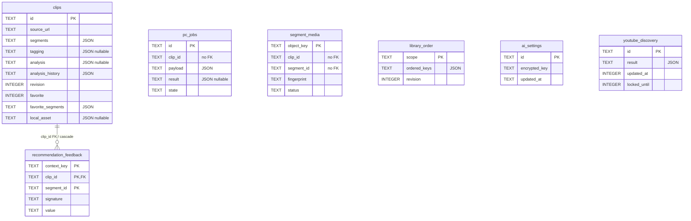

# 실제 테이블·JSON·API 표현의 차이

[도메인 안내](README.md) · [기존 전체 컬럼 목록](../declarations/records.md)

## 조사 질문과 확인 위치

필드 관계 중 무엇을 DB가 강제하는가? [schema.ts](../../../../apps/web/db/schema.ts)와 [0000~0009 migration](../../../../apps/web/drizzle/)을 대조하고 빈 메모리SQLite에10개migration을 적용했다. 테이블7개, 명시적 FK1개, CHECK0개를 확인했다. 개인D1/영상/자격정보는 사용하지 않았다. 메모리검사에는 foreign_keys=ON을 명시했으며 실제실행환경의FK설정을 이번에 검사했다는 뜻은 아니다.

## 저장 관계 표

| 요소 A | 요소 B | 관계 | 저장 형태 | 사용·검증 위치 | UML 표시 여부 | 근거 |
|---|---|---|---|---|---|---|
| clips | ClipRow/Clip | 주요영속행→공개값 | 17컬럼;id PK,문자열/정수 및JSON TEXT | server.serialize,clips API,작업complete | ER핵심 | [schema](../../../../apps/web/db/schema.ts),[server](../../../../apps/web/lib/server.ts) |
| clips JSON | 구간/태그/보고서/이력 | 행 안 값 포함 | tags/segments/tagging/analysis/analysis_history/favorite_segments/local_asset | 각parse함수/JSON.stringify·parse | 컬럼,별도테이블로안그림 | [POST](../../../../apps/web/app/api/clips/route.ts),[PATCH](../../../../apps/web/app/api/clips/[id]/route.ts) |
| clips | 파일키/로컬파일 | 위치참조 | video_key/poster_key;local_asset JSON | R2 put/get/delete,Node assetFile | 표만 | [media-response](../../../../apps/web/lib/media-response.ts),[PC media](../../../../apps/pc/media.mjs) |
| pc_jobs | clips | clip_id 논리참조 | 15컬럼;id PK,payload/result JSON,state/lease 등 | submit/claim/complete,FK 없음 | 독립ER | [0009](../../../../apps/web/drizzle/0009_pc_jobs.sql),[jobs/server](../../../../apps/web/lib/jobs/server.ts) |
| segment_media | clips/구간/R2 | ID·key·fingerprint 참조 | 14컬럼;object_key PK,clip/segment ID는FK 없음 | pending→ready→deleting,현재원본·구간서명비교 | 독립ER | [schema](../../../../apps/web/db/schema.ts),[segment-media](../../../../apps/web/lib/segment-media.ts) |
| recommendation_feedback | clips | 실제FK | 6컬럼;context_key+clip_id+segment_id 복합PK;clip_id→clips.id ON DELETE CASCADE | feedback route의현재구간/signature검사 | 유일FK선 | [0007](../../../../apps/web/drizzle/0007_amusing_blizzard.sql),[feedback route](../../../../apps/web/app/api/recommendations/feedback/route.ts) |
| library_order | 카드 ID목록 | scope별정렬상태 | 3컬럼;scope PK,ordered_keys JSON,독립revision | parseOrderChange/유효키필터/CAS/readLibraryOrder | 독립ER | [0008](../../../../apps/web/drizzle/0008_silent_giant_man.sql),[order route](../../../../apps/web/app/api/library/order/route.ts) |
| ai_settings | 제공자 연결 | 자격정보저장 | 3컬럼;id PK,암호문/수정시각 | saveKey/apiKey;공개응답은상태만 | 독립ER | [settings](../../../../apps/web/lib/ai/settings.ts),[crypto](../../../../apps/web/lib/ai/crypto.ts) |
| youtube_discovery | 추천캐시/검색lock | 캐시문서·락 | 5컬럼;id PK,result JSON,시각·lock정보 | 추천route의기한/lock소유권/정리 | 독립ER | [추천route](../../../../apps/web/app/api/recommendations/youtube/route.ts),[0008](../../../../apps/web/drizzle/0008_silent_giant_man.sql) |

## ER 다이어그램: DB 제약만 연결

읽는 방법: 컬럼은 핵심만 발췌했다. 실제7개테이블 모두 표시하되 **FK가 있는 선만** 연결했다. 나머지테이블이클립과무관하다는뜻이아니라논리참조를DB제약처럼그리지않기위함이다. 구간/태그/report를가짜테이블로만들지않았다. FK의cascade는R2나PC파일삭제를수행하지않는다.

## DB 보장과 앱 관리의 차이

| 항목 | DB가 보장하는 것 | 애플리케이션이 관리하는 것 |
|---|---|---|
| 식별자 | PK 유일성/NOT NULL | UUID·문자형식,영상플랫폼,source URL 정규화 |
| 구간/태그/분석 | JSON을담는TEXT/nullable/default | JSON유효성,구간최대30/기간,tagId/버전,engine/model,이력정책. JSON CHECK나분리FK없음 |
| revision | INTEGER NOT NULL/default | 비교후UPDATE의WHERE조건과증가. 단순컬럼선언만으로동시수정안전하지않음 |
| favorites | INTEGER/JSON 기본값 | boolean의의미·실제구간ID·중복정리. 전용SQL은clip revision을올리지않음 |
| order | scope PK/revision INTEGER | scope허용값·keys형식/유효카드·중복·동시순서충돌. clip삭제시order행cascade없음 |
| job/구간파일 | 각행PK와일부index | clip유실·취소·원본/구간변경·lease·파일정리. ID 참조대상이항상존재한다는DB보장없음 |
| 피드백 | 복합PK와clip FK/cascade | segment_id존재/signature일치. JSON구간엔FK없음 |
| taxonomy | DB테이블없음 | YAML schema/부모cycle검증·runtime tagById조회. 사전ID가일반사용자문자열태그와같지않음 |

readLibraryOrder는 저장된 키를 JSON.parse하며, 읽을 때 모든 키가 현재 카드에 대응하는지 다시 검사하지 않는다. 순서 PATCH에서 현재 키로 필터하고 applyOrder는 실제 items만 정렬하므로, 삭제된 카드의 키가 남아도 카드를 되살리지 않는다. 새 카드는 저장 순서에 없는 키로 앞에 나온다. 이를 “삭제 즉시 모든 참조 제거”로 설명하지 않는다.

## 도메인·DTO·레코드의 차이

- Clip은 도메인 값이면서 공개 API 응답으로도 사용한다. 별도 ClipDto class는 없다. ClipRow는 snake_case와 JSON 문자열·nullable 필드를 사용한다. serialize가 localVideo·상대 videoUrl/posterUrl을 계산하고 내부 asset·R2 키·last_job_id는 제외한다.
- ClipSegment/Tagging/AnalysisReport는 독립 PK가 없고 클립 안에 JSON으로 복제될 수 있다. report의 제안 구간과 사용자가 편집한 현재 구간은 같은 타입이지만 의미와 수명이 다르다.
- LocalAsset는 루트 UUID와 파일명을 담는 내부 타입이다. 실제 파일의 존재·길이·codec은 DB 타입만으로 보장되지 않는다. 공개 Clip에는 로컬 여부와 재생 URL이 들어간다.
- schema.ts는 Drizzle 런타임 schema 객체이고, 실제 route는 database().prepare 등의 raw SQL을 쓴다. schema 선언이 현재 모든 조회에서 ORM 검증을 수행한다는 뜻은 아니다.
- 원본 URL/R2/local_asset의 조합을 강제하는 DB CHECK는 없다. media POST·attach에서 기존 원본을 거절하고 revision을 검사한다. 이를 임의 DB 수정이나 동시 실행의 모든 경우까지 포괄하는 상호 배타성 보장으로 확대하지 않는다.
- serialize는 tagging에 parseTagging을 적용하지만 analysis/history는 JSON.parse로 읽는다. 역직렬화가 모든 보고서를 parseAnalysis로 재검증하는 것은 아니다. 필드명 변환, 기본값 처리, 런타임 검증은 서로 다른 책임이다.

## 검증·미확인

메모리 마이그레이션의 테이블·컬럼·FK·CHECK를 확인했다. 실제 D1 설정·개인 데이터 손상·동시 실행·파일 존재는 미검증이다. 새 ER의 관계와 필드를 수동 대조했지만 Mermaid 파서·렌더링은 미검증이다. 전체 필드 목록은 기존 [레코드 표](../declarations/records.md), 삭제 책임은 [수명 조사](../lifetime/README.md)를 따른다.
