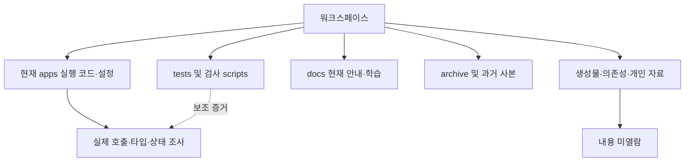

# 워크스페이스 분류와 파일 지도

[전체 안내](README.md) · [상세 조사 대상·선정 근거](selection.md)

## 질문과 이유

현재 실행 소스와 과거 사본을 어떻게 구별하는가? 같은 이름의 파일을 잘못 수정하지 않기 위해 전체 디렉터리 항목을 먼저 열거하고 실행 진입점과 Git 공개 후보를 대조했다. 파일 내용 전체를 읽는 방식은 사용하지 않았다.

## 확인 위치와 조사 결과

`os.walk(followlinks=False)`로 워크스페이스의 파일 이름 메타데이터만 열거했다. 연결 디렉터리를 따라가지 않았고, node_modules·캐시·바이너리·영상·개인 DB·비밀 파일의 내용을 열지 않았다. 아래 수치는 UML 작성 전 스냅샷이며 이후 검사 산출물 수는 달라질 수 있다. 개인 파일 이름 목록은 문서에 복제하지 않는다.

| 최상위 | 파일 수 | 분류·내용 조사 여부 |
|---|---:|---|
| `(root)` | 2 | README·Git 제외 규칙: 현재 안내/설정 |
| `.git` | 958 | 버전 관리 내부: 내용 미열람 |
| `.security-checks` | 40,117 | 격리 공개 검사·검증 산출물: 기존 내용 미열람 |
| `.tools` | 116 | 외부 도구·다운로드 영상·격리 테스트 데이터: 내용 미열람 |
| `apps` | 36,631 | 현재 실행 소스와 의존성/생성물 혼재: 아래 경계로 선별 |
| `archive` | 22 | 과거 공개 기록·설계·사전: 현재 런타임 아님 |
| `assets` | 6 | 브랜드 자산: 바이너리 내용 미열람 |
| `docs` | 32 | 현재 안내·학습·과거 구현 기록 |
| `docs_ext` | 5 | Git 제외 보관 자료: 내용 미열람 |
| `example` | 6 | 로컬 참고 자료: 내용 미열람 |
| `legacy` | 1 | 개인 과거 원본: 내용 미열람 |
| `main` | 147,459 | 과거 작업·사본·생성물: 현재 실행 기준 아님, 내용 미열람 |
| `scripts` | 5 | 현재 공개 검사 도구 |
| `tests` | 19 | 회귀/통합 검사: 운영 요소가 아닌 보조 증거 |

총 **225,379개 파일**. 내용 조사는 아래 현재 소스 중 다이어그램 관계를 확인하는 파일에 한정했다. 파일 이름을 열거한 것과 내용을 분석한 것은 다르다.

| 내부 경계 | 분류 기준 |
|---|---|
| `apps/pc/*.mjs` | Node 백엔드 실행 코드. 외부 프로세스·파일·작업 수명 담당 |
| `apps/web/app/api`, `lib`, `features` | Worker API·공통 규칙·화면 요청 경계. TS/JS도 핵심 백엔드 |
| `apps/web/build` | 이름과 달리 **빌드 입력 소스**. `dist`와 구별 |
| `apps/web/scripts`, `vite.config.ts`, `package.json`, `cloudflare-env.d.ts` | 실행·빌드·환경 계약. 실제 비밀 설정 파일과 구별 |
| `db/schema.ts`, `drizzle/*.sql`, `drizzle/meta` | 현재 DB 정의·적용 migration·도구 생성 스냅샷. JSON snapshot은 설계 클래스 아님 |
| `data/taxonomy` | 사전 입력 YAML/schema. 생성된 taxonomy-data.ts와 구별 |
| `apps/android/app/src/main/java`, manifest | 실제 Java 클래스·Android 공유 진입 |
| `apps/android/launcher.mjs`, `bridge/server.mjs` | PC 실행·LAN 인증 Node 코드 |
| `tests`, Android tests, bridge/server.test.mjs | 논리·프로세스·서비스 검사. UML 운영 노드로 넣지 않음 |
| `node_modules`, `dist`, `.next`, Android build, 캐시 | 의존성·빌드 생성물. 구조 역할만 분류 |
| `.wrangler`, `.cutnote-pc`, `.dev.vars`, pairing/connection 파일 | 사용자 저장소·비밀/개인 설정. 내용 미열람 |
| `.env.example`, lockfile | 공개 설정 예제/재현용 의존성 선언. 키나 패키지 구현을 뜻하지 않음 |
| CSS·JSX의 시각 요소·res·branding | 상세 UML 제외. 요청·상태를 다루는 컴포넌트/훅만 포함 |

## 분류 흐름도와 읽는 방법

다음은 분류용 flowchart이며 UML 배포도가 아니다. 화살표는 실행 호출이 아니라 “분류된다”는 뜻이다.



## 판단과 학습 포인트

폴더 이름만으로 실행 여부를 단정하지 않는다. `package.json`의 start→start-pc→startPc, Android launcher의 spawn과 Worker route 호출을 확인하여 현재 경계를 정했다. 과거 사본의 동일 파일명은 호출 근거가 아니다. 전체 행 수/파일 수도 코드 복잡도와 같지 않다.

## 공개 후보 파일 목록

Git의 tracked 및 untracked/non-ignored 목록을 합친 아래 목록은 작성 시점 **294개**다. 비공개 파일의 개별 이름은 제외하고 위 역할로만 분류했다. 신규 UML 문서는 이 기준 목록 이후 추가된다. 이 목록 자체는 내용 열람 목록이 아니며 각 주제의 근거 표가 실제 조사 위치다.

### (root)

```text
.gitignore
README.md
```

### apps

```text
apps/.env.example
apps/android/.gitignore
apps/android/README.md
apps/android/app/src/main/AndroidManifest.xml
apps/android/app/src/main/java/app/cutnote/mobile/ConnectionProbe.java
apps/android/app/src/main/java/app/cutnote/mobile/DownloadPolicy.java
apps/android/app/src/main/java/app/cutnote/mobile/DownloadTransfer.java
apps/android/app/src/main/java/app/cutnote/mobile/EntryPolicy.java
apps/android/app/src/main/java/app/cutnote/mobile/FileAccess.java
apps/android/app/src/main/java/app/cutnote/mobile/LinkPolicy.java
apps/android/app/src/main/java/app/cutnote/mobile/MainActivity.java
apps/android/app/src/main/java/app/cutnote/mobile/ShareRequest.java
apps/android/app/src/main/java/app/cutnote/mobile/UploadPolicy.java
apps/android/app/src/main/res/color/cutnote_text_primary.xml
apps/android/app/src/main/res/color/cutnote_text_secondary.xml
apps/android/app/src/main/res/drawable/cutnote_dialog_background.xml
apps/android/app/src/main/res/drawable/ic_cutnote.xml
apps/android/app/src/main/res/values-v27/colors.xml
apps/android/app/src/main/res/values/styles.xml
apps/android/bridge/README.md
apps/android/bridge/server.mjs
apps/android/bridge/server.test.mjs
apps/android/bridge/start.command
apps/android/build.sh
apps/android/launcher.mjs
apps/android/tests/ConnectionProbeTest.java
apps/android/tests/DownloadFormatsTest.java
apps/android/tests/EntryPolicyTest.java
apps/android/tests/LinkPolicyTest.java
apps/android/tests/MediaTransferTest.java
apps/android/tests/ShareRequestTest.java
apps/pc/egress.mjs
apps/pc/media.mjs
apps/pc/process.mjs
apps/pc/runner.mjs
apps/pc/server.mjs
apps/pc/settings.mjs
apps/pc/start.mjs
apps/web/.gitignore
apps/web/.npmrc
apps/web/.openai/hosting.json
apps/web/README.md
apps/web/app/api/ai/analyze/route.ts
apps/web/app/api/ai/connect/route.ts
apps/web/app/api/ai/effect-query/route.ts
apps/web/app/api/ai/frames/route.ts
apps/web/app/api/ai/image-query/route.ts
apps/web/app/api/ai/status/route.ts
apps/web/app/api/clips/[id]/route.ts
apps/web/app/api/clips/route.ts
apps/web/app/api/internal/jobs/route.ts
apps/web/app/api/jobs/[id]/[action]/route.ts
apps/web/app/api/jobs/route.ts
apps/web/app/api/library/order/route.ts
apps/web/app/api/links/media/route.ts
apps/web/app/api/links/resolve/route.ts
apps/web/app/api/media/[id]/route.ts
apps/web/app/api/recommendations/feedback/route.ts
apps/web/app/api/recommendations/youtube/route.ts
apps/web/app/api/segment-media/[id]/[segmentId]/route.ts
apps/web/app/api/segment-media/[id]/route.ts
apps/web/app/globals.css
apps/web/app/layout.tsx
apps/web/app/mobile/page.tsx
apps/web/app/page.tsx
apps/web/build/connector-preview-plugin.mjs
apps/web/build/connector-preview-worker.mjs
apps/web/build/sites-vite-plugin.LICENSE
apps/web/build/sites-vite-plugin.ts
apps/web/build/sites-worker.ts
apps/web/cloudflare-env.d.ts
apps/web/components.json
apps/web/components/connector-error.tsx
apps/web/components/media/source-player.tsx
apps/web/components/media/video-player.tsx
apps/web/components/ui/alert-dialog.tsx
apps/web/components/ui/button.tsx
apps/web/components/ui/dialog.tsx
apps/web/components/ui/sheet.tsx
apps/web/components/ui/sonner.tsx
apps/web/components/ui/tabs.tsx
apps/web/data/taxonomy/taxonomy.schema.json
apps/web/data/taxonomy/taxonomy.v2.yaml
apps/web/db/index.ts
apps/web/db/schema.ts
apps/web/drizzle.config.ts
apps/web/drizzle/0000_steady_wendell_rand.sql
apps/web/drizzle/0001_narrow_xavin.sql
apps/web/drizzle/0002_lyrical_switch.sql
apps/web/drizzle/0003_public_psylocke.sql
apps/web/drizzle/0004_dear_big_bertha.sql
apps/web/drizzle/0005_special_famine.sql
apps/web/drizzle/0006_confused_sentinels.sql
apps/web/drizzle/0007_amusing_blizzard.sql
apps/web/drizzle/0008_silent_giant_man.sql
apps/web/drizzle/0009_pc_jobs.sql
apps/web/drizzle/meta/0000_snapshot.json
apps/web/drizzle/meta/0001_snapshot.json
apps/web/drizzle/meta/0002_snapshot.json
apps/web/drizzle/meta/0003_snapshot.json
apps/web/drizzle/meta/0004_snapshot.json
apps/web/drizzle/meta/0005_snapshot.json
apps/web/drizzle/meta/0006_snapshot.json
apps/web/drizzle/meta/0007_snapshot.json
apps/web/drizzle/meta/0008_snapshot.json
apps/web/drizzle/meta/0009_snapshot.json
apps/web/drizzle/meta/_journal.json
apps/web/eslint.config.mjs
apps/web/features/connections/ai-connection.tsx
apps/web/features/connections/library-connection.tsx
apps/web/features/discovery/discovery-profile.ts
apps/web/features/discovery/effect-explorer.tsx
apps/web/features/discovery/image-search-dialog.tsx
apps/web/features/discovery/image-search.ts
apps/web/features/discovery/recommendations.ts
apps/web/features/discovery/youtube-discovery.tsx
apps/web/features/library/clip-details-sheet.tsx
apps/web/features/library/clip-draft.ts
apps/web/features/library/clip-editor-dialog.tsx
apps/web/features/library/favorite-button.tsx
apps/web/features/library/favorites.ts
apps/web/features/library/library-order.ts
apps/web/features/library/library-presentation.ts
apps/web/features/library/library-workspace.tsx
apps/web/features/library/mobile-save.tsx
apps/web/features/library/pc-ingest.tsx
apps/web/features/library/sortable-cards.tsx
apps/web/features/library/use-clip-analysis.ts
apps/web/features/library/use-library-sync.ts
apps/web/features/library/use-library-workspace.ts
apps/web/features/segments/segment-drafts.ts
apps/web/features/segments/segment-editor.tsx
apps/web/features/segments/segment-library.tsx
apps/web/features/segments/segment-search.ts
apps/web/features/segments/segment-tagging.ts
apps/web/features/tagging/tag-review.tsx
apps/web/lib/ai/crypto.ts
apps/web/lib/ai/effect-query.ts
apps/web/lib/ai/gemini.ts
apps/web/lib/ai/image-query.ts
apps/web/lib/ai/key-input.ts
apps/web/lib/ai/openai.ts
apps/web/lib/ai/result.ts
apps/web/lib/ai/settings.ts
apps/web/lib/ai/youtube-discovery.ts
apps/web/lib/ai/youtube-public-search.ts
apps/web/lib/analysis/color.ts
apps/web/lib/analysis/link.ts
apps/web/lib/analysis/retag-segments.ts
apps/web/lib/analysis/types.ts
apps/web/lib/analysis/video.ts
apps/web/lib/analysis/whole-video.ts
apps/web/lib/client-request.ts
apps/web/lib/clips.ts
apps/web/lib/connector-context.ts
apps/web/lib/connector-contract.mts
apps/web/lib/connector-errors.mts
apps/web/lib/connector-preview.d.ts
apps/web/lib/connectors.ts
apps/web/lib/id.ts
apps/web/lib/jobs/server.ts
apps/web/lib/jobs/types.ts
apps/web/lib/json.ts
apps/web/lib/library-order-server.ts
apps/web/lib/links/fetch.ts
apps/web/lib/links/instagram.ts
apps/web/lib/links/provider.ts
apps/web/lib/links/resolve.ts
apps/web/lib/links/types.ts
apps/web/lib/media-response.ts
apps/web/lib/mobile-share.ts
apps/web/lib/segment-media.ts
apps/web/lib/segments.ts
apps/web/lib/server.ts
apps/web/lib/server/chatgpt-auth.ts
apps/web/lib/tagging.ts
apps/web/lib/taxonomy.ts
apps/web/lib/utils.ts
apps/web/lib/video-export.ts
apps/web/lib/workspace-context.ts
apps/web/next.config.ts
apps/web/package-lock.json
apps/web/package.json
apps/web/postcss.config.mjs
apps/web/public/analysis-worker.js
apps/web/public/favicon.svg
apps/web/scripts/build-verified.sh
apps/web/scripts/connector-preview/connector-preview-session.mjs
apps/web/scripts/connector-preview/host-binding.mjs
apps/web/scripts/connector-preview/protocol.mjs
apps/web/scripts/execution-profile.mjs
apps/web/scripts/generate-taxonomy.mjs
apps/web/scripts/init-local-db.mjs
apps/web/scripts/install-ci.mjs
apps/web/scripts/install-ci.sh
apps/web/scripts/install-pnpm.sh
apps/web/scripts/npm-install.mjs
apps/web/scripts/pnpm-install.mjs
apps/web/scripts/run-framework.mjs
apps/web/scripts/sites-env.mjs
apps/web/scripts/sites-env.sh
apps/web/scripts/start-pc.mjs
apps/web/tsconfig.json
apps/web/vendor/shadcn-tailwind-4.13.0.LICENSE.md
apps/web/vendor/shadcn-tailwind-4.13.0.css
apps/web/vite.config.ts
```

### tests

```text
tests/README.md
tests/pc/live-download.mjs
tests/pc/runtime.test.mjs
tests/pc/worker-smoke.mjs
tests/run-web.mjs
tests/web/clip-analysis.test.ts
tests/web/discovery-order.test.ts
tests/web/favorites.test.ts
tests/web/full-video.test.ts
tests/web/image-search.test.ts
tests/web/mock-cloudflare.ts
tests/web/pc-jobs.test.ts
tests/web/recommendation.test.ts
tests/web/segment-independent.test.ts
tests/web/segment-media.test.ts
tests/web/segment-retag-parser.test.ts
tests/web/segment-tagging-current.test.ts
tests/web/sync-polling.test.mjs
tests/web/youtube-public-search.test.ts
```

### scripts

```text
scripts/check-publication.mjs
scripts/publication-secrets.mjs
scripts/publication-secrets.test.mjs
scripts/reviewed-media.json
scripts/verify-publication-index.mjs
```

### docs

```text
docs/README.md
docs/engineering/README.md
docs/engineering/android.md
docs/engineering/architecture.md
docs/engineering/codex 활용법.md
docs/engineering/development.md
docs/engineering/documentation-review-2026-10-03.md
docs/engineering/lan.md
docs/engineering/licenses.md
docs/engineering/lint-notes.md
docs/engineering/local-video-ingestion-operations.md
docs/engineering/local-video-ingestion-plan.md
docs/engineering/local-video-ingestion-progress.md
docs/engineering/local-video-ingestion-reference.md
docs/engineering/local-video-ingestion-study.md
docs/engineering/security.md
docs/engineering/setup.md
docs/engineering/tagging.md
docs/engineering/testing-details.md
docs/engineering/testing.md
docs/presentations/README.md
docs/presentations/서비스 소개 발표문.md
docs/presentations/컷노트_3분발표_5분QnA.md
docs/product/README.md
docs/product/구현 범위 요약 개정판.md
docs/product/문제 정의서.md
docs/product/서비스 소개문.md
docs/product/영상 후보군.md
docs/product/유사 효과 탐색 카드 기능 설명.md
docs/refactoring-study.md
```

### archive

```text
archive/README.md
archive/design/README.md
archive/design/export-cutnote-logo.py
archive/design/logo-outline.swift
archive/documentation/cleanup.md
archive/event/참가자-허브.example.md
archive/handoff-2026-10-01/audit/THIRD_PARTY_DEPENDENCIES.csv
archive/handoff-2026-10-01/audit/copy-records.json
archive/handoff-2026-10-01/audit/environment-variable-names.txt
archive/handoff-2026-10-01/audit/exclusion-records.json
archive/handoff-2026-10-01/audit/original-baseline.json
archive/handoff-2026-10-01/audit/original-preservation.json
archive/handoff-2026-10-01/audit/package-inventory.csv
archive/handoff-2026-10-01/audit/security-review.json
archive/handoff-2026-10-01/audit/validation-results.json
archive/handoff-2026-10-01/audit/work-file-review.csv
archive/planning/아이디어 베끼기.md
archive/taxonomy/README.md
archive/taxonomy/generate-taxonomy.mjs
archive/taxonomy/taxonomy.schema.json
archive/taxonomy/taxonomy.v2.yaml
archive/taxonomy/분류 후보군_개정판.md
```

### assets

```text
assets/branding/cutnote-app-icon.svg
assets/branding/cutnote-lockup-dark.svg
assets/branding/cutnote-lockup-white.svg
assets/branding/cutnote-web-icon.svg
assets/branding/logo_black.png
assets/branding/logo_white.png
```

### main

```text
main/handoff-package/.gitignore
main/handoff-package/LICENSE_NOTES.md
main/handoff-package/README.md
main/handoff-package/docs/LINT_FIX_STUDY.md
```

## 관련 문서와 미확인 사항

[코드 지도](../architecture.md), [개발 규칙](../development.md). Git 제외 사본·개인 자료의 내용과 생성물의 실제 유효성은 조사하지 않았다. 심볼릭 링크 외부 대상도 범위 밖이다.
