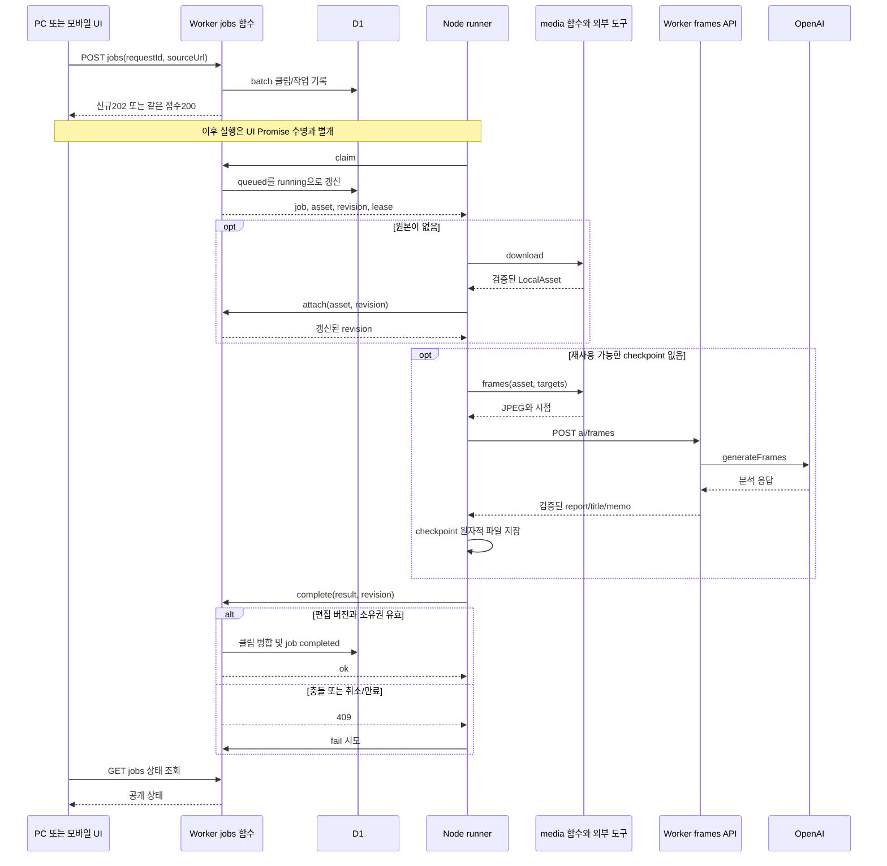

# PC 작업의 실행 순서와 상태 전이

[전체 안내](README.md)

## 무엇을 왜 조사하는가

다운로드와 분석은 누가 이어서 수행하며 실패 후 무엇을 재사용하는가? 상태와 단계, 취소 요청과 취소 완료를 분리하여 장애 수정 위치를 찾는다.

## 파일·심볼과 조사 결과

| 관계/전이 | 근거 | 확인 결과 |
|---|---|---|
| 화면 → submit | [PcIngest.submit](../../../apps/web/features/library/pc-ingest.tsx), [useLibraryWorkspace.save](../../../apps/web/features/library/use-library-workspace.ts) → [POST jobs](../../../apps/web/app/api/jobs/route.ts) | UUID 재사용, 입력 정규화 후 D1 기록 |
| submit → queued | [jobs/server.ts](../../../apps/web/lib/jobs/server.ts) `submit` 및 [0009 SQL](../../../apps/web/drizzle/0009_pc_jobs.sql) | PK id 멱등성, 기본 queued. 다른 payload의 같은 ID는409 |
| queued → running | `workerAction('claim')` | SQL UPDATE RETURNING, attempt 증가, 60초 lease |
| 실행 → 원본/분석 | [runner.startRunner/tick](../../../apps/pc/runner.mjs), [media.download/frames](../../../apps/pc/media.mjs) | 원본 있으면 재사용, 없으면 확보. checkpoint 일치 시 프레임/AI 생략 |
| running → completed | jobs의 `complete` 또는 export 분기 | lease·취소·revision 검사 후 결과 반영 |
| 실행 실패 | runner `failureCode`/catch → `workerAction('fail')` | 단계에 따른 failed, 취소 또는 interrupted |
| 취소 | `changeJob('cancel')`, heartbeat, runner abort | queued 즉시 cancelled, running은 플래그 후 확인 |
| 재시도/복구 | `changeJob('retry')`, `recover` | 존재하는 클립의 실패/중단/취소만 queued; 만료 running은 중단 또는 취소 |

## 수집 실행 순서

Gateway/Bridge 프록시는 생략했다. API batch에서 순차 결과 receipt `last_job_id`도 확인한다. 모든 실패에서 fail 저장이 성공하는 것은 아니다. lease가 이미 만료되면 fail도 거부될 수 있고 이후 recover가 처리한다. heartbeat(5초)는 실행 중 병행되며 그림의 간결성을 위해 메시지 루프를 생략했다. export는 OpenAI 호출 없이 별도 분기하며 [구간 흐름](media-and-features.md)에 있다.

## 영속 state 전이

정확한 상태 전이 표와 단일 기준 그림은 [11단계 작업 stateDiagram](states/jobs.md)을 따른다.

completed에서 retry 화살표는 없다. 새 전체 분석/retag/export는 새 job ID를 제출한다. completed를 최종 종료 원으로 연결하지 않은 이유는 DB 행이 계속 남기 때문이다. `terminalJob`은 UI상 완료/실패/취소/중단을 종료 상태로 분류할 뿐 삭제를 의미하지 않는다.

`phase`는 queued/download/frames/analyze/commit/export/completed 등의 진행 표시다. 실패/취소에서는 직전 phase가 남을 수 있다. running claim은 기존 원본 재분석·export도 우선 download phase로 시작한다. 이를 별도 상태나 실제 재다운로드 증거로 해석하지 않는다.

## 판단 근거와 학습 포인트

멱등성은 URL 중복 제거가 아니라 **같은 요청 ID의 재전송 결과 보장**이다. lease는 영속 DB의 작업 소유권 유효 시간이며 Node 객체 소유권과 다르다. 강제 종료 직후 interrupted가 즉시 기록되는 것은 아니다. listJobs/claim에서 recover를 실행할 때 만료 조건을 평가한다.

클립 revision 검사는 편집 충돌을 막고 checkpoint는 불필요한 재호출을 줄인다. 하지만 응답을 checkpoint에 쓰기 전에 PC가 종료되면 재시도에서 비용이 다시 생길 수 있다. 실제 provider를 포함한 정확히 한 번 실행 보장으로 표현하지 않는다.

## 관련 문서·미확인

[운영·복구](../local-video-ingestion-operations.md), [pc-jobs 테스트](../../../tests/web/pc-jobs.test.ts), [runtime 테스트](../../../tests/pc/runtime.test.mjs). 코드 경로를 조사했으며 이번에 테스트를 재실행하지 않았다. 실제 OpenAI 성공·전원 강제 종료·Android 화면 종료 후 종단 완료는 기존 기록의 미검증을 유지한다.
