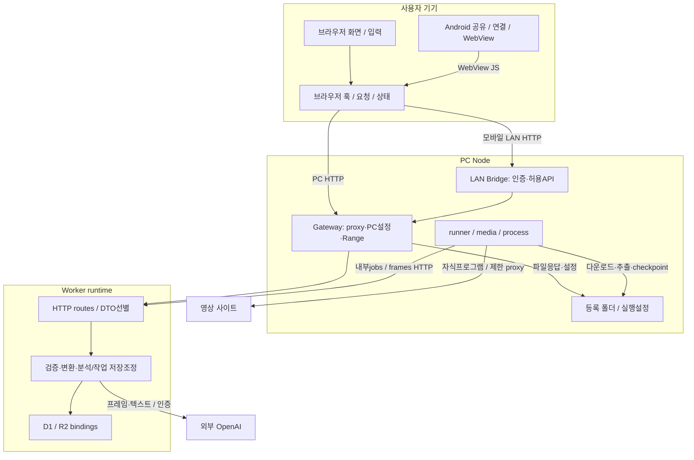

# 7단계: 책임과 실행 위치에 따른 계층 경계

2026-10-03 작업 트리 기준. [UML 안내](../README.md) · [실제 호출 의존](../dependencies/README.md)

## 무엇을 왜 조사했는가

화면, 요청 수명, HTTP, 검증, 작업 실행, 저장은 어떤 경계를 갖는가? MVC 이름을 대응시키지 않고 실제 함수의 책임과 프로세스를 분류했다. 폴더가 계층과 일대일 대응하지 않는다. features 안의 순수 검증 함수는 Worker에서도 사용하고, apps/android/launcher.mjs와 bridge/server.mjs는 Android 단말이 아닌 PC Node에서 실행된다.

- 이 문서: 계층 경계 표와 구조도.
- [데이터 공개·직렬화·검증 경계](data-boundaries.md): 일반 DTO/PC 설정/내부 API/자격정보/프로세스 구조.
- [PC 링크 입력부터 저장까지](pc-sequence.md): 접수와 비동기 완료를 분리한 sequenceDiagram.

## 계층 경계 표

외부 노출은 “인터넷에 무인증 공개”라는 뜻이 아니다. 브라우저·Android가 HTTP 응답을 받을 수 있는지, Node/Worker 내부만 사용하는지 구분한다. 기본 PC 실행기의 loopback/Bridge 구성을 전제로 한다.

| 요소 | 계층 | 실행 위치 | 외부 노출 여부 | 입출력 계약 | 연결 대상 | 검증 책임 | UML 배치 제안 |
|---|---|---|---|---|---|---|---|
| [LibraryWorkspace/편집 화면](../../../../apps/web/features/library/library-workspace.tsx) | 화면·사용자 입력 | 브라우저/WebView | 사용자 표시·입력 | 폼/선택→callback,Clip/진행상태→화면 | useLibraryWorkspace/하위 화면 | 입력 유도,최종 보안검증 아님 | UI 경계 |
| [PcIngest](../../../../apps/web/features/library/pc-ingest.tsx) | 화면+로컬 요청 조정 | 브라우저/WebView | URL입력·상태·PC설정 | requestId/kind/sourceUrl→jobs; 공개PcJob/설정응답 | jobs/settings API | 중복실행ref·같은ID 재전송; 플랫폼 최종검증은 서버 | UI/요청 겹치는 경계 |
| [useLibraryWorkspace](../../../../apps/web/features/library/use-library-workspace.ts) | 브라우저 유스케이스 조정 | 브라우저 | hook 자체는HTTP아님 | 폼→저장요청/로컬상태 | useClipAnalysis/useLibrarySync/request | 사용자 입력 정리·충돌 UX,서버검증 대체 안 함 | 브라우저 조정 모듈 |
| [useLibrarySync](../../../../apps/web/features/library/use-library-sync.ts) | 브라우저 요청·동기화 | 브라우저 | 공개Clip/order 수신 | GET clips→state/선택 갱신 | client-request/HTTP | 요청버전·abort·가시성·timeout; DTO 전체 runtime schema검증 아님 | 브라우저 요청 경계 |
| [useClipAnalysis](../../../../apps/web/features/library/use-clip-analysis.ts) | 분석 요청 수명/분기 | 브라우저 | 분석결과/오류 표시 | localVideo→job,기존파일→분석 | whole-video/AI API/jobs | 늦은응답/취소·provider 분기 | 브라우저 조정 모듈 |
| [client-request](../../../../apps/web/lib/client-request.ts) | HTTP 클라이언트 | 브라우저 호출경로 | JSON 응답 수신 | fetch→JSON/HTTP error | Worker API | res.ok·JSON 실패처리; `as T`는 검증 아님 | 요청 adapter |
| [jobs routes](../../../../apps/web/app/api/jobs/route.ts) | HTTP API·공개 DTO | Worker | PC/인증된LAN 화면 | JSON→submit/listJobs→PcJob | jobs/server/server | 출처·본문크기·JSON,도메인으로 위임 | HTTP 경계 |
| [clips route](../../../../apps/web/app/api/clips/route.ts) / [clip route](../../../../apps/web/app/api/clips/[id]/route.ts) | HTTP+검증·저장 조정 | Worker | 공개Clip/오류 | FormData/JSON→Clip | 검증함수/D1/R2 | 파일·필드·revision·보상삭제 | API에 저장조정도 포함,가상Service 분리 금지 |
| [internal jobs route](../../../../apps/web/app/api/internal/jobs/route.ts) | 내부 HTTP API | Worker | runner/Gateway 내부만 | action JSON→내부응답 | workerAction | 내부Bearer·크기·JSON; lease는workerAction | 내부API 경계 |
| [jobs/server](../../../../apps/web/lib/jobs/server.ts) | 작업 등록·상태·완료 조정 | Worker | publicJob만공개,나머지는경로별 | unknown JSON→JobRow/ClipRow/PcJob | D1·도메인함수 | canonicalSource/assetInput·lease/revision·중복·완료결과 | 작업 저장조정 모듈 |
| [clips/segments/tagging/analysis types](../../../../apps/web/lib/analysis/types.ts) | 도메인 검증·변환 | Worker,일부브라우저공유 | 함수자체비노출,값은DTO에포함 | unknown→검증값/병합값 | [clips](../../../../apps/web/lib/clips.ts),[segments](../../../../apps/web/lib/segments.ts),[tagging](../../../../apps/web/lib/tagging.ts) | 타입·범위·사전·기간·사용자판단 | 공유 순수함수 영역 |
| [segment-tagging](../../../../apps/web/features/segments/segment-tagging.ts) | 구간 도메인 규칙 | Worker/브라우저 | 함수자체비노출 | 대상구간/태그→검증·병합 | jobs/result/retag | 기존ID·시작끝·사용자태그 보존 | features폴더지만 UI 밖에배치 |
| [frames API/openai](../../../../apps/web/lib/ai/openai.ts) | 분석 HTTP·외부 제공자 adapter | Worker | 분석결과공개,제공자키비반환 | FrameInput→OpenAI→report/title/memo | [frames route](../../../../apps/web/app/api/ai/frames/route.ts),settings/result | 입력프레임·출력schema/근거검증 | Worker 분석 경계 |
| [result.ts](../../../../apps/web/lib/ai/result.ts) | AI 결과 검증·정규화 | Worker | 정규화값만다음단계 | JSON텍스트→fields/segments/tagging | 도메인함수 | 사전ID·기간·대상정렬·관찰 | 분석과 도메인 사이 |
| [runner](../../../../apps/pc/runner.mjs) | 영속 작업 실행 조정 | PC Node | job상태는API통해,객체는비노출 | claim→download/frames→complete/fail | Worker/media/FS | 단일실행·heartbeat·취소·checkpoint 조건 | Node 작업 실행 |
| [media/process/egress](../../../../apps/pc/media.mjs) | 다운로드·추출·OS 실행 | PC Node/자식프로그램 | 원본/결과는선택API,프로세스는내부 | URL/asset→파일/프레임 | [process](../../../../apps/pc/process.mjs),[egress](../../../../apps/pc/egress.mjs),FS/사이트 | 실행경로·인자·네트워크·크기·기간·timeout | Node→OS/인터넷 경계 |
| [server.ts](../../../../apps/web/lib/server.ts) / [schema](../../../../apps/web/db/schema.ts) | DB/R2 binding·DTO변환 / schema정의 | Worker / 개발도구 | Clip만 선별 반환 | row→serialize, database/bucket | D1/R2 | binding존재·일부값parse,모든행schema 재검증은아님 | 저장 adapter와선별변환 |
| [settings](../../../../apps/pc/settings.mjs) / [Gateway](../../../../apps/pc/server.mjs) | PC설정·FS·미디어HTTP | PC Node | PC설정화면에경로노출,LAN설정차단 | folder/tools→저장,asset→Range응답 | FS/내부asset API/Worker proxy | safeRoot/inside,Host/Origin/LAN,Range | Node HTTP/FS 경계 |
| [MainActivity](../../../../apps/android/app/src/main/java/app/cutnote/mobile/MainActivity.java) / [ShareRequest](../../../../apps/android/app/src/main/java/app/cutnote/mobile/ShareRequest.java) | Android 공유·진입·복원 | Android | 링크/ID/화면,연결정보는앱관리 | Intent→pending→mobilePath→ACK | LinkPolicy/preferences/WebView | 링크추출·UUID·동일origin ACK | Android native 경계 |
| [ConnectionProbe](../../../../apps/android/app/src/main/java/app/cutnote/mobile/ConnectionProbe.java) | Android 연결확인 | Android background Thread | 연결상태/보관함JSON 수신 | 주소/연결인증→status/cookie/clips | Bridge HTTP | 주소·응답종류·크기·cookie형태 | native HTTP 경계 |
| [LAN Bridge](../../../../apps/android/bridge/server.mjs) | 인증·허용API·중계 | **PC Node** | LAN HTTP 진입 | 연결인증/session→허용요청→upstream | Android/WebView→Gateway | Host/Origin/session/허용경로·크기·시간 | 독립 LAN 경계 |
| [launcher](../../../../apps/android/launcher.mjs) / [startPc](../../../../apps/pc/start.mjs) | 서비스 시작·준비·종료 | **PC Node** | 연결안내 표시, child 정보는 내부/개인파일 | 설정→서비스/close | Bridge/Gateway/Worker/runner | 기존서비스확인·자기소유 종료·파일권한 | 실행 수명 영역 |

## 책임·실행 위치 구조도

읽는 방법: 박스는 책임·실행환경이며 MVC 클래스 계층이 아니다. 같은 Rules의 순수 함수 일부는 브라우저에서도 실행되지만 서버의 검증 책임은 남는다. DB/R2는 binding의 대상이지 Node FS와 동일 API가 아니다. 그림의 기본 Worker는 PC 실행기의 로컬 Worker이고, 호스팅 배포에 Node 다운로드 기능이 자동으로 존재하는 것은 아니다. 시작/종료 구조는 [실행 수명](../lifetime/runtime-android.md)으로 연결한다.

## 판단과 미확인

사실: route가 HTTP 처리뿐 아니라 도메인 검증·저장 조정도 수행하며, 별도 Controller/Repository 클래스는 없다. 공개DTO 생성과 입력검증은 다른 책임이고, 일부 JSON 역직렬화는 타입단언만 있다. 이에 대한 정확한 노출/검증 범위는 [데이터 경계](data-boundaries.md)를 따른다.

새 서비스 실행·환경설정 변경·API키 조회는 하지 않았다. 실제 비밀값·경로·PID는 수집하지 않고 source의 필드/변환/전달 방식만 조사했다. Mermaid 자동 파싱·시각 렌더링은 도구 부재로 미검증이며 문서 검사 결과는 [검증 기록](../validation.md)에 남긴다.
