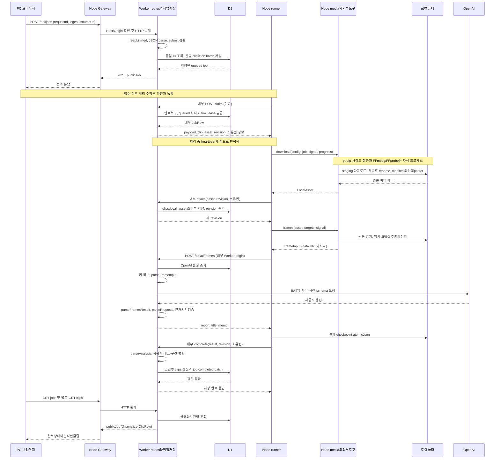

# PC 링크 입력의 접수부터 저장까지

[계층 안내](README.md) · [데이터 경계](data-boundaries.md) · [기존 실패/복구 상태도](../jobs.md)

## 무엇을 왜 조사했는가

PC 화면이 보낸 요청이 끝나는 시점과 원본/분석이 저장되는 시점을 구분한다. 아래는 **새 ingest 요청·다운로드 도구/AI설정 정상·성공 경로**를 중심으로 한 sequenceDiagram이다. API가202를 반환하기 전에 placeholder 클립과 작업이 D1에 먼저 저장된다. 모든 저장이 분석 이후에 처음 일어난다고 그리지 않았다.

## 확인 위치와 결과

| 단계 | 확인한 파일·심볼 | 결과 |
|---|---|---|
| 입력/응답 | [PcIngest](../../../../apps/web/features/library/pc-ingest.tsx) submit/api | requestId 유지·POST·접수표시·공개상태poll |
| HTTP 경계 | [Gateway](../../../../apps/pc/server.mjs) createGateway; [jobs route](../../../../apps/web/app/api/jobs/route.ts) | Host/Origin→중계→크기·JSON→submit |
| 영속 접수 | [jobs/server](../../../../apps/web/lib/jobs/server.ts) submit | URL정규화·ID/payload중복확인·clip/job batch |
| 실행/원본 | [runner](../../../../apps/pc/runner.mjs) tick; [media](../../../../apps/pc/media.mjs) download/frames | 내부claim→도구실행/파일→attach→프레임 |
| 분석/저장 | [frames route](../../../../apps/web/app/api/ai/frames/route.ts),[openai](../../../../apps/web/lib/ai/openai.ts),[jobs/server](../../../../apps/web/lib/jobs/server.ts) complete | 입력/출력검증·checkpoint·태그병합·D1완료 |
| 결과 확인 | [useLibrarySync](../../../../apps/web/features/library/use-library-sync.ts) loadClips; PcIngest effect | 상태조회와Clip조회는별도,후속응답으로UI갱신 |

## sequenceDiagram

## 읽는 방법과 생략 범위

실선은 실제 호출/요청, 점선은 반환이다. W 참여자는 같은 Worker에서 routes/jobs/server/AI 모듈의 실행을 묶은 것이며 하나의 Service class가 아니다. M도 Node media 함수와 그 함수가 시작하는 별도 OS 프로그램을 가독성을 위해 묶었다. 프로세스별 선이 필요한 경우 [6단계 구조도](../dependencies/structure.md)를 따른다. D1 응답 일부와 progress update는 생략했다.

브라우저의 jobs 조회는 약3초, 보관함은 가시성/이벤트 및 약5초 주기로 갱신된다. 마지막 두 GET은 원자적인 하나의 요청이 아니다. 그림은 처리 순서를 읽기 위한 것이며 실제 timer 순서를 모두 고정하지 않는다. runner claim은 브라우저가 접수 응답을 받기 전에도 접수 SQL 완료 후 가능하다.

## 성공 그림에 포함하지 않은 분기

- 같은 requestId와 payload이면 기존job200 재사용, 다른내용이면409다. 새UUID로 같은URL을 제출하면 별도작업일 수 있다. 그림의 신규INSERT를 재전송 때 반복한다고 해석하지 않는다.
- 원본asset이 있으면 존재확인 후 다운로드를 생략한다. manifest 재사용도 가능하다. payload/파일크기 조건이 맞는 checkpoint가 있으면 프레임과AI 호출을 생략하고 complete로 진행한다.
- 다운로드/분석/저장 실패는 tick catch→내부 fail로 구분 저장한다. fail 요청 자체도 실패하면 lease 만료 후 recover가 필요하다. 취소는 플래그→heartbeat→AbortSignal 경로이고202는완료보장이아니다.
- 브라우저 입력/HTTP 실패는 접수 이전 실패일 수 있다. 원본은 저장됐지만 attach/complete가 실패하는 경우도 있어 D1과FS를 하나의 트랜잭션으로 그리지 않는다.
- export는AI분석을거치지않으며 retag는기존구간대상이다. 이 그림은 ingest 성공경로이며 기존 파일업로드/Gemini 경로는 [이전 계약](../contracts/analysis-storage.md)으로 연결한다.

미확인: Mermaid 자동 파싱·시각 렌더링, 실제 사이트 다운로드/AI완료/PC강제종료를 이번 단계에서 실행하지 않았다. 성공경로 그림은 소스상 호출과 검증 책임을 나타내며 실제 서비스 검증 완료 선언이 아니다.
