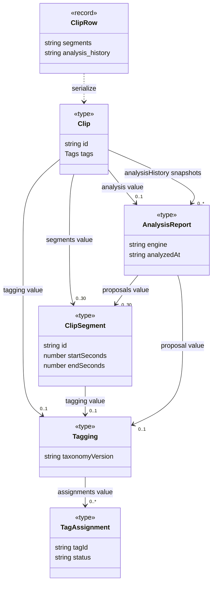

# 클립 데이터의 포함과 영속 참조

[수명 조사 안내](README.md) · [작업·파일](jobs-files.md)

## 무엇을 왜 조사했는가

구간/태그/분석 보고서가 독립 DB 레코드인지, 현재 결과와 이력이 같은 객체인지 확인했다. 타입 선언 외에 POST/PATCH/worker complete의 JSON 저장과 DELETE를 대조했다. 아래 표의 생명주기는 메모리 GC가 아니라 앱이 수행하는 생성·저장·삭제 책임을 설명한다.

## 관계 표

| 주체 | 대상 | 필드/키/보관 방식 | 관계 종류 | 다중성 | 생성·삭제 책임 | 판단 근거 | UML 표기 |
|---|---|---|---|---|---|---|---|
| Clip | ClipSegment | segments 배열 → clips.segments JSON | 값 포함 | 0..30 검증 경로 | 사용자 편집/분석 병합이 구성, PATCH가 배열 교체. clip행 삭제 때 해당 JSON 제거 | [clips.ts](../../../../apps/web/lib/clips.ts) Clip; [segments.ts](../../../../apps/web/lib/segments.ts) parseSegments; [PATCH](../../../../apps/web/app/api/clips/[id]/route.ts) | `Clip --> ClipSegment` |
| Clip/ClipSegment | Tagging | tagging 선택 필드/JSON 내부 값 | 값 포함 | 각각0..1 | parseTagging/mergeTagging/mergeSegmentTagging이 새 값 구성; 부모 JSON 교체/삭제 | [tagging.ts](../../../../apps/web/lib/tagging.ts); [segment-tagging.ts](../../../../apps/web/features/segments/segment-tagging.ts) | association, composition 없음 |
| Tagging | TagAssignment | assignments 배열 | 값 포함 | 0..*; parse 입력 최대403 | parseTagging 검증·정규화·필터링; 승인/거절도 값 수정. 독립행 DELETE 없음 | [tagging.ts](../../../../apps/web/lib/tagging.ts) parseTagging/decideTag | `Tagging --> TagAssignment` |
| TagAssignment | 사전 태그 | tagId → tagById | 공통 ID 조회 | 정상 검증값당1 | taxonomy가 사전 관리. 클립 태그 제거는 사전 항목 삭제 아님 | [tagging.ts](../../../../apps/web/lib/tagging.ts) parseTagging; [taxonomy.ts](../../../../apps/web/lib/taxonomy.ts) tagById | ID association |
| Clip | Tags | tags의 color/shot/effect 문자열 배열 | 값 포함/표시 데이터 | 1 객체, 항목0..* | validateFields 정규화; displayTags는 표준 태그/구간에서 표시값도 파생. 별도 Tag 클래스 없음 | [clips.ts](../../../../apps/web/lib/clips.ts) Tags/validateFields/displayTags | 속성으로 표시 |
| Clip | 현재 AnalysisReport | analysis nullable | 현재 결과 값 | 0..1 | POST/PATCH 또는 worker complete 저장. local retag는 현재 report 유지, 이력에는 새 결과 추가 | [analysis/types.ts](../../../../apps/web/lib/analysis/types.ts); [jobs/server.ts](../../../../apps/web/lib/jobs/server.ts) complete | `Clip --> AnalysisReport : analysis` |
| Clip | 분석 이력의 AnalysisReport | analysisHistory 배열 / analysis_history JSON | 스냅샷 값 포함 | 0..*; 아래 제한 주의 | 신규 POST는 초기 결과 이력, worker complete는 append 후 slice(-10); PATCH는 다른 조건 | [POST](../../../../apps/web/app/api/clips/route.ts); [PATCH](../../../../apps/web/app/api/clips/[id]/route.ts); [complete](../../../../apps/web/lib/jobs/server.ts) | 같은 타입에 별도 history 선 |
| AnalysisReport | 제안 구간·Tagging | segments/tagging | 분석 시점 값 포함 | 구간0..30 검증, tagging0..1 | parseAnalysis가 값 검증, 병합은 사용자 판단 보존. 현재 Clip 구간과 동일 객체라는 보장 없음 | [parseAnalysis](../../../../apps/web/lib/analysis/types.ts), [mergeSegmentTagging](../../../../apps/web/features/segments/segment-tagging.ts) | 값 association |
| ClipRow | 공개 Clip | JSON.parse/serialize 및 media URL 생성 | 변환·값 복사 | serialize 호출당1 출력 | serialize가 반환 객체 생성; HTTP JSON 뒤 다른 런타임의 값. row와 메모리 동일 객체 아님 | [server.ts](../../../../apps/web/lib/server.ts) serialize | `ClipRow ..> Clip` |
| clips 행 | 구간·태그·분석·이력 JSON | TEXT 컬럼들 | 단일 레코드 영속 포함 | 행당 컬럼 각각1,nullable구분 | SQL UPDATE/DELETE가 값 교체/제거. 이 모델은 JS 객체 수명 composition과 별개 | [schema.ts](../../../../apps/web/db/schema.ts) clips; [마이그레이션 레코드](../declarations/records.md) | 행 속성/노트 |
| Clip | 즐겨찾기 구간 | favoriteSegmentIds / favorite_segments JSON | 로컬 구간 ID 참조 | 0..* | PATCH에서 삭제된 구간 ID 필터; serialize도 존재하는 구간만 노출 | [PATCH](../../../../apps/web/app/api/clips/[id]/route.ts) favorite_segments SQL; [serialize](../../../../apps/web/lib/server.ts) | ID association, 그림 생략 |
| recommendation_feedback 행 | clips 행/구간 | clip_id FK, segment_id·signature | DB FK + 논리 ID 참조 | clip1; 현재 구간0..1 | clip FK ON DELETE CASCADE. 구간에는 FK 없고 signature로 오래된 피드백 구분 | [schema.ts](../../../../apps/web/db/schema.ts) recommendationFeedback; [feedback route](../../../../apps/web/app/api/recommendations/feedback/route.ts) | FK association, 자동 구간 cascade로 확대 금지 |

## 클립 데이터 classDiagram

읽는 방법: 실선은 이 문서에서 값 필드 association이다. 데이터가 같은 타입이라는 이유로 한 객체를 공유하거나 독점 소유한다는 뜻이 아니다. 보고서의 제안 구간을 현재 구간에 병합할 때 새 값이 생기고 이후 사용자 편집으로 둘은 달라질 수 있다. 0..30은 TypeScript 배열 문법이 아니라 parseSegments의 입력 검증에 근거한다. 역방향 다중성은 추정하지 않았다.

## 이력 제한의 예외와 남은 의문

코드상 worker complete는 언제나 최근10개로 자른다. 그러나 PATCH는 먼저 이력에 없는 prior.analysis를 추가하고, **새 analysis가 존재하며 이전과 다를 때만** slice(-10)을 수행한다. 따라서 기존 이력이10개이고 현재 analysis가 이력에 없을 때, 분석을 바꾸지 않는 편집 또는 analysis를 null로 지우는 요청은11개를 남길 수 있다. 구간 retag 이력이 쌓여 현재 report가 밀려난 경우처럼 코드상 가능한 조합이다. 이 때문에 그림의 이력 다중성은0..10으로 고정하지 않았다.

이는 소스 분기에서 확인한 제한 예외이며 이번에 실제 DB로 재현하지 않았다. 후속 검증은 메모리 DB에 이력10개+별도 현재 report를 준비하고 동일 revision PATCH 후 배열 길이를 확인하면 된다. 제품 코드는 이번 범위에서 수정하지 않았다. 기존 설명의 “항상10개”로 읽힐 문구는 이 문서의 조건부 설명으로 연결한다.

학습 포인트: JSON 컬럼을 지우면 그 행에 저장된 값은 사라지지만, 같은 보고서의 job.result·checkpoint 사본까지 지워지지는 않는다. 저장소 단위의 수명과 객체 composition을 구분해야 한다. 실제 FK 활성 환경·삭제 실패·동시 편집은 [검증 범위](../validation.md)에 명시한 대로 이번에 재실행하지 않았다.
