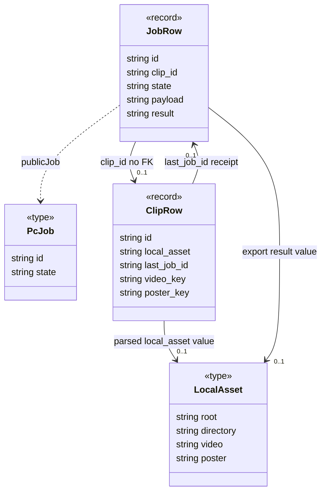
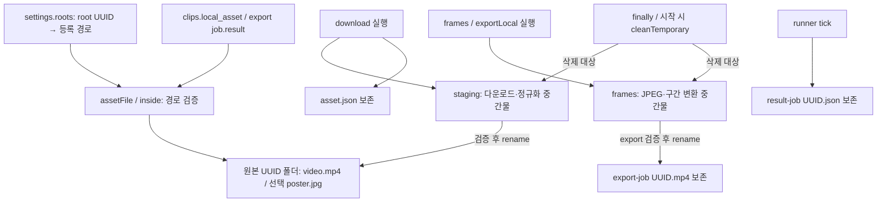

# 작업 레코드와 파일 수명

[수명 조사 안내](README.md) · [클립 데이터](data.md) · [실행 수명](runtime-android.md)

## 무엇을 왜 조사했는가

작업 상태와 원본 파일이 같은 저장소에 속하는가? 취소·클립 삭제·PC 재시작 때 실제로 무엇을 지우는지 확인했다. 아래 파일 이름은 소스의 고정 규칙이며 실제 개인 경로나 파일 내용을 조사한 것이 아니다. 파일·행의 존재는 실패나 외부 조작으로 달라질 수 있다.

## 관계 표

| 주체 | 대상 | 필드/키/보관 방식 | 관계 종류 | 다중성 | 생성·삭제 책임 | 판단 근거 | UML 표기 |
|---|---|---|---|---|---|---|---|
| JobRow/pc_jobs | ClipRow/clips | clip_id 문자열; ingest에서는 job.id=clip.id | 논리 ID 참조, FK 없음 | job당 참조ID1, 존재행0..1; clip당 job0..* | submit이 생성/연결; clip DELETE는 job행 삭제 안 함. heartbeat가 clip유실을 취소로 전달 | [0009](../../../../apps/web/drizzle/0009_pc_jobs.sql); [submit/heartbeat](../../../../apps/web/lib/jobs/server.ts); [DELETE](../../../../apps/web/app/api/clips/[id]/route.ts) | `JobRow --> ClipRow` |
| ClipRow | 마지막 완료 작업 | last_job_id | 완료 receipt용 ID 참조 | 0..1 값 | complete가 revision과 함께 갱신; 다음 완료가 교체. 별도 FK 없음 | [jobs/server.ts](../../../../apps/web/lib/jobs/server.ts) complete SQL | ID association |
| JobRow | 작업 상태·소유권 | state/phase/progress/attempt/cancel_requested 및 lease 컬럼 | 행 내부 값/시한부 실행 권한 | 각 컬럼1,소유권nullable | claim/heartbeat/progress/fail/complete/recover가 갱신; 상태 객체·자식클래스 없음 | [workerAction/recover](../../../../apps/web/lib/jobs/server.ts) | 속성, 상태도는 [기존 문서](../jobs.md) |
| JobRow | 요청·완료 결과 | payload/result JSON | 입력 스냅샷·결과 사본 | payload1,result0..1 | submit 생성; complete 저장. 취소/retry가 레코드 자체를 삭제하지 않음 | [submit/changeJob/complete](../../../../apps/web/lib/jobs/server.ts) | 값 속성 |
| JobRow | PcJob | publicJob 변환 | 공개 DTO 값 복사 | 변환당1 | 응답용 새 객체; 내부 payload·소유권 값 제외 | [publicJob](../../../../apps/web/lib/jobs/server.ts) | dependency |
| ClipRow | LocalAsset | local_asset TEXT JSON | 파일 메타 값 포함 | 0..1 | worker attach가 조건부 저장; clip DELETE는 JSON만 제거, PC 파일 미삭제 | [assetInput/attach](../../../../apps/web/lib/jobs/server.ts); [types](../../../../apps/web/lib/jobs/types.ts) | association |
| LocalAsset | 등록 저장 루트 | root UUID → settings.roots[root] | ID→경로 조회 | ID1,설정유효시1경로 | loadSettings.update가 등록, 폴더 변경 때 기존 roots 유지. 자동 파일 이동 없음 | [settings.mjs](../../../../apps/pc/settings.mjs) update; [assetFile](../../../../apps/pc/media.mjs) | 참조, composition 없음 |
| LocalAsset | 원본 영상 | directory + video, 기본 video.mp4 | 파일 위치 참조 | 정상원본1,누락시0 | download가 staging에서 검증 후 rename. 취소/클립삭제/cleanTemporary는 완료원본 제거 안 함 | [download/assetFile](../../../../apps/pc/media.mjs) | metadata→file association |
| LocalAsset | 썸네일 | poster:null 또는 poster.jpg | 선택 파일 위치 참조 | 0..1 | FFmpeg 생성; 실패해도 원본 유지, 취소면 중단. poster 없는 manifest/부분파일 가능 | [download](../../../../apps/pc/media.mjs) poster try/catch | association |
| 원본 디렉터리 | asset.json | LocalAsset의 JSON 사본 | 재사용용 파일 스냅샷 | 0..1 | download atomicJson, 다음 시도 파일크기 확인 후 재사용. attach 실패해도 디스크에 남을 수 있음 | [download](../../../../apps/pc/media.mjs) manifest | 파일 수명 노트 |
| download 실행 | staging 파일들 | `<원본 UUID>/staging/` | 임시 파일 작업 범위 | 0..* | download finally가 cleanDirectory; PC 시작 cleanTemporary가 잔여 정리. setup 실패/강제종료 때 즉시삭제 보장 없음 | [media.mjs](../../../../apps/pc/media.mjs) download/cleanTemporary | flowchart 관리선 |
| frames/exportLocal 실행 | 임시 JPEG/변환 파일 | `<원본 UUID>/frames/` | 임시 파일 작업 범위 | frames 표본최대120,중도실패0개 가능 | FFmpeg 생성, JPEG는 data URL 값으로 읽은 뒤 finally 디렉터리 삭제; startup도 정리 | [frames/exportLocal](../../../../apps/pc/media.mjs) | flowchart 관리선 |
| runner tick | 결과 checkpoint | `result-<job UUID>.json` | 재시도용 영속 파일 사본 | job당0..1 | AI 응답 후 atomicJson; payload 문자열/영상크기 일치 시 재사용. complete/취소/clip삭제 자동삭제 없음 | [runner.mjs](../../../../apps/pc/runner.mjs) checkpoint/atomicJson | association/수명 노트 |
| export JobRow | 완료 구간 파일 | result의 asset, `export-<job UUID>.mp4` | 파일 메타 값 + 위치 참조 | job당0..1 | exportLocal 검증 후 rename, complete가 DB기록. 구간변경은 접근선택 무효화이지 파일삭제 아님 | [exportLocal](../../../../apps/pc/media.mjs); [localSegments](../../../../apps/web/lib/jobs/server.ts) | association |
| ClipRow | R2 원본·poster | video_key/poster_key | object key 참조 | 각각0..1 | clips POST/media POST가 put; 실패 보상삭제. DELETE는 행 제거 뒤 R2 delete. 삭제실패가 원자적으로 복구되지 않음 | [clips POST](../../../../apps/web/app/api/clips/route.ts); [media POST](../../../../apps/web/app/api/media/[id]/route.ts); [clip DELETE](../../../../apps/web/app/api/clips/[id]/route.ts) | key association |
| segment_media 행 | R2 구간 object/클립·구간 | object_key,clip_id,segment_id,fingerprint | key/논리 ID 참조, clip FK 없음 | object키1,실제파일0..1 | pending행→R2 put→ready; cleanSegmentMedia는 deleting/오래된pending→R2삭제→행삭제, 실패행은 남겨 재시도 | [segment route](../../../../apps/web/app/api/segment-media/[id]/[segmentId]/route.ts); [cleanSegmentMedia](../../../../apps/web/lib/segment-media.ts); [schema](../../../../apps/web/db/schema.ts) | association, cascade 아님 |
| atomicJson 실행 | 교체용 tmp | 대상이름+UUID+.tmp | 파일 쓰기 중간물 | 호출당0..1 | wx/write/fsync/close 후 rename/unlink. write/fsync 실패는 뒤 rename-finally에 도달하지 않아 tmp 잔류 가능 | [settings.mjs](../../../../apps/pc/settings.mjs) atomicJson | 실패 노트, composition 생략 |

## 작업·메타데이터 classDiagram

읽는 방법: nullable 필드의 전체 타입은 [원본 선언](../declarations/jobs.md)을 따른다. 이 그림의 string은 요약이며 실제 result/local_asset/last_job_id 등은 nullable이다. job→clip 대상이0..1인 것은 ID가 optional해서가 아니라 clip행이 삭제될 수 있기 때문이다. 영속 작업이 클립의 composition이면 설명할 수 없는 상태다. export result의 LocalAsset 형태는 값 설명이고 JobRow.result 자체의 선언은 JSON 문자열이다.

## 물리 파일과 정리 경계

이것은 파일 관리 흐름도이며 UML 클래스·배포 표기가 아니다. Saved/Manifest/Checkpoint/Export에는 cleanup 삭제선을 연결하지 않았다. 영상·썸네일·완료결과가 없는 경우도 있으며, manifest와 D1 attach는 별도 단계라 한쪽만 남을 수 있다. `{root,directory,video}`는 안전한 경로 조회 재료이지 파일 존재 증명은 아니다.

## 판단·학습 포인트·남은 의문

클립 삭제가 모든 미디어를 자동 삭제한다는 composition은 틀리다. R2는 애플리케이션이 별도로 삭제하고, PC 완료 파일은 보존한다. pc_jobs의 자동 만료 삭제나 완료 파일 GC는 조사한 현재 실행 코드에서 확인되지 않았다. 보관함에서 사라진 원본·job·checkpoint가 남는 것은 현재 수명 계약이며 별도 정리 정책의 결정 대상이다.

원본 파일 삭제/이동을 사용자가 수행하면 root UUID나 DB 기록이 남아도 source_missing/404가 된다. 구간 변경 후 localSegments가 기존 export를 선택하지 않는다고 OS 파일이 지워지지는 않는다. DB revision/lease는 경쟁 쓰기 방지이고 파일시스템과의 분산 트랜잭션이 아니다.

atomicJson의 write/fsync 실패 tmp 잔류는 코드 분기로 확인한 사항이고 실패 주입은 미실행이다. 후속 검증은 격리 임시 디렉터리에서 write/fsync 오류를 주입하고 tmp 잔류 및 startup 정리 범위를 확인한다. 실제 사용자 폴더에서 재현하지 않는다. 강제 전원종료·파일삭제·R2 실패와 동시 요청 검증은 이번 문서 범위에서 하지 않았다.
