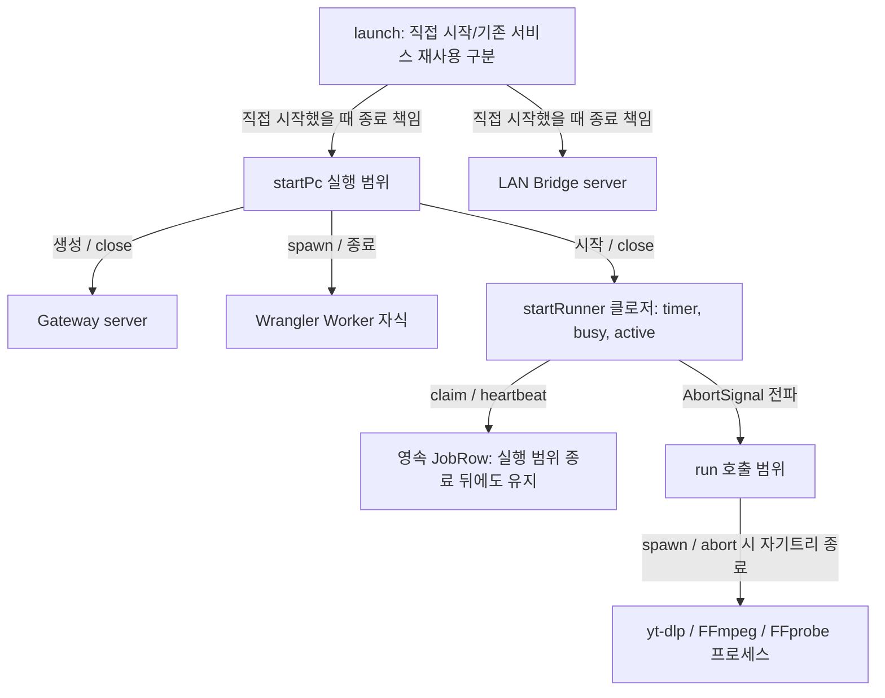
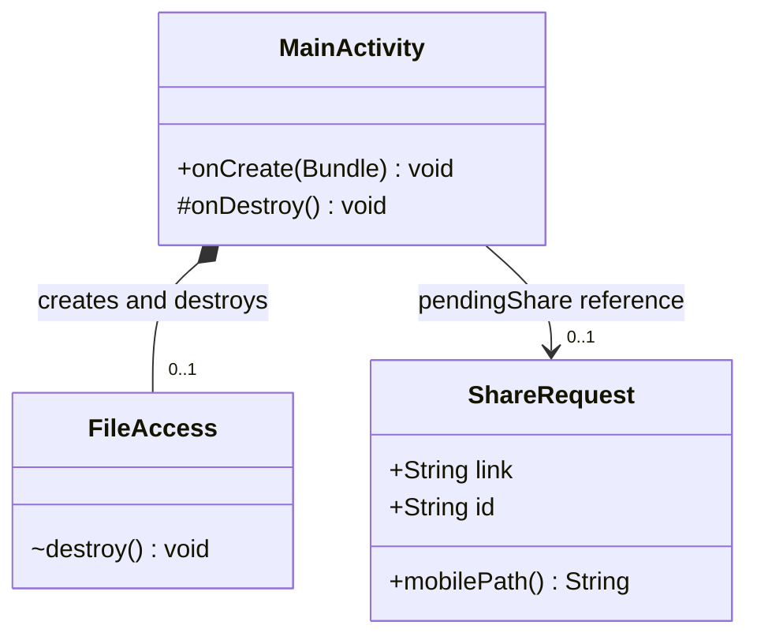

# 실행 범위·프로세스·Android 수명

[수명 조사 안내](README.md) · [작업·파일](jobs-files.md)

## 무엇을 왜 조사했는가

“작업 관리자”가 실제 클래스인지, 누가 실행 프로세스를 끝내는지 확인했다. 현재 PC 관리자는 startPc/startRunner의 함수·반환 클로저이며 JobManager 클래스가 아니다. Android는 Activity 소멸과 공유 요청의 영속 수명이 다르다. 정상 종료 코드의 책임을 설명하고 OS 강제종료까지 성공한다고 확대하지 않는다.

## 관계 표

| 주체 | 대상 | 필드/키/보관 방식 | 관계 종류 | 다중성 | 생성·삭제 책임 | 판단 근거 | UML 표기 |
|---|---|---|---|---|---|---|---|
| startPc 실행 범위 | Gateway/Worker child/runner | 지역 gateway/child/runner와 반환 close | 프로세스·서버 수명 관리 | 각각0..1,성공준비시1 | 직접 생성/listen/spawn/startRunner; close가 runner 중단·Gateway 종료·자기child 종료·runtime vars 제거 | [start.mjs](../../../../apps/pc/start.mjs) startPc/close | flowchart 관리선; 가상 class 없음 |
| startRunner 실행 범위 | timer/실행 중 job/AbortController | timer,busy,active; tick 지역 job | 단일 실행·취소 수명 관리 | poll timer1,실행job/active 각각0..1 | startRunner 생성, tick claim/AbortController; finally heartbeat해제·active=null·busy=false; close poll중단·abort·대기 | [runner.mjs](../../../../apps/pc/runner.mjs) | flowchart 관리선 |
| tick의 claimed job | D1 JobRow | id+lease 소유권 및 expiry | 시한부 실행권한, 행 소유 아님 | 한 tick에0..1 | workerAction claim/heartbeat가 발급·연장; tick 끝나도 row 유지; lease만 만료·반납 | [runner](../../../../apps/pc/runner.mjs), [workerAction](../../../../apps/web/lib/jobs/server.ts) | ID/권한 의존 |
| run 호출 범위 | spawn한 ChildProcess | child, signal listener, timer | 외부 프로세스 수명 관리 | 호출당0..1; 도구 내부 후손은별도 | run이 spawn; abort/timeout은 자기트리 kill, close/error가 settle·timer/listener해제. 정상 종료는 도구 자신 | [process.mjs](../../../../apps/pc/process.mjs) run/kill/finish | flowchart 관리선 |
| launch 실행 범위 | PC child·Bridge server | child/server, ownsPc/ownsBridge, close | 직접 시작분만 수명 관리 | 직접 소유각0..1 | 기존서비스는 probe/재사용; close가 직접 만든 대상만 종료, lock release. 공유 서비스 소유로 확대 금지 | [launcher.mjs](../../../../apps/android/launcher.mjs) launch/close | 소유 여부 노트 |
| MainActivity | FileAccess | fileAccess 필드/new FileAccess(this,...) | **생성·정리 수명 소유** | 초기화 후1 | onCreate 생성, onDestroy에서 destroy. 외부로 넘겨 수명을 이전하는 코드 없음 | [MainActivity.java](../../../../apps/android/app/src/main/java/app/cutnote/mobile/MainActivity.java) L87,698; [FileAccess.destroy](../../../../apps/android/app/src/main/java/app/cutnote/mobile/FileAccess.java) | `MainActivity *-- FileAccess` |
| FileAccess | Activity/Connection | final activity,connection | 역참조·callback 참조 | 각각1 | 생성자에서 주입; Activity 삭제 책임 없음. Connection은 현재주소 접근 구현 | [FileAccess.java](../../../../apps/android/app/src/main/java/app/cutnote/mobile/FileAccess.java) 필드/생성자 | association; 부모를 composition으로 소유하지 않음 |
| MainActivity | WebView | web 필드 | UI 자원 생성·파괴 관리 | 0..1 현재참조 | new WebView(this), destroyWeb이 stopLoading/destroy/null; 연결 재설정에서도 교체 | [MainActivity.java](../../../../apps/android/app/src/main/java/app/cutnote/mobile/MainActivity.java) L544,699 | composition 가능, 핵심그림은 생략 |
| MainActivity | ShareRequest | pendingShare | 메모리 참조, 영속값과 분리 | 0..1 | receiveShare가 create; ACK 또는 새공유로 교체; onDestroy는 pending영속값 삭제 안 함 | [MainActivity.java](../../../../apps/android/app/src/main/java/app/cutnote/mobile/MainActivity.java) L92~98,154~170,585~594,698 | association, composition 없음 |
| preferences/Bundle | 공유 링크·UUID 값 | pendingLink/pendingShareId 또는 shareId | 값 복사·복원용 저장 | 논리 pending각0..1 | persistPendingShare/apply 및 onSaveInstanceState가 기록; restore가 새 ShareRequest 객체. 현재 ACK가 preferences 제거 | [Activity](../../../../apps/android/app/src/main/java/app/cutnote/mobile/MainActivity.java); [ShareRequest.restore](../../../../apps/android/app/src/main/java/app/cutnote/mobile/ShareRequest.java) | 노트/복원 dependency |
| 공유 요청 | PC 작업 | shareId → requestId → job.id | 네트워크 ID 전달, 수명 독립 | 같은 유효ID 요청당job0..1 | PcIngest POST 후 D1 접수, ACK는 pending정리. WebView/Activity 소멸이 PC cancel을 호출하지 않음 | [PcIngest](../../../../apps/web/features/library/pc-ingest.tsx) submit/effect cleanup; [submit](../../../../apps/web/lib/jobs/server.ts) | ID 의존, composition 없음 |
| FileAccess | DownloadTransfer·Thread | active/worker | Android 파일전송 수명 관리 | 각각0..1 현재참조 | startDownload가 생성/시작; 완료callback active/worker=null; destroy가 cancel/interrupt 요청. thread join 보장 없음 | [FileAccess.java](../../../../apps/android/app/src/main/java/app/cutnote/mobile/FileAccess.java) startDownload/destroy | 관리 association, 그림 생략 |

FileAccess composition은 **Android 소유 객체의 명시적 정리 책임**만 모델링한다. GC 시점이나 destroy 호출 직후 모든 background thread가 종료된다는 보장은 아니다. 역참조 activity 필드가 있다는 이유로 양쪽에 합성 다이아몬드를 달지 않는다.

## PC 실행 범위 흐름도

이 그림은 실제 클래스 diagram이 아닌 프로세스 관리 flowchart다. Worker의 DB가 runner의 메모리 자식이 아니므로 composition으로 묶지 않았다. 라이브러리 생성자 호출 하나와 OS 프로세스 종료 성공은 다르다. 특히 launcher.close는 자기PC 종료를 최대5초 기다린 뒤 반환할 수 있고, 재사용서비스는 종료하지 않는다.

## Android 객체와 공유 참조 classDiagram

검은 다이아몬드 쪽이 생성·정리 주체다. FileAccess.destroy는 package-private이므로 `~`로 표시했다. ShareRequest는 같은 Activity 객체와 함께만 존재하는 논리 요청이 아니다. 링크·UUID가 저장되었다가 새 Activity/새 객체로 복원될 수 있어 참조선만 사용했다. 저장된 값과 heap 객체를 하나의 불멸 객체처럼 그리지 않았다.

## 학습 포인트·미확인

PC 수집과 Android “휴대폰에 영상 저장”은 서로 다른 작업이다. 전자는 PC 영속 job이라 모바일 화면 종료와 독립적이고, 후자는 FileAccess의 전송 Thread라 Activity 종료가 취소를 요청한다. 두 Download 단어만 보고 수명 소유자를 합치면 안 된다.

정상 close/finally는 코드로 확인했지만 kill·전원차단·OS Activity 회수에서 실행을 보장하지 않는다. 현재 미확인은 실제 기기 복원 타이밍, 종료 중 소켓/프로세스 잔류, 파일 정리 실패다. 다음 검증은 격리 프로세스와 JVM/Android lifecycle 테스트로 생성·정리 순서 및 영속 pending/job을 확인해야 한다. 이번에는 제품 실행·개인 데이터를 건드리지 않았다.

종합 점검: FileAccess 다중성은 초기화 전 null 가능성을 포함해 Android 개요와 같은 0..1로 표기한다. 생성 이후에는 Activity가 destroy 책임을 가진다.
