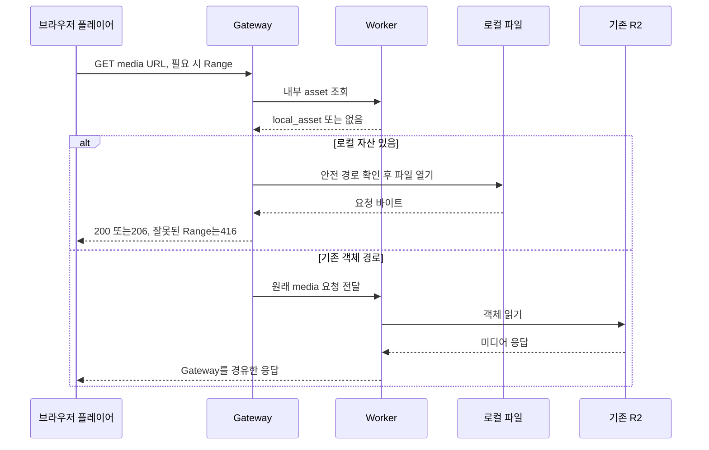
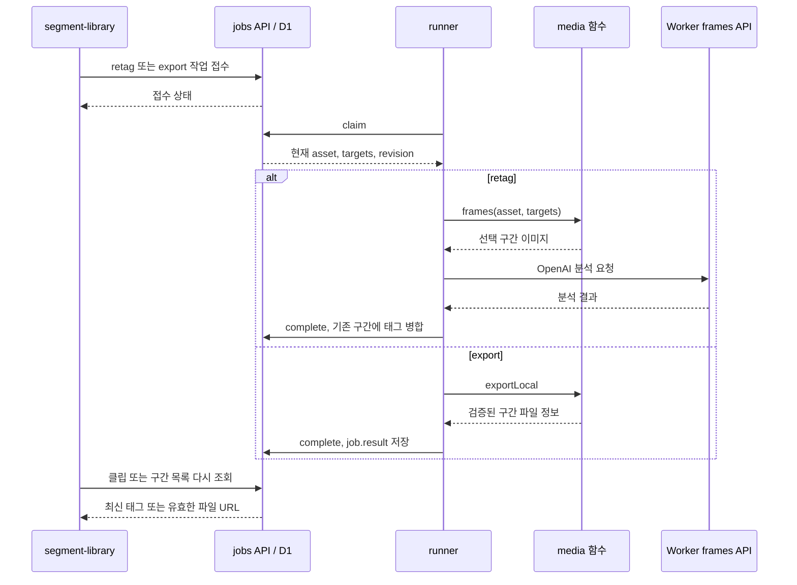
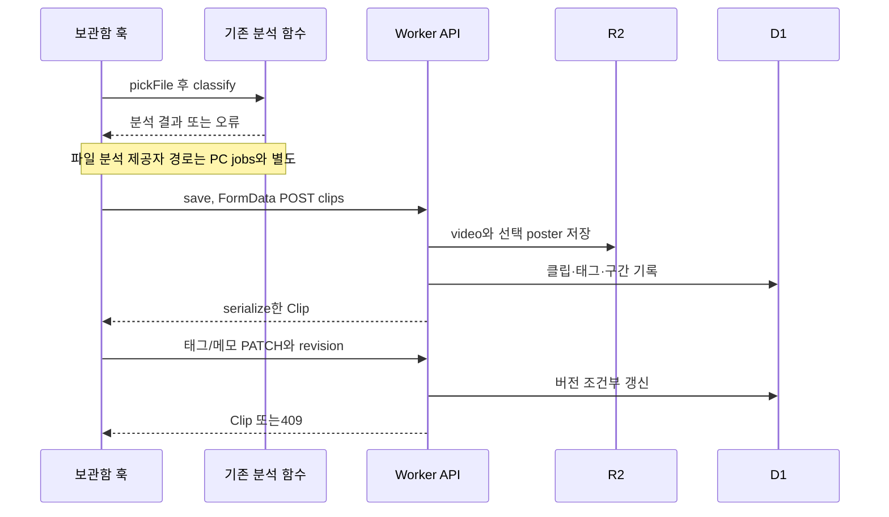

# 재생·구간 작업과 기존 기능의 경계

[전체 안내](README.md)

## 무엇을 왜 조사하는가

로컬 원본과 기존 R2 업로드는 같은 URL로 보이는데 처리도 같은가? 새로운 PC 작업과 기존 편집·분석·검색 기능의 접점을 확인해 수정 파급 범위를 찾는다. JSX 모양은 제외하고 요청 함수와 훅을 조사한다.

## 파일·심볼과 조사 결과

| 관계 | 근거 | 사실 |
|---|---|---|
| 플레이어 → media URL | [serialize](../../../apps/web/lib/server.ts), [VideoPlayer](../../../apps/web/components/media/video-player.tsx), [SourcePlayer](../../../apps/web/components/media/source-player.tsx) | 파일 URL과 외부 제공자 재생을 구분 |
| Gateway → 로컬/R2 | [createGateway/serveFile/rangeFor](../../../apps/pc/server.mjs), [media route](../../../apps/web/app/api/media/%5Bid%5D/route.ts) | local_asset면 파일 스트리밍, 아니면 Worker의 기존 객체 경로 |
| 구간 UI → retag | [segment-library](../../../apps/web/features/segments/segment-library.tsx) `retag`, [retagSegments](../../../apps/web/lib/analysis/retag-segments.ts) | localVideo면 jobs 제출 후 기존 Clip 반환. 즉시 분석 완료 결과가 아님 |
| 구간 UI → export | 같은 파일 `saveSegment`, [media.exportLocal](../../../apps/pc/media.mjs) | 로컬은 FFmpeg 작업, 업로드 원본은 브라우저 exportSegment 후 객체 저장 |
| 구간 결과 → 공개 파일 | [jobs.localSegments](../../../apps/web/lib/jobs/server.ts), [segment-media](../../../apps/web/lib/segment-media.ts) `segmentFingerprint` | 현재 원본/시간과 일치하는 export만 노출 |
| 파일 입력/저장 | [useLibraryWorkspace](../../../apps/web/features/library/use-library-workspace.ts) `pickFile`, `save`, [clips POST](../../../apps/web/app/api/clips/route.ts) | 기존 FormData/R2 경로 유지, 새 PC 링크만 jobs 분기 |
| 편집 → 조건부 저장 | [clips PATCH](../../../apps/web/app/api/clips/%5Bid%5D/route.ts), [tagging](../../../apps/web/lib/tagging.ts) | revision·검수 정책 적용 |
| 화면 갱신 | [useLibrarySync](../../../apps/web/features/library/use-library-sync.ts) `loadClips`, effect | 5초·focus/online/visibility/sync 이벤트; 오래된 응답과 중복 자동 요청 방지 |
| 검색 의도 → 순위 | [EffectExplorer](../../../apps/web/features/discovery/effect-explorer.tsx), [recommendSegments](../../../apps/web/features/discovery/recommendations.ts), [effect-query](../../../apps/web/lib/ai/effect-query.ts) | AI 의도 해석과 보관함 태그 순위 계산은 별개 |

## 원본 재생 순서

인증된 모바일 요청은 Bridge가 앞에 추가된다. local_asset가 있는데 실제 파일이 없으면 Gateway가404를 반환하며 R2로 자동 복구하지 않는다. Range는 파일의 일부 바이트를 읽는 HTTP 계약이며 영상 구간 시간 분석과 다른 개념이다. 구간 시작/끝 재생 제어는 플레이어의 playback range 처리다.

## 로컬 구간 작업

메시지는 성공 기본 경로다. checkpoint 재사용·실패·취소는 [작업 상태 문서](jobs.md)를 따른다. export는 AI를 호출하지 않고 영상·오디오를 변환한다. 구간/원본이 바뀌면 예전 export를 목록에서 숨기지만 파일을 자동 영구 삭제하는 것은 아니다.

## 기존 파일 저장과 검색 경계

위 파일 입력은 pickFile/save의 순서를 단순화한 것이다. 파일 선택이 즉시 D1/R2 저장을 뜻하지 않는다. 실패 보상 삭제와 제공자 세부 분기는 그림에서 생략했다. 기존 비 PC 모바일 분석은 화면 AbortController 수명에 의존한다. 새 jobs의 영속성이 모든 분석 경로에 적용된 것은 아니다.

효과 검색은 EffectExplorer가 의도를 준비하고 `recommendSegments(items,intent,feedback,exclude)`를 화면에서 호출한다. 자연어는 [effect-query API](../../../apps/web/app/api/ai/effect-query/route.ts)의 제공자 해석을 사용할 수 있고 preset/선택 구간도 있다. [사진 검색](../../../apps/web/lib/ai/image-query.ts)은 선택 제공자에 이미지를 보내며 [image-search 규칙](../../../apps/web/features/discovery/image-search.ts)이 보관함 구간과 비교한다. [YouTube 추천](../../../apps/web/lib/ai/youtube-discovery.ts)은 별도 OpenAI 웹 검색/공개 후보 수집 경로다. 세 기능을 다운로드 작업자로 통합한 서비스는 코드에 없다.

## 판단 근거와 학습 포인트

같은 UI의 버튼이라도 실행 주체가 다르다. `localVideo` 조건문, 직접 호출된 함수, 요청 경로를 따라가야 한다. import만으로 Gemini가 모든 요청에 호출된다고 판단할 수 없다. 새 로컬 수집/retag는 frames API의 OpenAI를 사용하지만 기존 분석·사진/효과 해석의 Gemini 선택지는 남아 있다.

`features`에 있는 recommendations 같은 순수 규칙은 서버에서도 사용한다. 폴더 이름만으로 프론트엔드 전용이라고 단정하지 않는다. 같은 URL 추상화가 로컬 파일/R2의 저장 소유 정책까지 동일하게 만들지는 않는다.

## 관련 문서·미확인

[태깅](../tagging.md), [기술 기준](../local-video-ingestion-reference.md), [검증](../local-video-ingestion-progress.md). 이번 조사는 실시간 재생·검색 품질·유료 AI 호출을 하지 않았다. provider별 파일 분석 세부/외부 플레이어 SDK/UI 전체는 이 UML의 상세 범위 밖이며 위 코드에서 이어서 확인한다.
