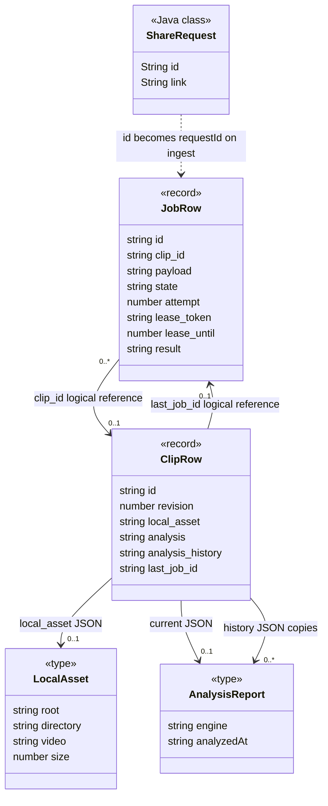
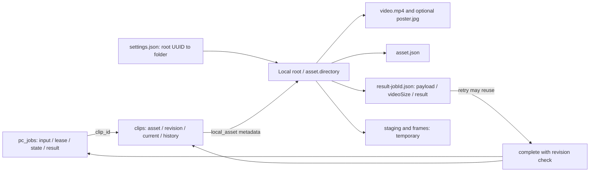

# 9단계: 작업 영속화·재시도·분석 이력

2026-10-03 작업 트리 기준. [UML 안내](../README.md) · [핵심 도메인](../domain/README.md) · [재시도·재시작 시퀀스](sequences.md) · [일관성과 보장 범위](guarantees.md)

## 무엇을 왜 조사했는가

화면 종료, API 응답 유실, PC 종료 이후 어떤 데이터를 근거로 다시 처리하는지 조사했다. 작업의 재실행 정보와 분석 결과 이력은 목적이 다르다. 확인한 경로에는 Memento 객체, 편집 명령 스택, undo/redo API가 없다. 아래의 체크포인트를 전체 클립 상태를 되돌리는 스냅샷으로 해석하지 않는다.

주요 근거는 [jobs/server.ts](../../../../apps/web/lib/jobs/server.ts)의 submit/recover/changeJob/workerAction/complete, [runner.mjs](../../../../apps/pc/runner.mjs)의 startRunner, [media.mjs](../../../../apps/pc/media.mjs)의 download/frames/cleanTemporary, [settings.mjs](../../../../apps/pc/settings.mjs)의 atomicJson, [클립 PATCH](../../../../apps/web/app/api/clips/[id]/route.ts)다. 저장 선언은 [0009 migration](../../../../apps/web/drizzle/0009_pc_jobs.sql), 공개 타입은 [jobs/types.ts](../../../../apps/web/lib/jobs/types.ts), 분석 값 타입은 [analysis/types.ts](../../../../apps/web/lib/analysis/types.ts)를 확인했다.

## 보존 데이터와 복구 방식

| 요소 | 보존 데이터 | 저장 위치 | 기록 시점 | 복구/재시도 방식 | 보장 범위 | 근거 |
|---|---|---|---|---|---|---|
| Android ShareRequest | link, UUID id | Activity 필드, Bundle, SharedPreferences의 pendingLink/pendingShareId | 공유 수신·상태 저장; accepted/saved ACK 뒤 제거 | 연결 재시도·Activity 재생성 때 같은 ID 복원 | 하나의 보류 공유를 보존; PC 접수 완료와 분석 완료는 다름 | [ShareRequest.create/restore](../../../../apps/android/app/src/main/java/app/cutnote/mobile/ShareRequest.java), [MainActivity.persistPendingShare/onSaveInstanceState](../../../../apps/android/app/src/main/java/app/cutnote/mobile/MainActivity.java) |
| PC 브라우저 요청 | requestId | PcIngest useRef; 모바일은 shareId URL | 최초 submit, 입력 변경/PC 접수 성공 시 초기화 | 응답 실패 후 같은 화면에서 같은 ID 재접수 | 일반 PC 입력의 미접수 ID를 브라우저 재시작까지 영속 보관하지 않음 | [PcIngest.submit](../../../../apps/web/features/library/pc-ingest.tsx), [shareLaunch](../../../../apps/web/lib/mobile-share.ts) |
| 작업 접수 식별 | id, clip_id, kind, payload | D1 pc_jobs; ingest 클립도 batch INSERT | submit 성공 전 | 같은 ID+동일 payload/kind/clip이면 기존 작업 반환 | URL 전체에 대한 중복 제거 아님; 새 공유 ID면 같은 영상도 별도 작업 | [submit](../../../../apps/web/lib/jobs/server.ts) |
| 작업 입력 | canonical source, targets, fields, segments, 접수 당시 asset 문자열 | pc_jobs.payload JSON TEXT | 최초 접수 | retry는 원래 payload 유지, claim은 현재 clip/asset/revision을 별도 제공 | 입력 변경은 새 요청; 현재 구간 변경은 complete에서 충돌 가능 | [submit/claim/complete](../../../../apps/web/lib/jobs/server.ts) |
| 작업 상태 | state, phase, progress, attempt, error_code, cancel_requested, 시각 | pc_jobs 행 | claim/progress/fail/cancel/retry/complete | failed/interrupted/cancelled를 같은 행 queued로 변경 | attempt는 claim마다 증가; retry에서 attempt/result/payload는 지우지 않음 | [changeJob/workerAction](../../../../apps/web/lib/jobs/server.ts) |
| 작업 임대 | lease_token, lease_until | pc_jobs 행 | claim 시 60초; heartbeat마다 60초 연장 | 만료 running을 recover가 interrupted 또는 cancelled로 전환 | Node 메모리 타이머 자체는 복원하지 않음; 이전 임대의 API는 409 | [recover/workerAction](../../../../apps/web/lib/jobs/server.ts), [5초 heartbeat](../../../../apps/pc/runner.mjs) |
| 저장 폴더 매핑 | rootId, roots, tools | PC runtime의 settings.json | 설정 생성/변경 시 atomicJson | 같은 설정을 읽어 기존 root UUID를 실제 폴더에 연결 | 설정·폴더가 모두 보존되어야 함; 기본 runtime은 apps/web/.cutnote-pc | [loadSettings](../../../../apps/pc/settings.mjs), [startPc](../../../../apps/pc/start.mjs) |
| 완료 원본 | video.mp4, asset 메타, 선택 poster.jpg | 선택 root/jobId 및 asset.json | 정규화 파일 rename 뒤 manifest; poster 시도 전후 기록 | DB asset 있으면 파일 stat; 없으면 download가 manifest+크기 확인 후 재사용 | 파일 내용 hash 검증 아님; manifest만으로 D1 클립을 복원하지 않음 | [download/assetFile](../../../../apps/pc/media.mjs), [startRunner](../../../../apps/pc/runner.mjs) |
| 클립 원본 연결 | local_asset, revision | clips JSON/INTEGER | 다운로드 반환 후 attach | claim에서 현재 연결을 읽어 다운로드 생략 | 원본이 없으면 source_missing; 자동 원본 재수집 없음 | [attach](../../../../apps/web/lib/jobs/server.ts), [startRunner](../../../../apps/pc/runner.mjs) |
| 임시 다운로드/프레임 | source 조각, 정규화 중간 파일, jpg 프레임 | root/jobId/staging, root/asset.directory/frames | 다운로드·프레임 추출 중 | finally 및 startPc의 cleanTemporary에서 삭제 | PC 재시작 시 부분 다운로드/프레임 이어받기 보장 없음 | [media.mjs](../../../../apps/pc/media.mjs), [start.mjs](../../../../apps/pc/start.mjs) |
| 분석 체크포인트 | payload 문자열, videoSize, result | 원본 폴더/result-jobId.json | AI 응답 JSON 수신 후, DB complete 전 | payload 문자열과 asset.size가 일치하면 프레임 추출·AI 호출 생략 | 모델/프롬프트 버전·파일 hash·현재 revision 비교 없음 | [startRunner](../../../../apps/pc/runner.mjs), [atomicJson](../../../../apps/pc/settings.mjs) |
| 최종 작업 결과 | 분석 result 또는 export asset | pc_jobs.result JSON | complete 성공 시 | 공개 job DTO에는 제외; export 목록은 완료 result 조회 | 분석 재시도는 DB result가 아닌 파일 체크포인트를 읽음 | [complete/publicJob/localSegments](../../../../apps/web/lib/jobs/server.ts) |
| 현재 분석 | AnalysisReport 또는 null | clips.analysis JSON | POST/PATCH, PC ingest/analyze complete | 현재 화면에 표시하는 분석 값 | retag complete는 기존 현재 report를 유지 | [클립 POST](../../../../apps/web/app/api/clips/route.ts), [PATCH](../../../../apps/web/app/api/clips/[id]/route.ts), [complete](../../../../apps/web/lib/jobs/server.ts) |
| 분석 이력 | AnalysisReport 배열 | clips.analysis_history JSON | POST 초기화, PATCH·PC complete | 과거 분석 결과 보존; retag 결과도 추가 | 전체 Clip/파일/편집 복원 데이터 아님; PATCH 상한 예외 있음 | [PATCH](../../../../apps/web/app/api/clips/[id]/route.ts), [수명 조사](../lifetime/data.md) |
| 클립 편집 버전 | revision, last_job_id | clips INTEGER/TEXT | 일반 PATCH/attach/분석 complete | SQL WHERE revision으로 충돌 검출; complete batch가 last_job_id와 증가 revision 연결 | 과거 상태 복구 번호 아님; favorite는 증가시키지 않음 | [PATCH](../../../../apps/web/app/api/clips/[id]/route.ts), [complete](../../../../apps/web/lib/jobs/server.ts), [favorites](../../../../apps/web/features/library/favorites.ts) |

### 요청 중복 판정의 정확한 범위

Android의 shareId는 PcIngest가 requestId로 전달하고 서버가 소문자 UUID v4로 확인한다. ingest에서는 job.id=clip.id=requestId이며, retag/analyze/export는 별도 작업 ID가 기존 clip_id를 가리킨다. source는 canonicalSource로 정규화하지만 중복 식별의 기본 키는 URL이 아니라 요청 ID다.

payload는 `{source, targets, fields, segments, asset}`를 JSON.stringify한 문자열이다. 기존 행 비교에는 payload/kind/clip_id가 사용되고, 동시 INSERT 뒤 재검사에는 payload/kind가 사용된다. 재시도는 submit 재호출과 다르다. submit은 기존 실패 상태를 반환할 뿐이고, changeJob의 retry가 queued로 전환한다. retag/export는 기존 작업을 찾기 전에도 현재 클립·구간을 검사하므로, 나중에 원본·구간이 바뀌거나 삭제되면 이전 요청 재접수가 거절될 수 있다.

학습 포인트: 같은 요청을 두 번 보내도 한 행을 쓰는 것은 외부 AI 호출이 정확히 한 번 발생한다는 뜻이 아니다. AI 성공 후 체크포인트 기록 전에 중단되면 재호출할 수 있다. Android의 복원 ID 검사와 웹의 UUID v4 검사가 동일하지 않지만 정상 create는 UUID.randomUUID를 사용한다.

## 작업·이력 데이터 구조도

읽는 방법: JobRow/ClipRow는 실제 선언의 일부 필드만 표시했다. nullable/optional 상세는 원본을 따른다. job→clip의 0..1은 클립 삭제 뒤 작업 행이 남을 수 있음을 나타내며 FK가 아니다. 같은 report 타입을 써도 현재 결과와 이력은 별도 JSON 값이다. 합성·상속이나 복원 명령 객체를 추가하지 않았다.

파일 체크포인트는 이름 붙은 TS 클래스가 아니라 startRunner가 쓰는 JSON 객체다. 아래 flowchart는 저장 위치를 설명하는 그림이며 정식 UML 배포 표기가 아니다.

## 검증과 관련 자료

소스·SQL과 [pc-jobs 테스트](../../../../tests/web/pc-jobs.test.ts), [Node runtime 테스트](../../../../tests/pc/runtime.test.mjs)를 보조 증거로 대조했다. 이번 단계에서 제품 테스트나 실제 PC 강제 종료·서비스 호출을 실행하지 않았다. Mermaid 자동 파싱·시각 렌더링은 미검증이다. 실제 복구 절차와 남은 검증은 [시퀀스](sequences.md)와 [보장 표](guarantees.md)를 따른다.
