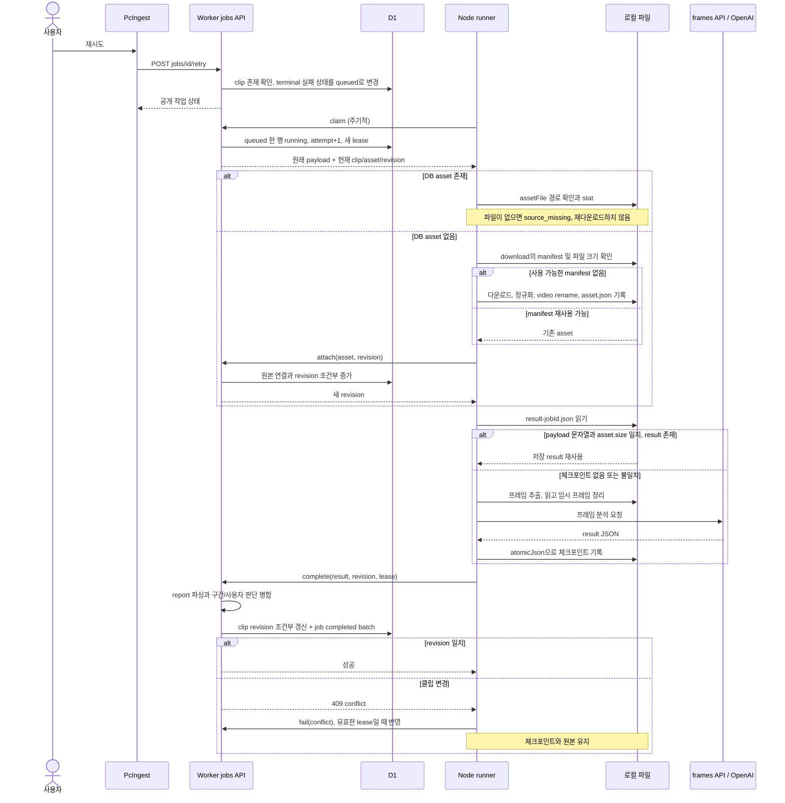
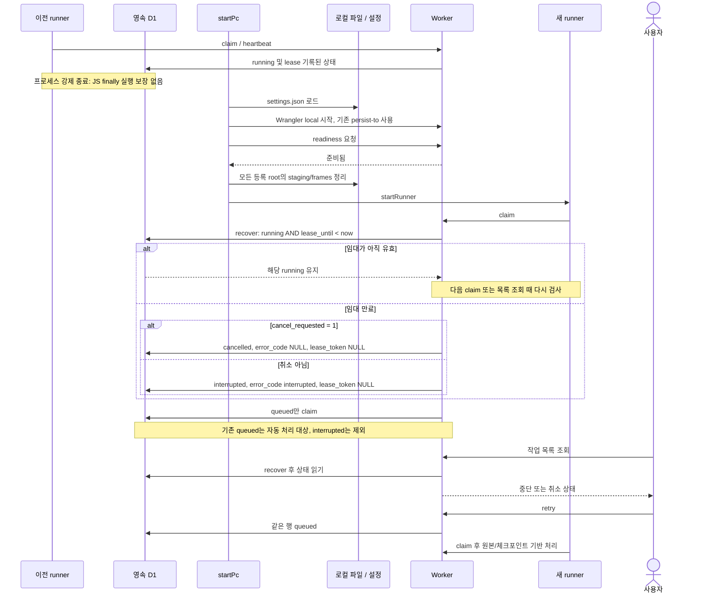

# 재시도와 PC 재시작 복구 순서

[9단계 안내](README.md) · [일관성과 보장](guarantees.md)

## 조사 질문과 호출 근거

재시도 버튼이 마지막 단계의 명령을 다시 호출하는가, 작업을 다시 claim하는가? PC 재시작 시 모든 running 작업을 바로 queued로 바꾸는가? [PcIngest.action](../../../../apps/web/features/library/pc-ingest.tsx), [changeJob/recover/workerAction](../../../../apps/web/lib/jobs/server.ts), [startRunner](../../../../apps/pc/runner.mjs), [startPc](../../../../apps/pc/start.mjs)를 따라 확인했다.

| 구간 | 실제 호출 | 판단 |
|---|---|---|
| 사용자의 재시도 | POST /api/jobs/id/retry → changeJob → queued | 같은 작업 행과 입력 유지, 단계별 함수 직접 호출 아님 |
| 원본 선택 | claim.asset → stat 또는 download → attach | 원본 존재 여부와 manifest가 재다운로드를 결정 |
| 결과 선택 | checkpoint 읽기 → 비교 → extractFrames/AI 또는 complete | 화면의 phase 숫자로 재개 지점을 정하지 않음 |
| 시작 | startPc → readiness → cleanTemporary → startRunner | 정리 후 큐 폴링 시작 |
| 만료 검사 | listJobs 및 claim → recover | running의 lease_until이 지난 경우만 상태 변경 |
| 정상 종료 | close → runner.close → abort → fail 시도 → Worker 종료 | fail 전달 실패 시 이후 만료 회수에 의존 |

그림의 API는 Worker route와 jobs/server 함수를 묶은 lifeline이다. 요청의 Gateway/LAN Bridge 인증 경유는 [기존 계층 시퀀스](../layers/pc-sequence.md)에 있으며 여기서는 생략했다. 화살표는 호출·응답이고 타이머들의 정확한 실행 순서를 보장하는 그림은 아니다.

## 수동 재시도

이 그림은 ingest/analyze/retag 경로다. source_missing, attach 충돌, 분석 오류는 그 지점에서 catch→fail로 종료하며 아래 단계로 계속 진행하지 않는다. export는 분석 체크포인트 분기 전에 exportLocal→complete로 빠진다. export 재시도는 기존 출력 검사를 통한 재사용 없이 다시 변환한다. 단계 표시(progress)는 보조 정보이고 다운로드 콜백의 progress 전송 오류는 무시될 수 있다.

## PC 재시작과 중단 회수

DB 저장 위치는 [startPc](../../../../apps/pc/start.mjs)의 Wrangler `--local --persist-to`로, 기본값은 `apps/web/.wrangler/state`이고 인자로 변경할 수 있다. 재시작해도 같은 경로를 사용한다는 조건이다. 앱 시작 자체가 DB·원본 백업 복원 기능은 아니다.

임대는 60초이며 runner는 5초마다 heartbeat를 보낸다. 정상적인 폴링 주기는 1.5초다. recover는 DB의 phase/progress/lease_until을 초기화하지 않으므로, interrupted 행에 이전 단계·진행률이 남을 수 있다. retry가 phase=queued/progress=0을 기록한다. PC/Worker가 멈춘 동안에는 만료를 기록하는 프로세스도 없으며, 다음 기동·조회에서 반영한다.

## 학습 포인트·남은 검증

복구는 실행 중 함수의 메모리를 복원하는 것이 아니라 영속 데이터로 다음 실행을 결정하는 방식이다. lease는 작업 소유권의 제한 시간이고 revision은 클립 편집 충돌의 기준이므로 역할이 다르다.

위 순서는 소스 호출과 SQL로 확인했다. 실제 전원 차단, 응답 유실, 저장 장치 오류, 다중 실행기 경쟁을 재현한 결과는 아니다. 격리된 실행 환경에서 임대 만료 전후, AI 응답 직후, 파일 rename과 attach 사이에 중단을 주입하고 DB/파일을 함께 관찰하는 검증이 남아 있다. Mermaid 자동 파싱·렌더링도 미검증이다.
