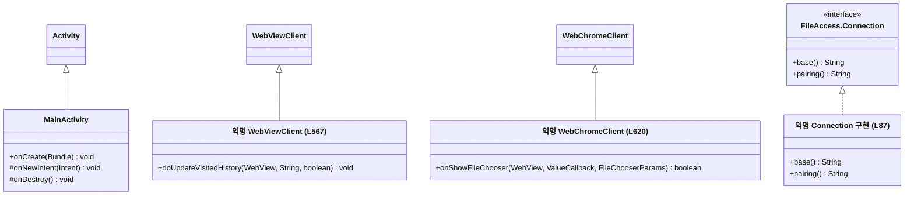
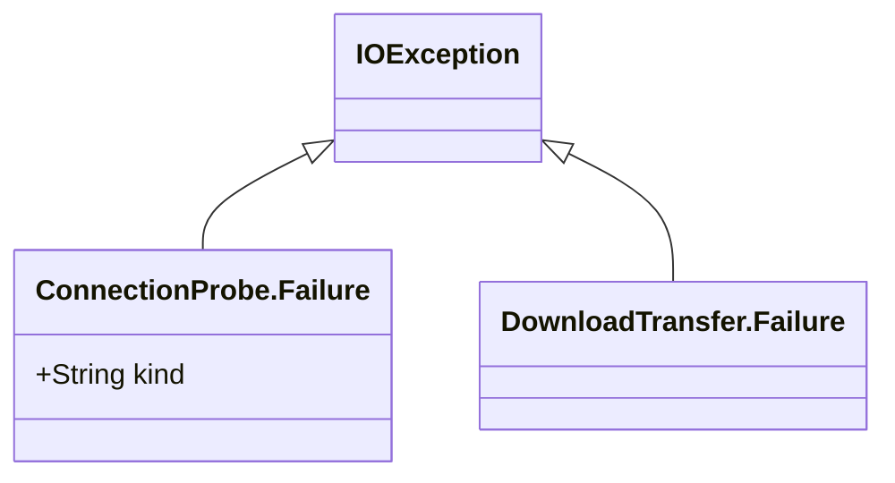
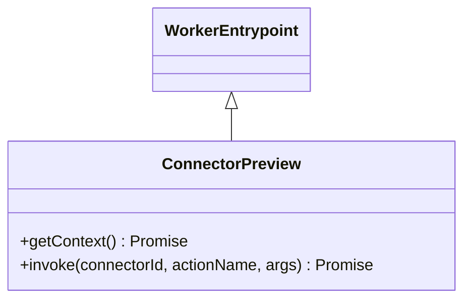

# 실제 클래스 일반화와 인터페이스 구현

[관계 조사 안내](README.md) · [타입 조합](type-composition.md)

## 조사 질문·확인 위치

실제 객체의 부모는 무엇이며 어떤 메서드를 바꾸는가? Java의 new 익명 클래스와 함수형 interface lambda도 확인하되 가상의 named class를 만들지 않는다. 근거 표의 줄 번호는 이번 작업 트리 기준이며 파일 링크는 해당 선언을 포함한다.

## 관계 표

| 상위 요소 | 하위 요소 | 코드 표현 | 관계 종류 | abstract 여부 | 관련 메서드 | 근거 | UML 표기 |
|---|---|---|---|---|---|---|---|
| android.app.Activity | MainActivity | `final class MainActivity extends Activity` | Java 런타임 상속 | 하위 concrete/final | @Override onCreate, onNewIntent, onBackPressed, onSaveInstanceState, onPause/onResume, onActivityResult, onDestroy | [MainActivity.java](../../../../apps/android/app/src/main/java/app/cutnote/mobile/MainActivity.java) L49,82~698 | `Activity <\|-- MainActivity` |
| java.io.IOException | ConnectionProbe.Failure | `static final class Failure extends IOException` | Java 런타임 상속 | 하위 concrete/final | package-private Failure(String kind), super(kind); override 없음 | [ConnectionProbe.java](../../../../apps/android/app/src/main/java/app/cutnote/mobile/ConnectionProbe.java) L18~20 | `IOException <\|-- ProbeFailure` |
| java.io.IOException | DownloadTransfer.Failure | `static final class Failure extends IOException` | Java 런타임 상속 | 하위 concrete/final | public Failure(String message), super(message); override 없음 | [DownloadTransfer.java](../../../../apps/android/app/src/main/java/app/cutnote/mobile/DownloadTransfer.java) L16 | `IOException <\|-- TransferFailure` |
| android.webkit.WebViewClient | MainActivity의 익명 객체 | `new WebViewClient() {...}` | Java 익명 subclass | 하위 concrete, 이름 없음 | @Override shouldOverrideUrlLoading/onPageStarted/onPageFinished/doUpdateVisitedHistory/onReceivedError/onReceivedHttpError/onReceivedSslError | [MainActivity.java](../../../../apps/android/app/src/main/java/app/cutnote/mobile/MainActivity.java) L567~619 | `WebViewClient <\|-- WebClientAt567` |
| android.webkit.WebChromeClient | MainActivity의 익명 객체 | `new WebChromeClient() {...}` | Java 익명 subclass | 하위 concrete, 이름 없음 | @Override onShowFileChooser/onProgressChanged/onCreateWindow | [MainActivity.java](../../../../apps/android/app/src/main/java/app/cutnote/mobile/MainActivity.java) L620~633 | `WebChromeClient <\|-- ChromeClientAt620` |
| FileAccess.Connection | MainActivity의 익명 객체 | `new FileAccess.Connection() {...}` | Java interface 구현 | interface 메서드 암시적 abstract; 구현은 concrete | public @Override base(), pairing() | [MainActivity.java](../../../../apps/android/app/src/main/java/app/cutnote/mobile/MainActivity.java) L87~90; [FileAccess.java](../../../../apps/android/app/src/main/java/app/cutnote/mobile/FileAccess.java) L23 | `Connection <\|.. ConnectionAt87` |
| DownloadTransfer.Progress | FileAccess.startDownload의 lambda | `(bytes,total) -> activity.runOnUiThread(...)` | Java 함수형 interface 대상 구현 | update는 암시적 public abstract; lambda가 본문 제공 | Progress.update(long,long), copy(...,Progress) | [FileAccess.java](../../../../apps/android/app/src/main/java/app/cutnote/mobile/FileAccess.java) L147~150; [DownloadTransfer.java](../../../../apps/android/app/src/main/java/app/cutnote/mobile/DownloadTransfer.java) L15,33 | 클래스 노드 생략, callback 계약으로 설명 |
| cloudflare:workers.WorkerEntrypoint | ConnectorPreview | `class ConnectorPreview extends WorkerEntrypoint` | **JavaScript** 런타임 상속 | 하위 concrete, abstract/implements 문법 없음 | async getContext(), invoke(...): virtual binding 위임. 부모 메서드 override 여부는 단정 안 함 | [connector-preview-worker.mjs](../../../../apps/web/build/connector-preview-worker.mjs) L1~14 | `WorkerEntrypoint <\|-- ConnectorPreview` |

ConnectionProbe.Failure와 DownloadTransfer.Failure는 이름만 같고 서로 다른 nested class다. 그림에서 합치지 않는다. `static` nested는 바깥 인스턴스가 필요 없다는 뜻이고 상위 IOException과의 상속을 제거하지 않는다. MainActivity가 Activity를 상속한다고 WebViewClient까지 상속하는 것은 아니다. 익명 callback 객체는 MainActivity가 만들고 등록하는 별도 객체다.

## Android 경계 classDiagram

읽는 방법: 부모 쪽의 빈 삼각형을 본다. 마지막 선만 interface realization이므로 점선이다. `+` public, `#` protected. 외부 플랫폼 부모의 모든 필드·메서드는 생략했다. 자식의 concrete override에는 추상 메서드 표시를 하지 않는다. 생성·등록 관계는 기존 [Android 조사](../android.md)에 있으므로 이 그림에 합성 관계를 추가하지 않았다.

## 예외의 작은 계층

읽는 방법: 두 예외는 형제 클래스다. 연결 probe는 kind를 갖고, 파일 전송 예외는 메시지를 부모 생성자에 전달한다. 바깥 클래스 ConnectionProbe/DownloadTransfer와의 중첩을 상속 화살표로 표현하지 않는다. 전체 Throwable 계층은 이번 기능 흐름에 필요하지 않아 확대하지 않았다.

## 개발용 JS RPC의 상속

[vite.config.ts](../../../../apps/web/vite.config.ts) L71~95는 command가 serve일 때만 auxiliary worker와 entrypoint를 등록한다. 따라서 이 클래스는 로컬 개발용 connector preview 경계다. 일반 PC job runner의 부모 클래스가 아니고 다운로드 경로에 이 RPC를 끼워 넣으면 안 된다. [메서드 계약](../contracts/README.md)의 함수 모듈과도 구분한다.

## 없는 관계·생략 이유와 학습 포인트

- Java9개 파일에는 명명 class의 `implements`와 `abstract class`가 없다. 인터페이스 구현은 익명 Connection과 Progress lambda의 실제 호출 위치로 확인했다. Progress lambda를 `ProgressService` 같은 클래스로 만들지 않았다.
- UI listener·Runnable lambda는 플랫폼 callback 사용이다. `new Thread(() -> ...)`, `runOnUiThread`, 다운로드 listener를 Activity의 implements 목록으로 바꾸지 않는다. 이들의 내부 합성/런타임 lambda 클래스 생성 방식은 이번 UML의 대상이 아니다.
- 선정 TS/JS의 클래스3개는 모두 `.mjs`에 있다. TypeScript class extends/implements와 interface extends는0곳이다. [NpmCacheProgress](../../../../apps/web/scripts/npm-install.mjs) L21과 [InstallProgress](../../../../apps/web/scripts/pnpm-install.mjs) L41은 명시적 상위 없이 선언된 설치 도구여서 상속 그림에서 제외했다.
- Java의 암시적 Object 부모, 외부 SDK 전체 계층은 표에 반복하지 않는다. `final`은 추가 subclass 금지이며 abstract와 반대 개념의 동일 축으로 단순 대체할 수는 없다.

미확인: 외부 SDK 부모의 전체 modifier/상속 트리와 런타임 callback 타이밍, Mermaid 렌더링. 소스에서 선언한 상속과 override는 확인했으나 이번에 APK/Worker RPC를 실행하지 않았다. 관계가 적다는 결과를 보완하려고 타입 별칭이나 함수에 상속을 만들어 넣지 않았다.
