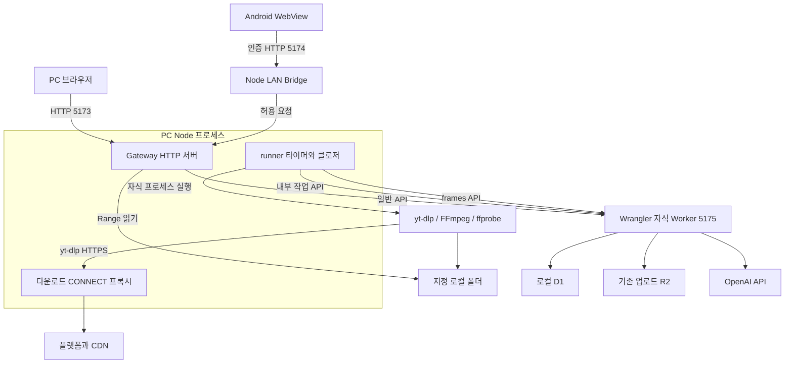

# 프로세스·배포와 함수 모듈

[전체 안내](README.md)

## 무엇을 왜 조사하는가

브라우저에서 다운로드 프로그램을 실행하는가? Gateway와 작업자는 별도 서버인가? 실행 위치를 알아야 취소·화면 종료·인증 경계를 혼동하지 않는다.

## 확인한 파일·심볼과 결과

| 관계 | 실행 근거 | 결과 |
|---|---|---|
| npm start → PC 시작 | [start-pc.mjs](../../../apps/web/scripts/start-pc.mjs)의 `startPc()` | Node 실행 진입점 |
| Android launcher → PC 자식/Bridge | [launcher.mjs](../../../apps/android/launcher.mjs)의 spawn·`createBridge` 호출 | 기존 서버 재사용 또는 자신이 시작한 프로세스 관리 |
| startPc → Gateway·runner | [start.mjs](../../../apps/pc/start.mjs)의 `createGateway`, `startRunner`, `close` | **같은 Node 프로세스 안**의 HTTP 서버와 타이머/클로저 |
| startPc → Worker | 같은 파일의 Wrangler `spawn`·readiness | 별도 자식 실행, loopback 5175 |
| Gateway → Worker | [server.mjs](../../../apps/pc/server.mjs)의 `createGateway`/`http.request` | 일반 API를 프록시하고 내부 경로는 차단 |
| runner → 도구 | [runner.mjs](../../../apps/pc/runner.mjs)의 `downloadMedia`/`extractFrames`/`exportLocal`; [media.mjs](../../../apps/pc/media.mjs) → [process.mjs](../../../apps/pc/process.mjs)의 `run` | shell 없이 실행한 자식 프로세스. 브라우저/Worker 실행 아님 |
| 도구 → 웹 | [egress.mjs](../../../apps/pc/egress.mjs)의 CONNECT 처리·DNS 검사; media의 proxy 인자 | 허용 플랫폼/CDN 및 공개 IPv4 연결 |
| Worker → D1/R2 | [server.ts](../../../apps/web/lib/server.ts)의 `database`/`bucket`; [clips POST](../../../apps/web/app/api/clips/route.ts) | DB와 기존 업로드 객체 저장 |
| Worker → OpenAI | [frames POST](../../../apps/web/app/api/ai/frames/route.ts)의 `apiKey('openai')`·`generateFrames` | 신규 PC 수집은 OpenAI 전용 |

## 구조 그림과 읽는 방법

네트워크·호출 방향은 요청자→대상이다. Disk를 가리키는 선은 파일 I/O이며 네트워크 요청이 아니다. Node 박스는 해석상 실행 경계이며 별도 `PcNode` 클래스가 없다. local 모드의 D1/R2는 Wrangler 상태에 보존하며 클라우드와 자동 동기화하지 않는다. 온라인 배포는 이 PC 프로세스 그림에 포함하지 않았다.

## 판단 근거와 학습 포인트

`startRunner`는 `{tick, busy, close}`를 반환하는 함수다. 전용 Worker OS 프로세스나 메시지 브로커가 아니다. 단일 runner의 `busy` 플래그와 SQL claim이 실행을 조정한다. 수명 관리는 `startPc.close`가 runner→Gateway→자식 종료를 수행하는 것으로 확인했다. 논리 책임이 분리되어 있다고 프로세스가 분리된 것은 아니다.

Bridge는 인증·API allowlist, Gateway는 PC Host/Origin·설정·파일 경계, 내부 Worker는 Bearer 작업 인증을 맡는다. 이 경계는 보안 역할 분담이라는 해석이며 서로 독립된 마이크로서비스로 배포한 구조는 아니다. loopback도 같은 PC의 모든 악성 프로세스를 차단하는 사용자별 권한 모델은 아니다.

## 관련 문서·미확인

[LAN](../lan.md), [PC API 기준](../local-video-ingestion-reference.md), [알려진 권한 결함](../documentation-review-2026-10-03.md). 실제 여러 OS의 프로세스 종료·전원 장애·인터넷 공개 운영을 이 조사에서 실행하지 않았다. 새 PC 경로 밖의 Gemini/검색 통신은 [기능 경계](media-and-features.md)에 별도로 설명한다.
