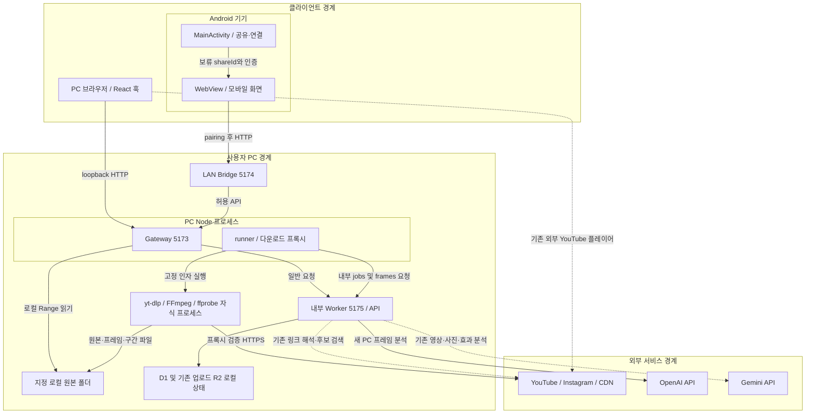

# UML 상세 조사 대상 선정

2026-10-03 현재 작업 트리 기준. [전체 UML 안내](README.md) · [전체 파일 메타데이터 목록](inventory.md)

## 조사 질문과 기준

어떤 파일을 실행 구조의 근거로 읽고 어떤 파일은 제외할 것인가? 전체 목록과 현재 진입점에서 시작한 호출 경로를 대조했다. 포함은 상세 UML 조사 대상, 보조는 설정/검증/이력 또는 활성 호출 미확인 코드, 제외는 상세 모델에 넣지 않는 대상이다. 보조나 제외는 삭제 권고가 아니다.

`apps/web`, `apps/android`, `apps/pc`가 현재 위치다. 이전 `main` 사본을 실행 기준으로 사용하지 않는다. 아래 분류는 **실행문·필드·요청 경로로 확인한 사실**과 조사 범위를 선택한 **판단**을 함께 적었다. 브라우저/Worker 공통 타입은 빌드 때 지워지므로 타입 선언 자체가 실행된다는 뜻은 아니다. 경로는 저장소 루트 기준이며 각 링크는 실제 파일을 가리킨다.

## 전체 구조 지도

```text
React-Cutnote/
├─ apps/
│  ├─ pc/                  [포함] Node Gateway·다운로드·작업·로컬 파일
│  ├─ web/
│  │  ├─ app/api/          [포함] Worker HTTP API
│  │  ├─ lib/              [포함 중심] 도메인·DTO·분석·저장·공통 규칙
│  │  ├─ features/         [선별 포함] 요청·분석·동기화·검수 훅/컴포넌트
│  │  ├─ components/media/ [선별 포함] 재생 상태·탐색 경계
│  │  ├─ db/, drizzle/     [포함/보조] 정의·SQL·도구 메타데이터
│  │  ├─ build/, scripts/  [포함/보조] 실행 진입·빌드 입력 코드
│  │  ├─ data/taxonomy/    [보조] 사전 원본과 schema
│  │  └─ dist/, 캐시/상태  [제외] 생성물·개인 데이터: 내용 미열람
│  └─ android/
│     ├─ app/src/main/     [포함] manifest·공유/연결/전송 Java
│     ├─ bridge/          [포함] LAN 인증·프록시; 테스트/안내는 보조
│     └─ launcher.mjs     [포함] PC·Bridge 시작/재사용/종료
├─ tests/, scripts/       [보조] 검증 도구, 운영 구성 요소 아님
├─ docs/                  [보조] 현재 안내와 당시 기록
├─ archive/, main/        [보조/제외] 과거 기록·사본
├─ assets/, example/      [제외] 표현 자산·과거 참고
└─ .tools/, .security-checks/, .git/ [제외] 도구·산출물·버전관리 내부
```

모든 폴더의 파일 내용을 읽지는 않았다. node_modules, 빌드 결과, 캐시, 영상, 바이너리, 개인 설정·비밀값은 미열람을 유지했다. 전체 열거 수치는 [이전 목록의 시점별 집계](inventory.md)에 보존하고, 이번 선정은 실제 소스 목록을 다시 확인했다.

## 상세 조사 대상

### 실행 진입점과 PC 코드

| 파일/디렉터리 | 포함/제외/보조 | 실행 위치 | 분류 | 핵심 역할 | 선정 근거 |
|---|---|---|---|---|---|
| [apps/web/package.json](<../../../apps/web/package.json>) | 보조 | PC 빌드/시작 | Launcher | start/dev/build 명령 정의 | start는 scripts/start-pc.mjs, dev/build는 run-framework로 연결 |
| [apps/web/app/page.tsx](<../../../apps/web/app/page.tsx>) · [apps/web/app/mobile/page.tsx](<../../../apps/web/app/mobile/page.tsx>) | 포함 | Worker 페이지 / 브라우저 경계 | Common | 보관함·모바일 진입 | Home→Cutnote, MobilePage→MobileSave 실제 렌더 호출; JSX 상세 제외 |
| [apps/web/scripts/start-pc.mjs](<../../../apps/web/scripts/start-pc.mjs>) | 포함 | PC Node | Launcher | PC 런타임 시작·종료 신호 | startPc 호출 및 IPC 종료 연결 |
| [apps/android/launcher.mjs](<../../../apps/android/launcher.mjs>) | 포함 | PC Node | Launcher | PC 확인·시작·Bridge 및 연결 설정 | spawn/createBridge 실행과 소유 프로세스 종료, 기존 서버 재사용 |
| [apps/pc/start.mjs](<../../../apps/pc/start.mjs>) | 포함 | PC Node 및 자식 도구 | Launcher | Worker 자식·Gateway·runner 수명 | startPc가 생성/시작/close를 직접 연결 |
| [apps/pc/server.mjs](<../../../apps/pc/server.mjs>) | 포함 | PC Node 및 자식 도구 | API / Storage | PC 설정·프록시·로컬 Range | createGateway→workerClient/serveFile 호출, 5173 loopback |
| [apps/pc/runner.mjs](<../../../apps/pc/runner.mjs>) | 포함 | PC Node 및 자식 도구 | Job | claim·heartbeat·취소·checkpoint·complete | startRunner의 tick 실행문과 타이머; 별도 OS 작업자 아님 |
| [apps/pc/settings.mjs](<../../../apps/pc/settings.mjs>) | 포함 | PC Node 및 자식 도구 | Storage | root 매핑·안전 경로·원자적 설정 | startPc.loadSettings, media/server의 inside/assetFile 경계 |
| [apps/pc/process.mjs](<../../../apps/pc/process.mjs>) | 포함 | PC Node 및 자식 도구 | Download | shell 없는 spawn·제한·도구 점검 | media의 run, Gateway의 diagnose 호출 |
| [apps/pc/egress.mjs](<../../../apps/pc/egress.mjs>) | 포함 | PC Node 및 자식 도구 | Download | 다운로드 CONNECT 프록시·DNS 제한 | media.download가 프록시를 열어 yt-dlp 인자로 전달 |
| [apps/pc/media.mjs](<../../../apps/pc/media.mjs>) | 포함 | PC Node 및 자식 도구 | Download / Analysis / Storage | 원본·썸네일·프레임·export·정리 | runner의 download/frames/exportLocal 및 startPc.cleanTemporary 호출 |

### HTTP API: 디렉터리별 route.ts

모두 Worker에서 실행된다. PC에서는 Gateway/Bridge를 경유하며 내부 jobs는 별도 인증 경계다. 아래는 HTTP dispatch가 진입점이며 단순 import만으로 선정하지 않았다.

| 파일/디렉터리 | 포함/제외/보조 | 실행 위치 | 분류 | 핵심 역할 | 선정 근거 |
|---|---|---|---|---|---|
| [apps/web/app/api/clips/route.ts](<../../../apps/web/app/api/clips/route.ts>) | 포함 | Worker | API / Storage | 목록·최초 저장 | useLibrarySync GET, useLibraryWorkspace.save POST |
| [apps/web/app/api/clips/[id]/route.ts](<../../../apps/web/app/api/clips/[id]/route.ts>) | 포함 | Worker | API / Domain | 편집·검수·즐겨찾기·삭제 | 보관함/구간 UI PATCH·DELETE, revision 조건부 SQL |
| [apps/web/app/api/jobs/route.ts](<../../../apps/web/app/api/jobs/route.ts>) | 포함 | Worker | API / Job | 영속 접수·상태 조회 | PcIngest와 기존 편집기/retag/export의 실제 요청 |
| [apps/web/app/api/jobs/[id]/[action]/route.ts](<../../../apps/web/app/api/jobs/[id]/[action]/route.ts>) | 포함 | Worker | API / Job | 취소·재시도 | PcIngest action 요청→changeJob |
| [apps/web/app/api/internal/jobs/route.ts](<../../../apps/web/app/api/internal/jobs/route.ts>) | 포함 | Worker | API / Job | claim·갱신·자산·결과 처리 | runner.workerClient 및 Gateway 내부 자산 조회 |
| [apps/web/app/api/media/[id]/route.ts](<../../../apps/web/app/api/media/[id]/route.ts>) | 포함 | Worker | API / Storage | 기존 원본·포스터 읽기/첨부 | Gateway 로컬 미해당 시 프록시, segment-library.attach POST |
| [apps/web/app/api/segment-media/[id]/route.ts](<../../../apps/web/app/api/segment-media/[id]/route.ts>) | 포함 | Worker | API / Storage | 구간 파일 목록 | segment-library 조회, localSegments 또는 기존 R2 |
| [apps/web/app/api/segment-media/[id]/[segmentId]/route.ts](<../../../apps/web/app/api/segment-media/[id]/[segmentId]/route.ts>) | 포함 | Worker | API / Storage | 기존 구간 객체 입출력 | 브라우저 export 후 POST; 로컬 GET/HEAD는 Gateway가 선처리 |
| [apps/web/app/api/ai/frames/route.ts](<../../../apps/web/app/api/ai/frames/route.ts>) | 포함 | Worker | API / Analysis | OpenAI 프레임 분석 | runner 및 analyzeWholeVideo의 POST |
| [apps/web/app/api/ai/analyze/route.ts](<../../../apps/web/app/api/ai/analyze/route.ts>) | 포함 | Worker | API / Analysis | 기존 Gemini 영상 분석 | useClipAnalysis·기존 retag 경로; 새 PC 수집에서는 호출하지 않음 |
| [apps/web/app/api/ai/status/route.ts](<../../../apps/web/app/api/ai/status/route.ts>) | 포함 | Worker | API / DTO | AI/보관함/PC 가용성 | MobileRouter·연결 UI·분석 분기에서 조회 |
| [apps/web/app/api/ai/connect/route.ts](<../../../apps/web/app/api/ai/connect/route.ts>) | 포함 | Worker | API / Storage | 키 연결·해제 | AiConnection 요청, PC/LAN 설정 경계 |
| [apps/web/app/api/ai/image-query/route.ts](<../../../apps/web/app/api/ai/image-query/route.ts>) | 포함 | Worker | API / Analysis | 사진→검색 조건 | ImageSearchDialog 요청 |
| [apps/web/app/api/ai/effect-query/route.ts](<../../../apps/web/app/api/ai/effect-query/route.ts>) | 포함 | Worker | API / Analysis | 자연어→효과 조건 | EffectExplorer 요청 |
| [apps/web/app/api/links/resolve/route.ts](<../../../apps/web/app/api/links/resolve/route.ts>) | 포함 | Worker | API / Download | 기존 링크 메타/원본 해석 | 기존 classifyUrl·retag·SourcePlayer/구간 원본 확보 경로 |
| [apps/web/app/api/links/media/route.ts](<../../../apps/web/app/api/links/media/route.ts>) | 포함 | Worker | API / Download | 기존 외부 미디어 프록시 | proxyMedia가 만든 URL 소비; 새 Node 다운로드와 별도 |
| [apps/web/app/api/library/order/route.ts](<../../../apps/web/app/api/library/order/route.ts>) | 포함 | Worker | API / Storage | 보관함 순서 | 보관함 정렬 저장 요청 |
| [apps/web/app/api/recommendations/youtube/route.ts](<../../../apps/web/app/api/recommendations/youtube/route.ts>) | 포함 | Worker | API / Analysis | 새 외부 영상 후보 | YouTubeDiscovery 요청→discoverYouTube |
| [apps/web/app/api/recommendations/feedback/route.ts](<../../../apps/web/app/api/recommendations/feedback/route.ts>) | 포함 | Worker | API / Domain | 검색 피드백 읽기/저장 | EffectExplorer의 GET/POST 호출 |

### lib: 도메인·DTO·분석·저장

| 파일/디렉터리 | 포함/제외/보조 | 실행 위치 | 분류 | 핵심 역할 | 선정 근거 |
|---|---|---|---|---|---|
| [apps/web/lib/clips.ts](<../../../apps/web/lib/clips.ts>) · [apps/web/lib/segments.ts](<../../../apps/web/lib/segments.ts>) · [apps/web/lib/tagging.ts](<../../../apps/web/lib/tagging.ts>) | 포함 | 브라우저 + Worker | Domain / DTO | Clip·구간·검수 타입/검증/병합 | UI와 API가 validateFields/parseSegments/parseTagging/mergeTagging 실제 호출 |
| [apps/web/lib/jobs/types.ts](<../../../apps/web/lib/jobs/types.ts>) | 포함 | 타입 + 브라우저 | DTO / Job | PcJob·LocalAsset·상태 문구 | publicJob 반환 타입, PcIngest 상태 표시 |
| [apps/web/lib/jobs/server.ts](<../../../apps/web/lib/jobs/server.ts>) | 포함 | Worker | Job / Storage | 정규화·멱등성·lease·결과/구간 조회 | jobs 및 internal route가 submit/workerAction 호출 |
| [apps/web/lib/server.ts](<../../../apps/web/lib/server.ts>) | 포함 | Worker | Storage / DTO | D1/R2 접근·ClipRow 직렬화 | API의 database/bucket/findClip/serialize 사용. 실제 저장 접근 기준 |
| [apps/web/lib/segment-media.ts](<../../../apps/web/lib/segment-media.ts>) · [apps/web/lib/media-response.ts](<../../../apps/web/lib/media-response.ts>) · [apps/web/lib/library-order-server.ts](<../../../apps/web/lib/library-order-server.ts>) | 포함 | Worker | Storage | 객체 수명·응답·정렬 저장 | media/segment-media/order API의 실행 함수 |
| [apps/web/lib/analysis/types.ts](<../../../apps/web/lib/analysis/types.ts>) | 포함 | 브라우저 + Worker | DTO / Analysis | 분석 report union·검증 | API 저장과 jobs.complete의 parseAnalysis 호출 |
| [apps/web/lib/analysis/whole-video.ts](<../../../apps/web/lib/analysis/whole-video.ts>) · [apps/web/lib/analysis/retag-segments.ts](<../../../apps/web/lib/analysis/retag-segments.ts>) | 포함 | 브라우저 | Analysis | 기존 프레임 입력·구간 분기 | useClipAnalysis/segment-library 호출; localVideo면 jobs 접수 |
| [apps/web/lib/ai/openai.ts](<../../../apps/web/lib/ai/openai.ts>) · [apps/web/lib/ai/gemini.ts](<../../../apps/web/lib/ai/gemini.ts>) · [apps/web/lib/ai/result.ts](<../../../apps/web/lib/ai/result.ts>) | 포함 | Worker | Analysis / DTO | 제공자 요청·파싱·공통 결과 계약 | frames/analyze API의 generateFrames/generateVideo 호출 |
| [apps/web/lib/ai/settings.ts](<../../../apps/web/lib/ai/settings.ts>) · [apps/web/lib/ai/crypto.ts](<../../../apps/web/lib/ai/crypto.ts>) · [apps/web/lib/ai/key-input.ts](<../../../apps/web/lib/ai/key-input.ts>) | 포함 | Worker 및 키 입력 검증 경계 | Storage / Common | 키 선택·암호화·입력 정규화 | status/connect/분석 API가 호출; 실제 비밀 저장 파일은 읽지 않음 |
| [apps/web/lib/ai/image-query.ts](<../../../apps/web/lib/ai/image-query.ts>) · [apps/web/lib/ai/effect-query.ts](<../../../apps/web/lib/ai/effect-query.ts>) | 포함 | Worker | Analysis | 검색 입력의 제공자 변환 | 각 검색 API가 generate 계열 함수 호출 |
| [apps/web/lib/ai/youtube-discovery.ts](<../../../apps/web/lib/ai/youtube-discovery.ts>) · [apps/web/lib/ai/youtube-public-search.ts](<../../../apps/web/lib/ai/youtube-public-search.ts>) | 포함 | Worker | Analysis / Download | 외부 후보 검색·검증 | recommendations/youtube의 discoverYouTube 및 내부 공개 검색 호출 |
| [apps/web/lib/links/resolve.ts](<../../../apps/web/lib/links/resolve.ts>) · [apps/web/lib/links/instagram.ts](<../../../apps/web/lib/links/instagram.ts>) · [apps/web/lib/links/fetch.ts](<../../../apps/web/lib/links/fetch.ts>) | 포함 | Worker | Download / Common | 원본·미리보기 해석/공개 fetch 제한 | resolveLink→instagramVideo/fetchPublic, API의 readLimited 사용 |
| [apps/web/lib/links/types.ts](<../../../apps/web/lib/links/types.ts>) · [apps/web/lib/links/provider.ts](<../../../apps/web/lib/links/provider.ts>) | 포함 | 브라우저 + Worker | DTO / Domain | LinkInfo·제공자 식별·URL helper | videoProvider/proxyMedia를 실제 재생/분석/요청에서 사용 |
| [apps/web/lib/taxonomy.ts](<../../../apps/web/lib/taxonomy.ts>) | 포함 | 브라우저 + Worker | Domain | 사전 조회·별칭·계층 | 검수·검색·AI 결과 파서의 tagById/resolveAliases 사용 |
| [apps/web/lib/video-export.ts](<../../../apps/web/lib/video-export.ts>) | 포함 | 브라우저 | Analysis / Storage | 기존 구간 변환 | segment-library.saveSegment의 exportSegment 호출; 로컬은 export job |
| [apps/web/lib/mobile-share.ts](<../../../apps/web/lib/mobile-share.ts>) · [apps/web/lib/client-request.ts](<../../../apps/web/lib/client-request.ts>) · [apps/web/lib/workspace-context.ts](<../../../apps/web/lib/workspace-context.ts>) | 포함 | 브라우저 / Worker별 함수 | Common / DTO | shareLaunch·JSON 요청·보관함 구분 | PcIngest·보관함 훅·ai/status 호출 |
| [apps/web/lib/id.ts](<../../../apps/web/lib/id.ts>) · [apps/web/lib/json.ts](<../../../apps/web/lib/json.ts>) | 포함 | 브라우저 + Worker | Common | ID·JSON 입력 helper | segments.randomId, 제공자/검색 파서의 object/array 사용 |
| [apps/web/lib/analysis/link.ts](<../../../apps/web/lib/analysis/link.ts>) · [apps/web/lib/analysis/video.ts](<../../../apps/web/lib/analysis/video.ts>) · [apps/web/lib/analysis/color.ts](<../../../apps/web/lib/analysis/color.ts>) | 보조 | 브라우저용 코드, 활성 진입 미확인 | Analysis | 이전 적은 프레임/MobileCLIP 계열 | analyzeLink/analyzeVideo의 현재 app/features 호출 미발견. 내부 상호 호출만으로 운영 활성으로 판정하지 않음 |
| [apps/web/lib/connectors.ts](<../../../apps/web/lib/connectors.ts>) · [apps/web/lib/connector-contract.mts](<../../../apps/web/lib/connector-contract.mts>) · [apps/web/lib/connector-errors.mts](<../../../apps/web/lib/connector-errors.mts>) · [apps/web/lib/connector-preview.d.ts](<../../../apps/web/lib/connector-preview.d.ts>) | 보조 | Worker/개발 preview 조건부 | Common / DTO | 호스팅 connector 계약 | sites-worker의 context/타입은 사용되나 connectorsForRequest의 제품 호출 미발견. 다운로드 경로와 분리 |
| [apps/web/lib/server/chatgpt-auth.ts](<../../../apps/web/lib/server/chatgpt-auth.ts>) | 보조 | Worker용 코드, 제품 호출 미확인 | Common | 호스팅 로그인 helper | getChatGPTUser/requireChatGPTUser의 외부 호출 미발견. LAN 인증으로 그리지 않음 |
| [apps/web/lib/utils.ts](<../../../apps/web/lib/utils.ts>) | 제외 | 브라우저 UI | Common | 클래스명 결합 등 표현 helper | 업무 요청/저장 관계가 아닌 스타일 결합이므로 상세 UML 제외 |
| [apps/web/lib/connector-context.ts](<../../../apps/web/lib/connector-context.ts>) | 포함 | Worker | Common | 요청별 connector context | sites-worker.fetch가 runWithConnectorBinding을 실제 호출. 제품 분석 서비스로 확대 해석하지 않음 |

### 데이터 정의와 마이그레이션

| 파일/디렉터리 | 포함/제외/보조 | 실행 위치 | 분류 | 핵심 역할 | 선정 근거 |
|---|---|---|---|---|---|
| [apps/web/db/schema.ts](<../../../apps/web/db/schema.ts>) | 포함 | DB 도구의 입력 | Storage | 테이블·컬럼·인덱스/FK 정의 | 현재 SQL/DTO와 대조; 모든 ID가 FK인 것은 아님 |
| [apps/web/db/index.ts](<../../../apps/web/db/index.ts>) | 보조 | Worker용 코드, 활성 호출 미확인 | Storage | Drizzle getDb 래퍼 | getDb 호출 미발견; 현 API는 lib/server.database().prepare 사용 |
| [apps/web/drizzle](<../../../apps/web/drizzle>) | 포함 | PC DB migration | Storage | 0000~0009 SQL | init-local-db가 적용하는 실제 변경, 0009는 pc_jobs/local_asset/last_job_id |
| [apps/web/drizzle/meta](<../../../apps/web/drizzle/meta>) | 보조 | DB 생성 도구 | Storage | journal·snapshot | 순서/생성 이력 근거. snapshot은 생성 메타데이터이며 상세 내용 재독 제외 |
| [apps/web/scripts/init-local-db.mjs](<../../../apps/web/scripts/init-local-db.mjs>) · [apps/web/drizzle.config.ts](<../../../apps/web/drizzle.config.ts>) | 포함 | PC Node/DB 도구 | Launcher / Storage | 기존 상태 위치·migration 실행 | npm db:init/db:generate가 연결. 사용자 DB는 조사하지 않음 |
| [apps/web/data/taxonomy/taxonomy.v2.yaml](<../../../apps/web/data/taxonomy/taxonomy.v2.yaml>) · [apps/web/data/taxonomy/taxonomy.schema.json](<../../../apps/web/data/taxonomy/taxonomy.schema.json>) · [apps/web/scripts/generate-taxonomy.mjs](<../../../apps/web/scripts/generate-taxonomy.mjs>) | 보조 | 빌드/사전 생성 | Domain / Launcher | 사전 원본·생성 계약 | taxonomy.ts가 생성 결과 사용; 생성 taxonomy-data.ts는 내용 미열람 |

### features: 요청·분석·동기화 경계

| 파일/디렉터리 | 포함/제외/보조 | 실행 위치 | 분류 | 핵심 역할 | 선정 근거 |
|---|---|---|---|---|---|
| [apps/web/features/library/library-workspace.tsx](<../../../apps/web/features/library/library-workspace.tsx>) · [apps/web/features/library/use-library-workspace.ts](<../../../apps/web/features/library/use-library-workspace.ts>) | 포함 | 브라우저, 순수 규칙은 Worker와 공유 | Common / Domain | 페이지 조정·저장·태그 편집 | Home→Cutnote→훅, save의 jobs/FormData/PATCH 분기 |
| [apps/web/features/library/use-clip-analysis.ts](<../../../apps/web/features/library/use-clip-analysis.ts>) | 포함 | 브라우저, 순수 규칙은 Worker와 공유 | Analysis | 분석 수명·취소·provider/PC 분기 | useLibraryWorkspace가 훅을 호출하고 classify/classifyUrl 동작 연결 |
| [apps/web/features/library/use-library-sync.ts](<../../../apps/web/features/library/use-library-sync.ts>) | 포함 | 브라우저, 순수 규칙은 Worker와 공유 | Common / Storage | 목록 polling·오래된 응답 방지 | loadClips→GET clips, 5초 및 online/focus/visibility 이벤트 |
| [apps/web/features/library/mobile-save.tsx](<../../../apps/web/features/library/mobile-save.tsx>) · [apps/web/features/library/pc-ingest.tsx](<../../../apps/web/features/library/pc-ingest.tsx>) | 포함 | 브라우저, 순수 규칙은 Worker와 공유 | Job / Common | 모바일 진입·접수 ACK·작업 표시 | MobilePage→MobileRouter→PcIngest 또는 기존 세션; submit→jobs |
| [apps/web/features/segments/segment-library.tsx](<../../../apps/web/features/segments/segment-library.tsx>) | 포함 | 브라우저, 순수 규칙은 Worker와 공유 | Analysis / Job | 원본 첨부·구간 저장·retag | attach/saveSegment/retag의 직접 요청 및 localVideo 분기 |
| [apps/web/features/segments/segment-tagging.ts](<../../../apps/web/features/segments/segment-tagging.ts>) · [apps/web/features/segments/segment-search.ts](<../../../apps/web/features/segments/segment-search.ts>) · [apps/web/features/segments/segment-drafts.ts](<../../../apps/web/features/segments/segment-drafts.ts>) · [apps/web/features/library/clip-draft.ts](<../../../apps/web/features/library/clip-draft.ts>) | 포함 | 브라우저, 순수 규칙은 Worker와 공유 | Domain / DTO | 구간 검증·병합·검색·편집 입력 | jobs/retag/API가 순수 규칙 사용; features 전체가 브라우저 전용은 아님 |
| [apps/web/features/library/favorites.ts](<../../../apps/web/features/library/favorites.ts>) · [apps/web/features/library/library-order.ts](<../../../apps/web/features/library/library-order.ts>) | 포함 | 브라우저, 순수 규칙은 Worker와 공유 | Domain | 즐겨찾기·순서 규칙 | UI/API의 변경·정렬 계약 |
| [apps/web/features/connections/ai-connection.tsx](<../../../apps/web/features/connections/ai-connection.tsx>) · [apps/web/features/connections/library-connection.tsx](<../../../apps/web/features/connections/library-connection.tsx>) | 포함 | 브라우저, 순수 규칙은 Worker와 공유 | Common / DTO | AI 키·보관함 연결 UI 경계 | status/connect 요청 및 PC/온라인 안내, 시각 마크업 제외 |
| [apps/web/features/discovery/effect-explorer.tsx](<../../../apps/web/features/discovery/effect-explorer.tsx>) · [apps/web/features/discovery/image-search-dialog.tsx](<../../../apps/web/features/discovery/image-search-dialog.tsx>) · [apps/web/features/discovery/youtube-discovery.tsx](<../../../apps/web/features/discovery/youtube-discovery.tsx>) | 포함 | 브라우저, 순수 규칙은 Worker와 공유 | Analysis / Common | 효과·사진·외부 후보 요청 | query/recommendations API 호출과 응답 경합 관리 |
| [apps/web/features/discovery/recommendations.ts](<../../../apps/web/features/discovery/recommendations.ts>) · [apps/web/features/discovery/image-search.ts](<../../../apps/web/features/discovery/image-search.ts>) · [apps/web/features/discovery/discovery-profile.ts](<../../../apps/web/features/discovery/discovery-profile.ts>) | 포함 | 브라우저, 순수 규칙은 Worker와 공유 | Domain / DTO | 순위·사진 매칭·취향 집계 | UI와 서버 API가 직접 호출하는 순수 규칙 |
| [apps/web/features/library/clip-editor-dialog.tsx](<../../../apps/web/features/library/clip-editor-dialog.tsx>) · [apps/web/features/library/clip-details-sheet.tsx](<../../../apps/web/features/library/clip-details-sheet.tsx>) · [apps/web/features/segments/segment-editor.tsx](<../../../apps/web/features/segments/segment-editor.tsx>) · [apps/web/features/tagging/tag-review.tsx](<../../../apps/web/features/tagging/tag-review.tsx>) | 보조 | 브라우저 | Common | 입력·검수 callback 연결 | 상위 훅으로의 이벤트 경계만 조사. JSX 레이아웃과 스타일은 제외 |
| [apps/web/features/library/favorite-button.tsx](<../../../apps/web/features/library/favorite-button.tsx>) · [apps/web/features/library/sortable-cards.tsx](<../../../apps/web/features/library/sortable-cards.tsx>) · [apps/web/features/library/library-presentation.ts](<../../../apps/web/features/library/library-presentation.ts>) | 보조 | 브라우저 | Common | 버튼·드래그·표시 규칙 | 상위 저장 callback 진입 보조; 상세 UI 구조는 제외 |
| [apps/web/components/media/source-player.tsx](<../../../apps/web/components/media/source-player.tsx>) · [apps/web/components/media/video-player.tsx](<../../../apps/web/components/media/video-player.tsx>) | 포함 | 브라우저 | Common | 외부/파일 재생·seek·range 수명 | 상세/편집 화면이 호출; 요청과 effect만 조사 |

### Android·Bridge

| 파일/디렉터리 | 포함/제외/보조 | 실행 위치 | 분류 | 핵심 역할 | 선정 근거 |
|---|---|---|---|---|---|
| [apps/android/app/src/main/AndroidManifest.xml](<../../../apps/android/app/src/main/AndroidManifest.xml>) | 포함 | Android OS | Android | 공유 alias·Activity 등록 | ACTION_SEND text/* → MainActivity, launcher 진입 확인 |
| [apps/android/app/src/main/java/app/cutnote/mobile/MainActivity.java](<../../../apps/android/app/src/main/java/app/cutnote/mobile/MainActivity.java>) | 포함 | Android | Android | Intent·연결·WebView·보류 ACK | manifest 진입, onCreate/onNewIntent/sharedLink/visited history 확인 |
| [apps/android/app/src/main/java/app/cutnote/mobile/ShareRequest.java](<../../../apps/android/app/src/main/java/app/cutnote/mobile/ShareRequest.java>) · [apps/android/app/src/main/java/app/cutnote/mobile/EntryPolicy.java](<../../../apps/android/app/src/main/java/app/cutnote/mobile/EntryPolicy.java>) · [apps/android/app/src/main/java/app/cutnote/mobile/LinkPolicy.java](<../../../apps/android/app/src/main/java/app/cutnote/mobile/LinkPolicy.java>) | 포함 | Android | Android / DTO / Domain | 공유 UUID·링크 검증·진입 경로 | MainActivity.receiveShare/openPending에서 실제 사용 |
| [apps/android/app/src/main/java/app/cutnote/mobile/ConnectionProbe.java](<../../../apps/android/app/src/main/java/app/cutnote/mobile/ConnectionProbe.java>) | 포함 | Android | Android / Bridge | PC 검증·cookie 연결 | verifyConnection→ConnectionProbe.check |
| [apps/android/app/src/main/java/app/cutnote/mobile/FileAccess.java](<../../../apps/android/app/src/main/java/app/cutnote/mobile/FileAccess.java>) · [apps/android/app/src/main/java/app/cutnote/mobile/DownloadTransfer.java](<../../../apps/android/app/src/main/java/app/cutnote/mobile/DownloadTransfer.java>) | 포함 | Android | Android / Download | 파일 선택·Android 로컬 저장 | MainActivity가 생성/정리, FileAccess가 전송 실행. PC 다운로드와 별개 |
| [apps/android/app/src/main/java/app/cutnote/mobile/DownloadPolicy.java](<../../../apps/android/app/src/main/java/app/cutnote/mobile/DownloadPolicy.java>) · [apps/android/app/src/main/java/app/cutnote/mobile/UploadPolicy.java](<../../../apps/android/app/src/main/java/app/cutnote/mobile/UploadPolicy.java>) | 포함 | Android | Android / Domain | 파일 URL·MIME·한도 정책 | FileAccess/DownloadTransfer 검사 경계 |
| [apps/android/bridge/server.mjs](<../../../apps/android/bridge/server.mjs>) | 포함 | PC Node | Bridge | pairing·allowlist·LAN 프록시 | launcher.createBridge 또는 직접 실행, 5174→Gateway 5173 |
| [apps/android/bridge/start.command](<../../../apps/android/bridge/start.command>) | 보조 | macOS shell | Launcher | Bridge 직접 실행 wrapper | 실제 경로/Node 선택 확인, Windows 실행 진입 아님 |
| [apps/android/build.sh](<../../../apps/android/build.sh>) | 보조 | 빌드 호스트 | Launcher | APK 생성·서명·JVM 검사 | 런타임 관계가 아니라 배포 전제. 키/SDK 바이너리 미열람 |

### 호스팅·개발 설정과 제외/보조 영역

| 파일/디렉터리 | 포함/제외/보조 | 실행 위치 | 분류 | 핵심 역할 | 선정 근거 |
|---|---|---|---|---|---|
| [apps/web/vite.config.ts](<../../../apps/web/vite.config.ts>) · [apps/web/build/sites-worker.ts](<../../../apps/web/build/sites-worker.ts>) | 포함 | PC 빌드 / Worker | Launcher / Common | 빌드 binding·fetch 진입 | Vite main→sites-worker.fetch→Vinext handler, build 폴더는 생성물 아님 |
| [apps/web/build/sites-vite-plugin.ts](<../../../apps/web/build/sites-vite-plugin.ts>) · [apps/web/build/connector-preview-plugin.mjs](<../../../apps/web/build/connector-preview-plugin.mjs>) · [apps/web/build/connector-preview-worker.mjs](<../../../apps/web/build/connector-preview-worker.mjs>) | 보조 | 개발/빌드·preview Worker | Launcher / Common | 호스팅/preview 기반 | Vite plugin 호출 확인. 다운로드 업무 UML과 분리; preview는 조건부 |
| [apps/web/scripts](<../../../apps/web/scripts>) | 보조 | PC Node/shell | Launcher | 설치·환경·빌드 wrapper | run-framework→Vinext/Vite, execution-profile 분기. 앞에서 선정한 start/init는 포함 우선 |
| [apps/.env.example](<../../../apps/.env.example>) · [apps/web/cloudflare-env.d.ts](<../../../apps/web/cloudflare-env.d.ts>) · [apps/web/tsconfig.json](<../../../apps/web/tsconfig.json>) | 보조 | 설정/컴파일 | Common | 공개 env·binding·별칭 계약 | 실제 키 파일과 구분; @/* 해석과 DB/BUCKET 타입 근거 |
| [tests](<../../../tests>) · [apps/android/tests](<../../../apps/android/tests>) · [apps/android/bridge/server.test.mjs](<../../../apps/android/bridge/server.test.mjs>) | 보조 | 검증 프로세스 | Common | 회귀·통합 보조 증거 | 가짜 제공자/테스트 runner를 운영 노드로 그리지 않음 |
| [scripts](<../../../scripts>) | 보조 | 문서/공개 검사 | Common | 공개 검사 도구 | 운영 호출이 아닌 검사. private knownSecrets를 읽는 검사는 이번에 실행하지 않음 |
| [docs](<../../../docs>) · [README.md](<../../../README.md>) | 보조 | 실행 없음 | Common | 현재 안내·조사/검증 기록 | 코드와 교차 확인할 자료, 실행 구조의 최종 근거 아님 |
| [archive](<../../../archive>) | 보조 | 현재 실행 없음 | Common | 과거 감사·기획·사전 | 보존 목적. 현재 코드로 간주하지 않음 |
| [main](<../../../main>) · [docs_ext](<../../../docs_ext>) · [example](<../../../example>) · [legacy](<../../../legacy>) | 제외 | 현재 진입점 연결 미확인 | Common | 과거 사본·샘플·개인 원본 | package/start/manifest에서 현 실행 연결 없음. 내용 미열람 |
| [assets](<../../../assets>) · [apps/android/app/src/main/res](<../../../apps/android/app/src/main/res>) · [apps/web/components/ui](<../../../apps/web/components/ui>) · [apps/web/vendor](<../../../apps/web/vendor>) · [apps/web/app/globals.css](<../../../apps/web/app/globals.css>) | 제외 | 표현/정적 자산 | Common | 이미지·스타일·UI 원형 | 업무 상태와 호출의 상세 조사 대상 아님, 바이너리 미열람 |
| [apps/web/public/analysis-worker.js](<../../../apps/web/public/analysis-worker.js>) | 보조 | 브라우저 Worker용, 활성 호출 미확인 | Analysis | 과거 MobileCLIP Worker | new Worker는 analysis/video.ts 안에 있으나 제품 진입에서 그 함수 호출 미발견 |

| 파일/디렉터리 | 포함/제외/보조 | 실행 위치 | 분류 | 핵심 역할 | 선정 근거 |
|---|---|---|---|---|---|
| `**/node_modules/`, lockfile | 제외 / lockfile 보조 | 의존성·설치 | Common | 외부 패키지·재현 선언 | 패키지 내부는 상세 조사하지 않음; 설치 버전 선언만 필요 시 참고 |
| `apps/web/dist/`, `.next/`, Android build, 생성 사전 | 제외 | 생성물 | Common | 빌드 산출물 | 원본 코드에서 계약 확인, 생성 파일 내용 미열람 |
| `.wrangler/`, `.cutnote-pc/`, `.dev.vars`, pairing/connection 파일 | 제외 | PC 개인 상태 | Storage | DB·설정·비밀값 | 역할만 모델링. 실제 내용 미열람 |
| `.tools/`, `.security-checks/`, `.git/` | 제외 | 도구·검증·버전관리 | Common | 바이너리·영상·캐시·내부 상태 | 파일 내용 조사하지 않음; 도구는 인터페이스 경계만 포함 |

## 실행 여부가 모호했던 코드

- **사실:** getDb 선언은 있으나 현재 app/features/lib/build에서 그 래퍼를 호출하는 지점을 찾지 못했다. API는 `database().prepare(...)`를 실행한다. Drizzle schema/migration은 포함하되 getDb를 핵심 저장 서비스로 그리지 않는다.
- **사실:** analyzeLink/analyzeVideo는 선언 및 옛 모듈 간 호출만 확인했다. 현재 훅은 analyzeWholeVideo 또는 서버 분석 API/PC jobs로 분기한다. MobileCLIP worker 파일이 존재한다는 이유만으로 현재 AI 처리 경로에 넣지 않는다.
- **사실:** sites-worker는 runWithConnectorBinding을 호출한다. 반면 connectorsForRequest와 ChatGPT 로그인 helper의 제품 호출은 찾지 못했다. 호스팅 scaffold와 실제 LAN 인증을 구분한다.
- **판단:** 이 파일들은 삭제 대신 보조/호출 미확인으로 둔다. 외부 호스트의 주입, 저장소 밖 consumer, 런타임 동적 호출 전체를 증명한 것은 아니다. 활성화하려면 실제 route/UI 호출·실행 trace를 추가 확인한다.

## PC·브라우저·Android·외부 서비스 경계

다음은 **실행 경계 flowchart**이며 정식 UML 배포 표기를 모사하지 않는다. 실선은 요청/호출/I/O, 점선은 조건부 기존 기능이다. 새 PC 수집과 기존 분석의 제공자 통신을 구분한다.



PC Node의 Gateway와 runner는 같은 프로세스의 서버/클로저다. 내부 Worker와 도구는 자식 실행 경계다. Bridge는 인증된 LAN만 받고 PC 설정·내부 API를 외부에 열지 않는다. 작업 접수 후 모바일 화면 수명과 PC 작업 수명은 분리되지만 PC가 꺼져도 동작한다는 뜻은 아니다. 로컬 저장도 OpenAI 분석에서는 인터넷/외부 데이터 전송이 필요하다.

이 경계의 실행 근거는 위 startPc/createGateway/startRunner, manifest/MainActivity, Bridge.createBridge, frames/analyze API 및 플레이어 파일이다. 온라인 배포의 별도 DB와 hosted connector provider는 PC 수집 그림에서 생략했다. 다이어그램 자동 파싱·실제 렌더링은 아직 미검증이며 Mermaid 원본을 편집할 수 있다.

## 학습 포인트·후속 조사 순서

1. Launcher→Gateway/Worker/runner로 실행 수명을 확인한다.
2. API 입력과 DTO 변환을 따라 Domain/Storage 계약을 정리한다.
3. Android shareId→영속 접수→ACK→PC 작업 순서를 연결한다.
4. 다운로드·프레임·OpenAI·결과 반영의 취소/실패/복구를 조사한다.
5. 기존 업로드·재생·구간 재분석·검수·동기화 분기가 유지되는지 대조한다.

[프로세스](runtime.md), [타입](types.md), [Android](android.md), [작업](jobs.md), [기존 기능](media-and-features.md), [검증](validation.md)에서 선정 파일의 실제 관계를 이어서 읽는다. 이번 선정은 소스 조사이며 실제 OpenAI·Android 미검증을 해소하는 실행 검증이 아니다. 제품 코드는 수정하지 않았다.
