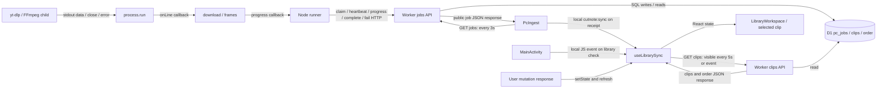

# 10단계: 작업 상태와 보관함 변경의 전달

2026-10-03 작업 트리 기준. [UML 안내](../README.md) · [조회 주기·정리 책임](lifecycle.md) · [Android 공유·재진입 순서](android-sequence.md) · [영속 복구](../recovery/README.md)

## 무엇을 왜 조사했는가

PC에서 바뀐 작업·클립이 브라우저와 Android에 언제 보이는지, 화면을 닫아도 남는 상태와 화면 안에서만 전달되는 이벤트를 구분했다. JSX 모양은 제외하고 요청·effect·callback·프로세스 이벤트를 조사했다. 최종 소스의 실행문이 근거이며 테스트는 보조 증거다.

중심 파일은 useLibrarySync, PcIngest, useLibraryWorkspace, MobileSave/MobileRouter, MainActivity/EntryPolicy, jobs/server, runner/process/media/start, Bridge와 Gateway다. 아래 표의 링크에서 실제 심볼로 추적할 수 있다.

## 상태 전달 관계 표

| 요소 | 생산자/조회자/소비자 역할 | 전달 방식 | 연결 대상 | 시작·종료 조건 | UML 표시 여부 | 근거 |
|---|---|---|---|---|---|---|
| jobs/server.workerAction | 상태 생산자·DB 기록자 | claim/progress/heartbeat/fail/complete HTTP 명령→SQL | Node runner, D1 pc_jobs/clips | 유효 lease 및 요청 조건; terminal 또는 만료 회수 | 표시 | [workerAction/complete](../../../../apps/web/lib/jobs/server.ts) |
| changeJob/recover | 취소·재시도·중단 상태 생산자 | 사용자 API 명령, 목록/claim 시 SQL | pc_jobs | cancel/retry 요청, 만료 running 발견 | 표시 | [changeJob/recover](../../../../apps/web/lib/jobs/server.ts) |
| GET /api/jobs | 상태 조회·공개 DTO 전달 | HTTP JSON, id 선택 필터 또는 최근 100행 | PcIngest→publicJob | 요청마다 recover; PC 비활성은 available:false | 표시 | [jobs route](../../../../apps/web/app/api/jobs/route.ts), [listJobs/publicJob](../../../../apps/web/lib/jobs/server.ts) |
| PcIngest | 작업 상태 조회자·소비자 | 즉시 GET+3초 interval, React setState | jobs API, 상태 문구/진행률 | mount/endpoint 변경 시 시작; cleanup 때 timer 해제 | 표시 | [PcIngest](../../../../apps/web/features/library/pc-ingest.tsx) |
| PC runner | 큐 조회자·작업 실행자 | 1.5초 claim polling, 5초 heartbeat, HTTP progress | 내부 jobs API, 도구·AI | startRunner 즉시 tick; busy 동안 claim 생략; close/작업 finally 정리 | 표시 | [startRunner](../../../../apps/pc/runner.mjs) |
| child_process | 출력·종료 이벤트 생산자 | stdout data→onLine; stderr data; error/close callback | process.run→media.download | spawn부터 error/close까지 | 표시 | [run](../../../../apps/pc/process.mjs) |
| download/frames | 진행률 생산자 | 함수 인자 progress callback | runner→progress API | 출력 숫자 또는 프레임 한 장 완료 시 | 표시 | [download/frames](../../../../apps/pc/media.mjs) |
| GET /api/clips | 보관함 조회·전달 | 전체 clips+order JSON, no-store | useLibrarySync/모바일 구형 흐름 | 각 요청 시 D1 읽기와 serialize | 표시 | [clips GET](../../../../apps/web/app/api/clips/route.ts), [json/serialize](../../../../apps/web/lib/server.ts) |
| useLibrarySync | 보관함 조회자·소비자 | 최초 GET, 5초 polling, focus/online/visibilitychange | clips API, clips/order/selected 상태 | 보이는 화면의 자동 갱신; cleanup 시 요청 abort·리스너 해제 | 표시 | [useLibrarySync](../../../../apps/web/features/library/use-library-sync.ts) |
| useLibraryWorkspace | 편집 결과 생산자·소비자 | mutation 응답→setClips/setSelected; refresh 호출 | clips/order API, useLibrarySync | 저장·태그·즐겨찾기·삭제·정렬 사용자 동작 | 표시 | [save/reviewSelected/toggleFavorite/remove/reorderCards](../../../../apps/web/features/library/use-library-workspace.ts) |
| cutnote:sync | 같은 window의 갱신 신호 | dispatchEvent/addEventListener, 데이터 payload 없음 | PcIngest/Android JS→useLibrarySync | PC 접수 성공 또는 Android 보관함 확인; listener effect 수명 | 표시 | [PcIngest.submit](../../../../apps/web/features/library/pc-ingest.tsx), [MainActivity](../../../../apps/android/app/src/main/java/app/cutnote/mobile/MainActivity.java) |
| AI 연결 상태 조회 | 설정 상태 조회자 | 즉시/15초/focus GET | /api/ai/status→useLibraryWorkspace | visible일 때; unmount 타이머·focus 해제 | 표만 | [workspace effect](../../../../apps/web/features/library/use-library-workspace.ts) |
| MobileRouter | 화면 경로 결정 소비자 | mount 시 AI status 1회 조회 | PcIngest 또는 MobileSaveSession | live flag로 늦은 응답 적용 방지 | 표시 | [MobileRouter](../../../../apps/web/features/library/mobile-save.tsx) |
| 구형 MobileSaveSession | 기존 분석 결과 조회자 | saved이고 미분석·비작업 상태에서 10초/focus GET | clips API | 분석 발견/busy/dep 변경 때 cleanup; 실제 PC 모드와 별도 | 표만 | [MobileSaveSession effect](../../../../apps/web/features/library/mobile-save.tsx) |
| SegmentLibrary | 구간 파일·편집 결과 소비자 | clip.id/segments/videoUrl effect→GET; onChange callback | segment-media API, 부모 changeClip | dependency 변경/mount; cleanup abort | 표만 | [SegmentLibrary](../../../../apps/web/features/segments/segment-library.tsx) |
| MainActivity/WebView | 공유 입력·ACK·연결 상태 전달자 | Intent, WebView callback, evaluateJavascript, runOnUiThread | MobileRouter/PcIngest, Bridge | 공유 수신·페이지 history 갱신·연결 확인; destroyWeb 정리 | 표시 | [MainActivity](../../../../apps/android/app/src/main/java/app/cutnote/mobile/MainActivity.java), [EntryPolicy](../../../../apps/android/app/src/main/java/app/cutnote/mobile/EntryPolicy.java) |
| LAN Bridge/Gateway | HTTP 중계자 | 요청/응답 stream과 close/error callback | Android↔PC Worker/미디어 | 각 HTTP 요청; close/deadline에서 upstream 정리 | 표시 | [Bridge](../../../../apps/android/bridge/server.mjs), [Gateway](../../../../apps/pc/server.mjs) |
| startPc | PC 프로세스 수명 소비자 | child error/exit→close, runner.close | Wrangler child, Gateway, runner | 실행기 시작~종료 | 표만 | [startPc](../../../../apps/pc/start.mjs) |
| useClipAnalysis/retagSegments | 요청 접수/브라우저 분석 진행 소비자 | 직접 callback 또는 작업 POST 응답 | 분석 함수·jobs API·부모 hook | 브라우저 분석은 abort 가능; PC 접수 뒤 완료 구독 없음 | 표만 | [useClipAnalysis](../../../../apps/web/features/library/use-clip-analysis.ts), [retagSegments](../../../../apps/web/lib/analysis/retag-segments.ts) |

## 상태 전달 구조도

읽는 방법: 화살표 라벨이 실제 전달 방식이다. HTTP 응답은 요청자가 받은 결과이며 서버 푸시가 아니다. 같은 그림의 DB 노드는 논리 저장소를 묶었고, 브라우저·Node·Worker는 서로 다른 실행 경계다. 모바일 HTTP는 Bridge/Gateway를 거치며 이 그림에서는 생략했다. 정식 UML 컴포넌트 표기가 아닌 Mermaid flowchart다.

## Observer와 폴링을 구분하는 학습 설명

- **폴링**은 조회자가 주기적으로 현재 값을 물어보는 방식이다. jobs 3초, 보관함 5초, runner claim이 이에 해당한다. DB 변경자가 화면 목록을 알고 통지하지 않는다. 중간 상태는 다음 조회 전에 바뀌어 화면에 나타나지 않을 수 있다.
- **직접 callback**은 호출자가 넘긴 함수를 실행하는 방식이다. download의 progress와 SegmentLibrary의 onChange가 예다. 구독자 등록/해제를 관리하는 이벤트 버스가 아니다.
- **DOM/프로세스 이벤트**는 listener를 등록해 특정 사건을 받는다. cutnote:sync와 child.stdout의 data가 여기에 해당한다. 관찰자와 비슷한 역할은 있지만, 이 코드에 별도 Subject/Observer 클래스나 전역 EventBus를 만들어 그릴 근거는 없다.
- **React effect**는 mount·dependency 변경에 맞춰 타이머와 listener를 설치하고 cleanup하는 수명 관리 장치다. effect 자체가 PC 상태를 다른 기기로 전송하지 않는다. useSyncExternalStore도 이름만으로 서버 구독이라고 볼 수 없다. MobileSave의 subscribeLocation은 실제 listener를 등록하지 않는 빈 구독 함수다.
- **SSE/WebSocket**으로 작업 변경을 전송하는 경로는 조사한 apps/web/app/api·features·lib, apps/pc, Android main/Bridge에서 찾지 못했다. EventSource/WebSocket/text/event-stream/BroadcastChannel 관련 검색도 해당 경로에서 일치가 없었다. 라이브러리 내부나 개발 서버의 별도 연결까지 없다는 주장은 아니다.

## 실제 보장과 확인 한계

각 화면은 같은 서버 상태를 독립 조회한다. cutnote:sync는 해당 window 안의 신호이므로 탭 간·기기 간 브로드캐스트가 아니다. 보관함의 클립과 작업 표시도 서로 다른 요청으로 갱신되어 잠시 시점이 다를 수 있다. OS 백그라운드 알림·Android 작업 완료 푸시를 이 경로에서는 확인하지 못했다.

정리 책임·오래된 응답 방지 차이는 [수명 표](lifecycle.md), Android 복원 조건은 [시퀀스](android-sequence.md), 영속 DB 복구는 [9단계](../recovery/README.md)를 따른다. Mermaid 자동 파싱·시각 렌더링은 미검증이다.
