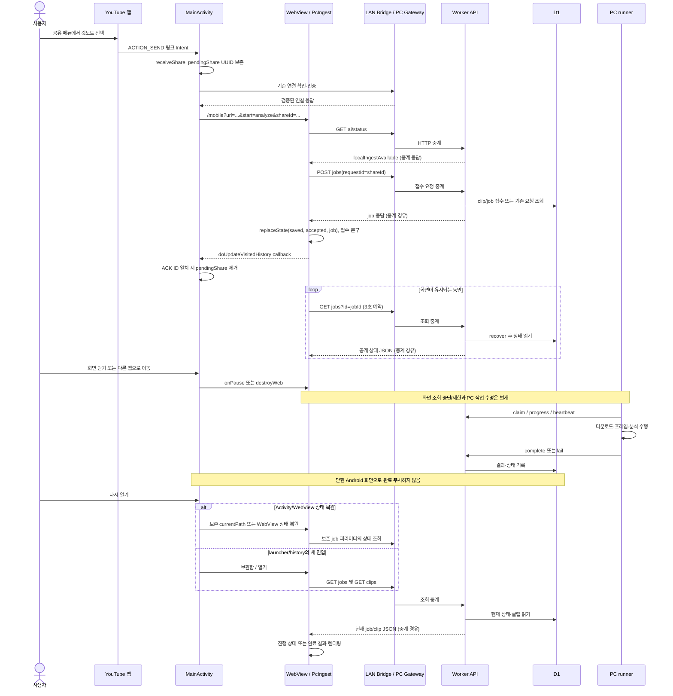

# Android 공유 접수·화면 종료·재진입

[10단계 안내](README.md) · [정리 책임](lifecycle.md) · [작업 영속 복구](../recovery/sequences.md)

## 조사 질문과 확인 위치

Android 화면 종료가 PC 작업을 중단하는지, 다시 열 때 메모리 상태와 서버 상태 중 무엇을 읽는지 조사했다. [MainActivity](../../../../apps/android/app/src/main/java/app/cutnote/mobile/MainActivity.java)의 receiveShare/doUpdateVisitedHistory/onSaveInstanceState/onPause/onResume/onDestroy, [ShareRequest](../../../../apps/android/app/src/main/java/app/cutnote/mobile/ShareRequest.java), [EntryPolicy](../../../../apps/android/app/src/main/java/app/cutnote/mobile/EntryPolicy.java), [MobileRouter](../../../../apps/web/features/library/mobile-save.tsx), [PcIngest](../../../../apps/web/features/library/pc-ingest.tsx)를 대조했다.

| 단계 | 확인 결과 | 복원의 근거 |
|---|---|---|
| 공유 수신 | UUID를 가진 pendingShare 생성·저장 | SharedPreferences + 필요 시 Bundle |
| 웹 진입 | 연결 확인 후 shareId가 든 /mobile, AI status로 PC 경로 선택 | pendingShare.mobilePath, MobileRouter |
| 접수 ACK | jobs POST 성공 뒤 replaceState에 saved/accepted/job 기록 | 작업 생성 응답이며 분석 완료 알림 아님 |
| Android ACK 처리 | 같은 origin의 history callback에서 ID 일치 시 pendingShare 제거 | currentPath 갱신 및 persistPendingShare |
| 화면 종료 | WebView pause 또는 destroy, PC runner에는 취소 명령 없음 | 별도 Node 프로세스·D1 작업 |
| Activity 복원 | Bundle의 currentPath/WebView 상태 사용 가능 | OS 상태 복원 조건에 따름 |
| 새 launcher/history 진입 | 보관함 /로 시작; 미완료 공유는 선택 후 재개 | EntryPolicy.openLibrary |
| 보관함 진입 | jobs/클립을 새 GET으로 읽음 | 3초/5초 폴링 재시작; 이전 React 상태 복제 아님 |

## sequenceDiagram

읽는 방법: W→B 반환 화살표는 L을 경유하는 HTTP 응답을 짧게 표시한 것이다. runner는 접수 직후 화면이 열려 있을 때부터 실행할 수도 있으며, 그림은 화면 종료 후에도 실행 가능한 독립성을 보여준다. React 컴포넌트가 정말 unmount되면 cleanup하지만 Android onPause만으로 React unmount나 모든 fetch 중단을 보장하지 않는다.

## 재진입과 연결 실패의 세부 조건

접수 응답을 확인하지 못했다면 Android의 pendingShare ID로 같은 요청을 재전송할 수 있다. PC 접수 성공 이후의 ACK는 완료 상태와 다르다. ACK 뒤 저장하는 currentPath는 Bundle에 들어가며, 일반 새 실행에서 마지막 job 화면을 무조건 복원하는 정책은 아니다. 새 실행은 보관함에서 jobs와 clips를 조회한다. PcIngest 일반 목록은 최근 100개 중 화면에 8개만 표시하고, 특정 job 파라미터가 있으면 그 작업을 조회한다.

MobileSave는 빈 subscribeLocation을 useSyncExternalStore에 전달한다. history.replaceState 호출 자체에 별도 location listener가 연결된 것은 아니다. 현재 공유 화면은 처음 shareId로 이미 selected job을 계산하므로 조회를 계속할 수 있지만, 주소 변경이 임의의 모든 React 구독자에게 즉시 통지된다고 설명하지 않는다.

MainActivity의 보관함 연결 확인은 쿠키를 갱신하고, 같은 origin의 루트 경로일 때 `evaluateJavascript`로 cutnote:sync를 발생시킨다. /mobile 등 다른 화면에서는 입력·분석 화면을 유지하는 Toast를 보여준다. 이는 서버에서 Android로 보내는 이벤트가 아니다. 401 연결 만료는 기존 verifyConnection 흐름으로 재인증하며, 일반 작업 API의 JSON 오류는 PcIngest가 error 문구로 표시한다.

API 접수 이후 화면 네트워크 연결이 끊어져도 D1 job은 남는다. 그러나 접수 이전에 Bridge가 끊겼는지 접수 응답만 유실됐는지는 화면 오류만으로 단정할 수 없다. 같은 requestId 재조회/재접수가 이를 다루는 방식이며 자세한 중복 기준은 [9단계](../recovery/README.md)를 따른다.

## 학습 포인트와 미확인

Android Bundle/WebView 상태는 사용자가 보던 화면의 복원 재료이고, DB는 PC 작업의 영속 상태다. 둘을 같은 “동기화 스냅샷”으로 보면 잘못된 복구 기대가 생긴다. 폴링은 현재 상태를 다시 읽으며, 닫혀 있던 동안 발생한 모든 진행 이벤트를 재생하지 않는다.

이 순서는 코드 대조 결과다. 이번 단계에서 실제 Android 공유·앱 강제 종료·LAN 단절·화면 복원은 실행하지 않았다. 검증 시 접수 ACK 전후를 나눠 종료하고, 복귀 경로(최근 앱 복원/launcher 새 시작)를 각각 비교해야 한다. 기대 결과는 PC 작업 유지와 현재 DB 상태 재조회이며, 마지막 화면의 무조건 복원이나 OS 완료 알림은 기대하지 않는다. Mermaid 자동 파싱·시각 렌더링도 미검증이다.
