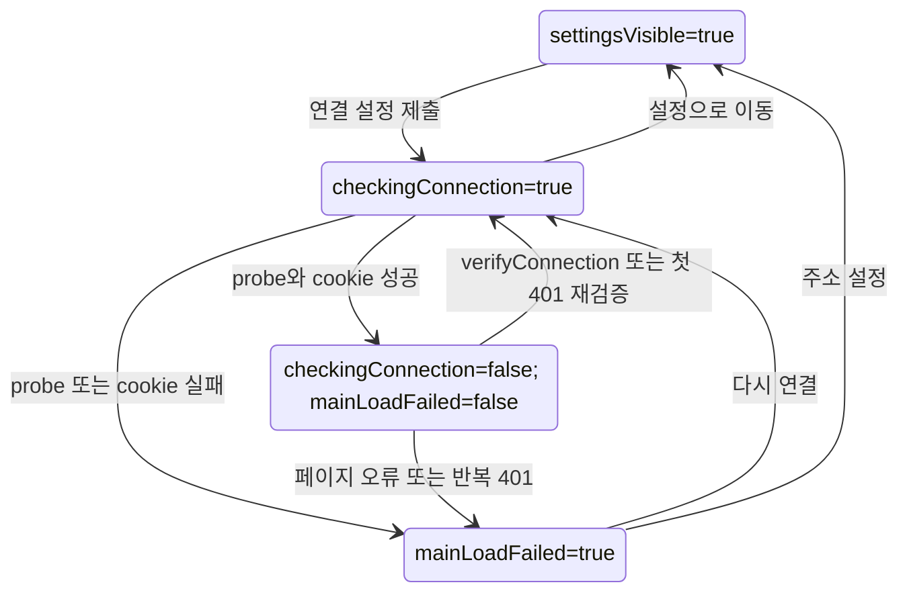
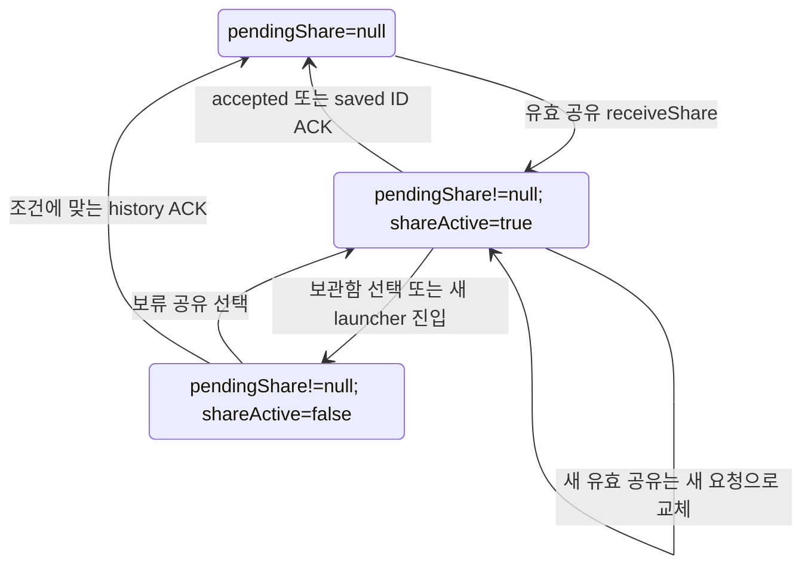

# Android 연결·공유와 모바일 화면 상태

[상태 안내](README.md) · [전체 Android 시퀀스](../state-delivery/android-sequence.md)

## 조사 질문과 실제 표현

[MainActivity](../../../../apps/android/app/src/main/java/app/cutnote/mobile/MainActivity.java)는 하나의 ConnectionState enum을 쓰지 않는다. checkingConnection, settingsVisible, mainLoadFailed, recoveredConnection, shareActive와 nullable pendingShare를 각각 변경한다. connectionGeneration은 오래된 연결 응답을 무시하는 번호이며 DB revision이 아니다. [ConnectionProbe](../../../../apps/android/app/src/main/java/app/cutnote/mobile/ConnectionProbe.java)의 Failure.kind의 address/pairing/server는 실패 분류이지 영속 연결 상태가 아니다. 일반 예외는 MainActivity가 network로 분류한다.

아래 표는 실제 메서드·필드를 대조한 결과다. Android 검증 근거는 **소스 대조**이며 이번 단계에서 기기/JVM 테스트를 실행하지 않았다. 민감한 연결 값은 조사·표시하지 않는다.

| 현재 상태 | 트리거 | 조건 | 수행 동작 | 다음 상태 | 영속 저장 여부 | 구현 근거 | 검증 근거 |
|---|---|---|---|---|---|---|---|
| pendingShare=null 또는 이전 요청 | 공유 Intent | 링크 추출 성공 | 새 ShareRequest/id 생성, persistPendingShare | pendingShare!=null, shareActive=true | SharedPreferences; Bundle 보조 | receiveShare, ShareRequest.create | 소스 대조 |
| 임의 공유 상태 | 공유 입력 오류 | create 결과 null | shareIssue 문구, /mobile 지정 | pendingShare=null, shareActive=true | pending 값 제거 | receiveShare | 소스 대조 |
| pendingShare!=null | 연결 실패/화면 종료 | ACK 전 | 공유 요청 유지 | pendingShare!=null | Preferences/Bundle | persistPendingShare/onSaveInstanceState | 소스 대조 |
| pendingShare!=null | history ACK | 같은 origin/허용 경로, accepted 또는 saved ID 일치 | pendingShare=null 후 저장 | pendingShare=null | Preferences 키 제거 | doUpdateVisitedHistory | 소스 대조 |
| pendingShare!=null | 새 launcher/history 진입 | EntryPolicy.openLibrary | /로 열고 자동 공유 비활성 | shareActive=false, pendingShare 유지 | 요청은 유지, 화면 플래그는 메모리/Bundle | onCreate/EntryPolicy | 소스 대조 |
| shareActive=false, pendingShare!=null | 보류 공유 선택 | 요청 있음 | shareActive=true, 공유 경로 로드 | shareActive=true | 메모리 | shareNotice listener | 소스 대조 |
| checkingConnection=false | verifyConnection | 연결 시도 | generation 증가, 화면 대기 표시 | checkingConnection=true, mainLoadFailed=false | 플래그 메모리 | verifyConnection | 소스 대조 |
| checkingConnection=true | probe 성공 | generation 유효, cookie 저장 성공 | checkingConnection=false, showWeb | checkingConnection=false, mainLoadFailed=false | save 선택 시 연결 설정 저장; 공유 유지 | verifyConnection callback | 소스 대조 |
| checkingConnection=true | probe/cookie 실패 | 현재 요청 응답 | 오류 화면 | checkingConnection=false, mainLoadFailed=true | 플래그 비영속 | showConnectionError | 소스 대조 |
| mainLoadFailed=false | 페이지 오류/연결 단절 | main frame 오류 등 조건 | 오류 화면, pendingShare 유지 | mainLoadFailed=true | 비영속 | WebViewClient callbacks | 소스 대조 |
| recoveredConnection=false | 401 연결 만료 | main frame 또는 연결 만료 헤더 | recoveredConnection=true, 재검증 | checkingConnection=true | 비영속 | onReceivedHttpError | 소스 대조 |
| recoveredConnection=true | 다시 연결 만료 | 자동 복구 이미 시도 | showConnectionError | mainLoadFailed=true | 비영속 | onReceivedHttpError | 소스 대조 |
| mainLoadFailed=true | 다시 연결 버튼 | 주소·설정 선택 | recoveredConnection=false 후 verify | checkingConnection=true | 플래그 비영속 | showConnectionError retry | 소스 대조 |
| 임의 연결 시도 | 설정/종료/새 Intent | lifecycle 조건 | generation 변경으로 늦은 응답 무시 | checkingConnection=false 또는 Activity 종료 | 공유 요청만 별도 유지 | onNewIntent/onBackPressed/onDestroy | 소스 대조 |

### 연결 플래그 투영

Web은 enum Connected를 새로 만든 것이 아니라 표시된 두 필드를 묶은 별칭이다. 아직 페이지 로딩 중일 수도 있어 네트워크 연결의 지속 보장을 뜻하지 않는다. 오류 화면도 WebView 객체를 항상 즉시 파괴하지 않는다.

### 보류 공유 투영

연결 끊김은 pendingShare 제거 조건이 아니다. 사용자 작업 취소(cancel job)와 Android pendingShare 제거(접수 ACK)도 다르다. “접수 완료” 문구를 “분석 완료” 전이로 그리지 않는다.

## 모바일 화면: setter와 jobs 값의 조합

근거는 [MobileRouter/PcIngest](../../../../apps/web/features/library/mobile-save.tsx), [PcIngest](../../../../apps/web/features/library/pc-ingest.tsx), [jobMessages](../../../../apps/web/lib/jobs/types.ts)다. 아래는 하나의 UI enum이 아닌 독립 필드의 전이 표다.

| 현재 상태 | 트리거 | 조건 | 수행 동작 | 다음 상태 | 영속 저장 여부 | 구현 근거 | 검증 근거 |
|---|---|---|---|---|---|---|---|
| pc=null | AI status 응답 | 요청 성공 | setPc(localIngestAvailable) | pc=true 또는 false | 메모리 | MobileRouter effect | 소스 대조 |
| pc=null | 연결 조회 실패 | catch | setError | pc=null, error 비어 있지 않음 | 메모리 | MobileRouter | 소스 대조 |
| busy=false | submit | running.current=false | busy/running=true, error 초기화 | busy=true | 아직 화면 상태만 | PcIngest.submit | 소스 대조 |
| busy=true | POST 성공 | job 반환 | message·주소 ACK·refresh, finally | busy=false, jobs에 서버 상태 | 작업 D1, 화면 값 메모리 | submit | 소스 대조 |
| busy=true | 입력/연결/POST 실패 | catch | error 문구, finally | busy=false, error 비어 있지 않음 | 로컬 오류는 비영속; 접수 여부 별도 | submit | 소스 대조 |
| jobs의 기존 state | 목록 GET 성공 | effect live | setJobs | 조회한 queued/running/completed/failed 등 | 원본 D1, 사본 메모리 | poll effect | 소스 대조 |
| 기존 jobs | 목록 GET 실패 | effect live | setError, 기존 jobs 유지 | jobs 유지+error | 메모리 | poll effect | 소스 대조 |
| failed/cancelled/interrupted 표시 | retry 버튼 | API 요청 성공 | refresh | 서버의 queued 등 | D1 | action/changeJob | pc-jobs 테스트 소스 |
| queued/running 표시 | cancel 버튼 | API 요청 성공 | refresh, cancelRequested 표시 가능 | 서버의 cancelled 또는 running+flag | D1 | action/changeJob | pc-jobs 테스트 소스 |

성공한 poll이 error를 초기화하지 않아 오류와 최신 상태가 동시에 표시될 수 있다. busy=false도 작업 완료가 아닌 제출 함수의 종료다. 구형 MobileSaveSession의 saved/busy/message/error와 PC jobs 경로는 별개이며, [10단계 수명 표](../state-delivery/lifecycle.md)에 시작·정리 조건을 분리했다. 실제 기기 복원·ACK·늦은 응답 경쟁은 미검증이다.
