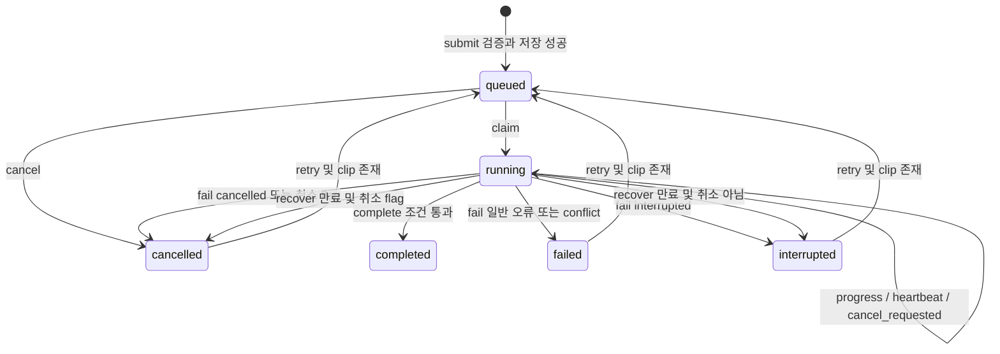

# PC 작업: state와 phase 분리

[상태 안내](README.md) · [복구 데이터](../recovery/README.md)

## 조사 질문·근거·책임

작업 상태를 바꾸는 주체는 [jobs/server](../../../../apps/web/lib/jobs/server.ts)의 submit/changeJob/recover/workerAction/complete다. [runner](../../../../apps/pc/runner.mjs)는 내부 HTTP로 변경을 요청하고 [PcIngest](../../../../apps/web/features/library/pc-ingest.tsx)는 공개 상태를 조회한다. DB 선언은 [0009](../../../../apps/web/drizzle/0009_pc_jobs.sql), 공개 문자열 타입과 표시 문구는 [jobs/types](../../../../apps/web/lib/jobs/types.ts)다.

DB state 값은 `queued/running/completed/failed/interrupted/cancelled`다. phase는 `queued/download/frames/analyze/commit/export/completed`이며 state와 별개다. claim은 export·재분석도 phase=download로 시작한다. 실패/중단에서 이전 phase와 progress가 남을 수 있다. `cancel_requested`는 취소 의사이고 cancelled는 상태다. SQL TEXT에 CHECK가 없고 TS도 string이므로 enum 수준의 닫힌 집합 보장이라고 표현하지 않는다.

검증 약어: **J**=[pc-jobs.test.ts](../../../../tests/web/pc-jobs.test.ts), **R**=[runtime.test.mjs](../../../../tests/pc/runtime.test.mjs). 아래 테스트는 이번 단계에서 재실행하지 않았다.

| 현재 상태 | 트리거 | 조건 | 수행 동작 | 다음 상태 | 영속 저장 여부 | 구현 근거 | 검증 근거 |
|---|---|---|---|---|---|---|---|
| 행 없음 | submit | ID/URL/입력 정상 | clip/job batch INSERT | queued | D1 | submit, migration 기본값 | J 중복 접수/URL 검증 |
| 행 없음 | 입력 오류 | 잘못된 ID·URL·kind·구간 등 | 400/404/409 또는 route 오류 응답 | 행 없음 | 정상 입력 검증 실패는 미기록 | submit, jobs route | J URL 거절, 소스 대조 |
| 기존 상태 | 같은 ID 접수 | 동일 payload/kind/clip 및 사전 검사 통과 | 기존 job 반환 | 기존 상태 | 새 상태 쓰기 없음 | submit | J 재접수 |
| 기존 상태 | 같은 ID 다른 입력 | 불일치 | 409 | 기존 상태 | 변경 없음 | submit | J 다른 URL |
| queued | claim | 대기행 선택 성공 | running, attempt+1, lease 60초, phase=download | running | D1 | workerAction claim | J claim/소유권 |
| running | progress/heartbeat | 유효 lease | 단계/진행률 또는 lease 갱신 | running | D1 | workerAction | J 소유권, R runner 경로 |
| running | complete | report·구간·revision·취소 검사 통과 | clip 병합+job completed 또는 export result | completed | D1 batch/UPDATE | complete/export 분기 | J CAS·완료 |
| running | 다운로드/프레임/분석/저장 오류 | fail 전달 가능, 유효 lease, 취소 아님 | error_code 기록, lease_token 제거 | failed | D1 | runner catch/failureCode, fail | J analysis_failed; 나머지 소스 대조 |
| running | 완료 시 revision 충돌 | 409 뒤 runner fail 성공 | error_code=conflict | failed | D1 | complete, workerClient, fail | J 409; runner 후속 소스 대조 |
| queued | cancel | queued인 행 | cancel_requested=1, state 변경 | cancelled | D1 | changeJob | 소스 대조 |
| running | cancel | running인 행 | cancel_requested=1 | running | D1 | changeJob | J cancel/heartbeat |
| running | heartbeat 취소 또는 abort | cancel_requested 또는 fail code=cancelled | abort 전달·fail, error_code NULL | cancelled | D1, fail 성공 조건 | runner, workerAction fail | J cancelled; R child 취소 |
| running | 정상 PC 종료/heartbeat 실패 | fail 전달 가능 | code=interrupted | interrupted | D1 | runner.close/heartbeat/catch | 소스 대조 |
| running | PC 강제 종료/통신 실패 | fail 미기록 | 당장 쓰기 없음 | running | 이전 행 유지 | runner catch의 fail 오류 무시 | 소스 대조, 실험 미실시 |
| running | recover | lease 만료, 취소 아님 | <code>lease_token</code>을 NULL로, error_code=interrupted | interrupted | D1 | listJobs/claim→recover | J lease_until=0 |
| running | recover | lease 만료, cancel_requested=1 | lease 제거,error_code=NULL | cancelled | D1 | recover | 소스 대조 |
| failed/interrupted/cancelled | retry | clip 존재 | queued, phase/progress/error/cancel/lease 초기화 | queued | D1 | changeJob | J retry·원본 유지 |
| failed/interrupted/cancelled | retry | clip 삭제 | 404 | 기존 상태 | 변경 없음 | changeJob | J 삭제 후 retry |
| completed/running/queued | retry | SQL 허용 state 아님 | UPDATE 0행, 현재 job 반환 | 기존 상태 | 상태 변화 없음 | changeJob | 소스 대조 |

읽는 방법: 중복 요청은 상태를 바꾸지 않아 선을 생략했다. 입력 실패는 아직 작업 행이 없으므로 failed 노드를 만들지 않는다. completed에서 retry 화살표는 없다. 종료 원을 생략한 것은 DB 행이 계속 남기 때문이다. 화면 종료는 이 상태 기계의 취소 트리거가 아니다.

학습 포인트: 오류 문구와 error_code, state를 분리해야 한다. workerClient는 409를 conflict, 다른 비정상 응답을 storage_failed로 바꾸므로 입력 report 검증 실패가 항상 analysis_failed가 되는 것은 아니다. fail조차 전달되지 않으면 나중 recover까지 running이 남는다. 실제 PC 재시작·다운로드 서비스·AI·경쟁 취소는 [남은 검증](../recovery/guarantees.md) 대상이다.
