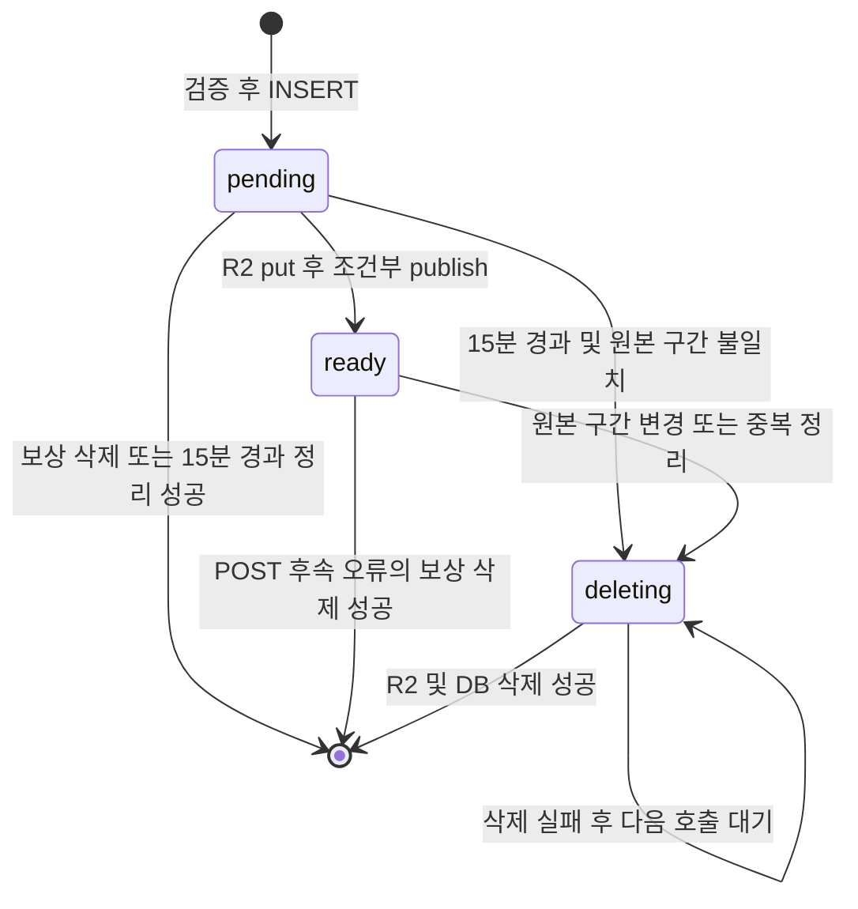

# 구간 미디어의 별도 준비·정리 상태

[상태 안내](README.md) · [파일 수명](../lifetime/jobs-files.md)

## 조사 질문과 책임

영상 파일의 “준비됨”은 PC 작업 completed와 같은 값인가? [segment-media POST](../../../../apps/web/app/api/segment-media/[id]/[segmentId]/route.ts), [cleanSegmentMedia/segmentMediaList](../../../../apps/web/lib/segment-media.ts), [DB schema](../../../../apps/web/db/schema.ts)를 확인했다. R2 구간 업로드는 segment_media.status의 `pending/ready/deleting`을 사용한다. 독립 상태 클래스나 enum이 아니라 TEXT/string과 SQL 조건이다.

검증 근거 **M**은 [segment-media.test.ts](../../../../tests/web/segment-media.test.ts)의 테스트 소스다. 이번 단계에서 실행하지 않았다.

| 현재 상태 | 트리거 | 조건 | 수행 동작 | 다음 상태 | 영속 저장 여부 | 구현 근거 | 검증 근거 |
|---|---|---|---|---|---|---|---|
| 행 없음 | 구간 업로드 | clip/segment/크기/MIME/magic/fingerprint 정상 | object_key 생성, INSERT | pending | D1 | POST | M 성공 저장 |
| 행 없음 | 검증 실패 | 조건 불충족 | 400/404/409/413 | 행 없음 | 미기록 | POST | M 원본/구간 조건, 소스 대조 |
| pending | R2 put 완료 | 현재 원본·구간 일치, 행도 pending | 조건부 UPDATE | ready | D1, R2 객체 | POST | M 성공·메타 편집 허용 |
| pending | 업로드 도중 원본·구간 변경 | UPDATE 0행 | 객체·행 삭제 후 409 | 행 없음 | 삭제 성공 조건 | POST | M 원본/구간 변경·클립 삭제 |
| pending 또는 ready | POST catch | 기록 이후 예외 | 객체·행 보상 삭제 시도 | 행 없음 또는 기존 상태 | 삭제 실패 시 기존 행 잔류 | POST catch | 소스 대조 |
| ready | 정리 호출 | 원본/구간 불일치 또는 더 새 동일 fingerprint 행 존재 | 상태 표시 | deleting | D1 | cleanSegmentMedia | M 범위 변경·중복 정리 |
| pending | 정리 호출 | 15분 경과, 원본/구간 불일치 | 상태 표시 | deleting | D1 | cleanSegmentMedia 첫 UPDATE | 소스 대조 |
| pending | 정리 호출 | 15분 경과 | 상태 변경 없이도 삭제 대상 조회 | 행 없음 또는 pending | R2/D1 삭제 성공 조건 | cleanSegmentMedia SELECT/loop | 소스 대조 |
| deleting | 정리 호출 | R2 delete와 DB delete 성공 | 객체·행 제거 | 행 없음 | 삭제 | cleanSegmentMedia | M tombstone 재시도 |
| deleting | 정리 호출 | 삭제 실패 | warning, 행 보존 | deleting | D1 | cleanSegmentMedia catch | M 실패 후 재시도 |

종료 원은 파일·추적 행 삭제를 뜻하며 deleted라는 상태 값이 저장되는 것은 아니다. 읽기에는 ready와 현재 fingerprint가 맞는 파일만 노출한다. 정리는 읽기/저장/삭제 경로에서 호출되며 독립적인 15분 주기 cron이 아니다. 15분은 pending의 나이를 검사하는 기준이다. 동시 파일·DB 원자성 전체를 보장하지 않는다.

## PC 로컬 미디어와의 차이

[PC media](../../../../apps/pc/media.mjs)는 파일 존재·manifest·원본 메타와 체크포인트를 사용한다. [Gateway](../../../../apps/pc/server.mjs)와 [localSegments](../../../../apps/web/lib/jobs/server.ts)는 local asset/export job 결과를 조회한다. 로컬 export는 segment_media에 pending→ready를 쓰는 흐름이 아니라 pc_jobs의 queued→running→completed를 사용한다. 두 저장 경로의 상태를 합치지 않는다.

기존 원격 R2 POST는 sourceIdentity(row)가 local_asset도 반환할 수 있지만 SQL publish/정리 조건은 coalesce(video_key,source_url)를 비교한다. 정상 로컬 UI는 PC export 작업으로 분기한다. 따라서 R2 상태 전이를 로컬 영상 직접 업로드까지 그대로 지원하는 것으로 확대하지 않는다. 직접 API 우회·동시 업로드의 범위 검증은 미실시다.

학습 포인트: pending 추적 행은 파일보다 먼저 만들고, deleting 행은 삭제 실패 후 재시도를 위한 표식으로 남긴다. 이 표식은 undo 스냅샷이 아니다. 미디어 codec/브라우저 readyState나 Gemini의 PROCESSING/ACTIVE는 다른 계층의 값이며 이 DB 상태 기계에 합치지 않는다. 실제 R2 장애·전원 중단·삭제 경쟁과 Mermaid 렌더링은 미검증이다.
