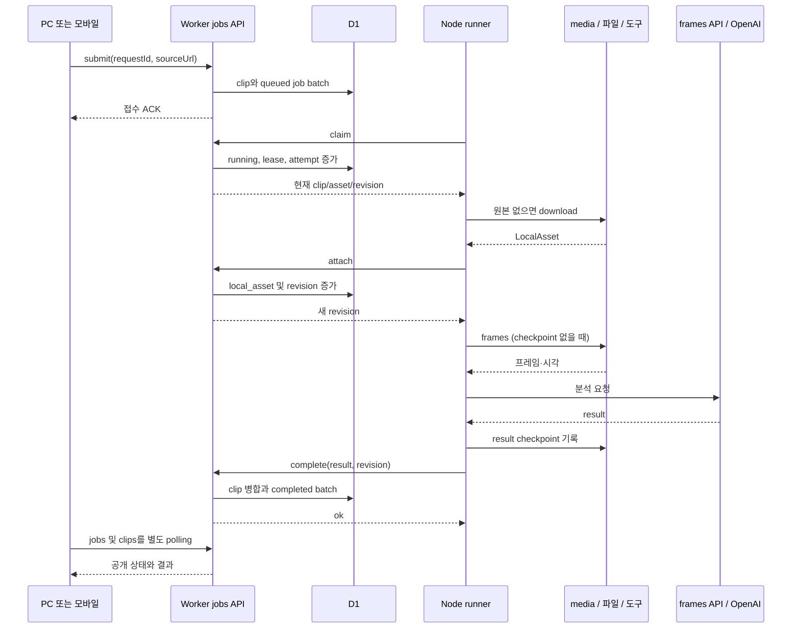
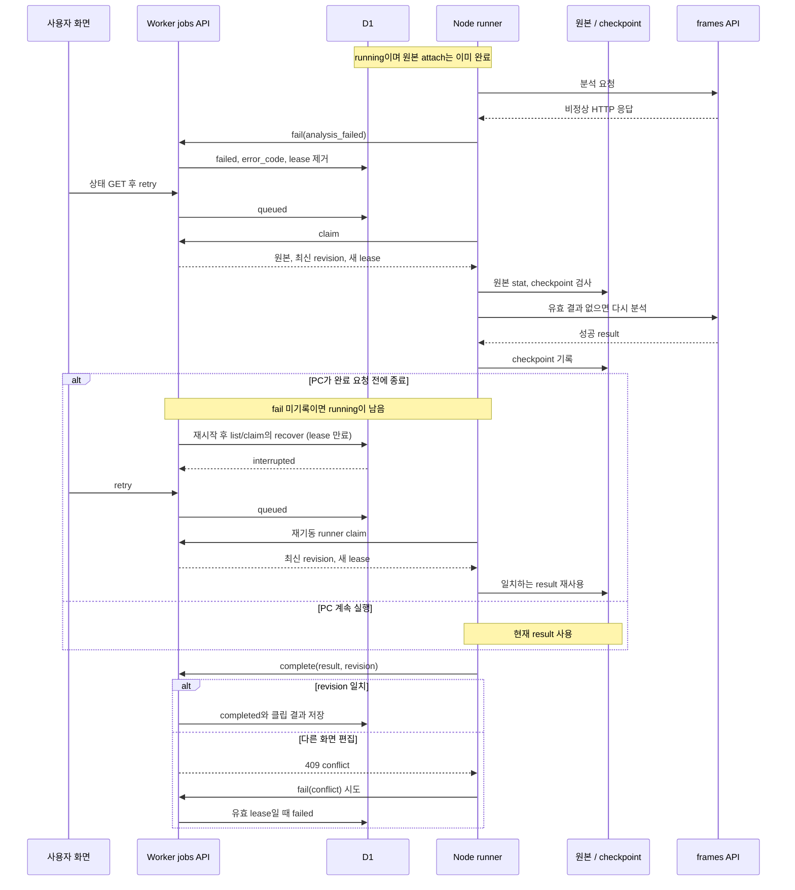

# 성공과 대표 실패·복구 경로

[상태 안내](README.md) · [상세 재시도/PC 재시작](../recovery/sequences.md) · [Android 화면 종료/재진입](../state-delivery/android-sequence.md)

## 무엇을 왜 조사했는가

전이 표의 조건이 실제 호출 순서에서도 성립하는지 확인했다. 근거는 [submit/workerAction/complete](../../../../apps/web/lib/jobs/server.ts), [startRunner](../../../../apps/pc/runner.mjs), [download/frames](../../../../apps/pc/media.mjs), [PcIngest](../../../../apps/web/features/library/pc-ingest.tsx)다. 아래는 gateway/bridge·heartbeat 반복을 생략한 핵심 시퀀스이며 외부 실행 성공을 증명한 그림은 아니다.

## 성공 경로

이 그림은 최초 원본·체크포인트가 없는 ingest 성공 예다. 기존 asset/checkpoint 재사용 분기는 [9단계](../recovery/sequences.md)에 있다. 접수 ACK 뒤 화면을 닫아도 runner는 계속하며, 같은 ID 재전송은 별도 작업을 만들지 않고 기존 행을 반환한다(입력/현재 클립 사전 조건 통과 시).

## 분석 실패 후 재시도와 중단 회수

검증 근거: [pc-jobs 테스트](../../../../tests/web/pc-jobs.test.ts)의 원본 유지·재시도·만료·CAS 사례와 [runtime 테스트](../../../../tests/pc/runtime.test.mjs)의 독립 runner 사례를 읽고 소스 순서와 대조했다. 이번에 실제 다운로드·AI·PC 재시작은 실행하지 않았다. 실패 후 fail도 통신/lease 문제로 거절될 수 있으며 그 경우 즉시 failed가 아니라 만료 회수를 기다린다. 연결 재시도, 취소, 중복 접수의 세부 조건은 [작업 표](jobs.md)와 [Android 표](android-mobile.md)를 따른다.
