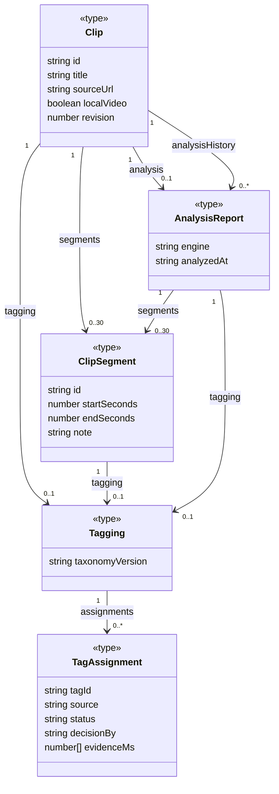
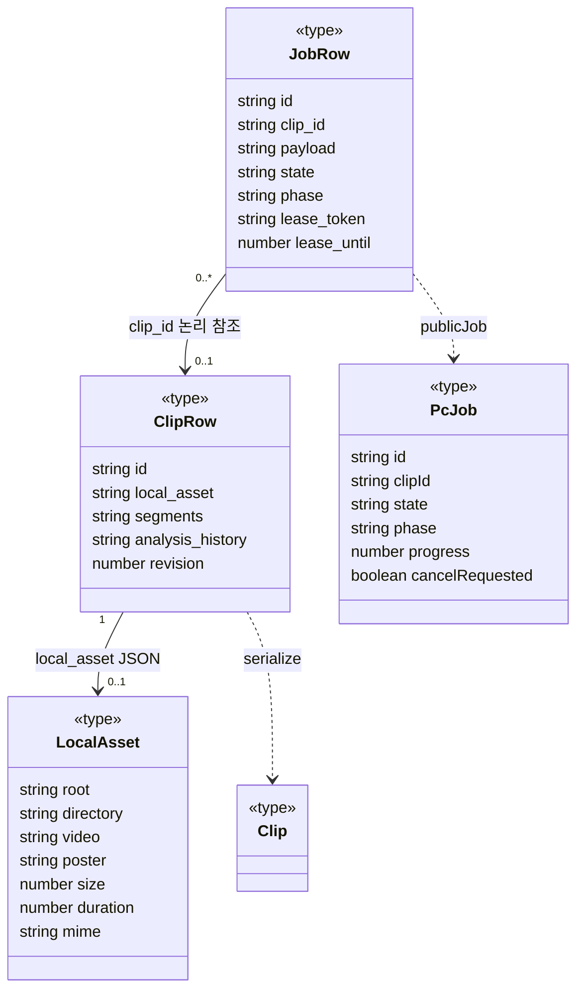

# TypeScript 데이터 타입과 영속 표현

[전체 안내](README.md)

## 무엇을 왜 조사하는가

화면의 Clip과 D1 행은 같은 객체인가? 구간·태그·로컬 파일이 클립 삭제에 종속되는가? 잘못된 합성 관계나 DB 외래 키를 그리지 않기 위해 선언과 직렬화/삭제 규칙을 나눠 확인한다.

## 확인한 파일·심볼과 조사 결과

| 심볼·관계 | 근거 파일 | 사실 |
|---|---|---|
| Clip → ClipSegment/Tagging/AnalysisReport | [clips.ts](../../../apps/web/lib/clips.ts) `Clip` | optional 필드/배열. 함수 기반 값 객체이며 class 아님 |
| ClipSegment → Tagging | [segments.ts](../../../apps/web/lib/segments.ts) `ClipSegment`, `parseSegments` | 선택 구간마다 별도 검수, 최대30구간 검사 |
| Tagging → TagAssignment | [tagging.ts](../../../apps/web/lib/tagging.ts) 선언·`parseTagging` | assignments 배열, 중복 tagId 거부·사용자 판단 보존 |
| AnalysisReport → 구간/검수 | [analysis/types.ts](../../../apps/web/lib/analysis/types.ts) `ReportBase`, `AnalysisReport` | engine 판별 union. 상속 클래스 3개가 아님 |
| ClipRow → Clip | [server.ts](../../../apps/web/lib/server.ts) `serialize` | JSON 문자열을 풀고 공개 media URL을 만든다 |
| JobRow → PcJob | [jobs/server.ts](../../../apps/web/lib/jobs/server.ts) `publicJob` | DB snake_case를 공개 camelCase로 변환; lease/payload 숨김 |
| ClipRow → LocalAsset | 위 `assetInput`, `workerAction`; [jobs/types.ts](../../../apps/web/lib/jobs/types.ts) | local_asset JSON 파싱. 절대 경로 대신 root ID |
| JobRow → ClipRow | `submit`, `changeJob`, [schema.ts](../../../apps/web/db/schema.ts) `pcJobs` | clip_id 참조지만 DB FK 없음. 클립 삭제 후 job이 남을 수 있음 |

## 도메인 타입 그림과 읽는 방법

**주요 필드만 발췌한 그림**이다. `Clip.localVideo`, `revision`은 실제 타입에서 optional이며 그림의 속성 칸은 optional 표시를 생략했다. `0..30`은 TS 배열 문법 자체가 아니라 `parseSegments`의 입력 검증 제약이다. analysisHistory는 타입상 배열이다. worker 완료는 최근10개로 자르지만 PATCH에는 예외가 있으므로 [5단계 수명 조사](lifetime/data.md)의 조건을 따른다. 모든 선은 값/필드 참조이며 객체 수명 소유를 뜻하는 합성선이 아니다.

## 저장·공개 타입 변환

nullable인 local_asset·poster·lease_token 등은 간결하게 필드명만 표시했다. `JobRow`는 jobs/server.ts 내부 타입이지 DB 모델 클래스가 아니다. `0..1 ClipRow`는 생성 시 클립이 필요하지만 이후 삭제되어 없을 수 있다는 유지보수 관점의 다중성이다. SQL 외래 키 다이어그램으로 읽지 않는다.

## 설계 판단과 학습 포인트

TS 타입은 런타임 JSON의 안전성을 보장하지 않는다. parseSegments/parseTagging/assetInput 같은 검증 함수가 실제 경계다. `AnalysisReport`의 mobileclip·Gemini·OpenAI union을 가상의 상속 구조로 바꾸면 코드에 없는 다형성을 암시하므로 하나의 타입으로 그렸다.

LocalAsset는 파일 자체가 아니다. root UUID→PC settings 매핑을 통해 파일을 찾고, ClipRow 삭제가 실제 원본 삭제를 의미하지 않는다. 반대로 recommendation_feedback에는 schema의 실제 cascade FK가 있다. 모든 ID 관계를 동일한 소유 관계로 그리면 삭제 정책을 잘못 이해하게 된다.

## 관련 문서·미확인

[스키마/API 기준](../local-video-ingestion-reference.md), [태깅 정책](../tagging.md), [상태](jobs.md). 데이터 실물은 열람하지 않았다. 이 그림은 저장된 모든 행의 무결성을 검사한 결과가 아니며 DB 테이블 전체의 ERD도 아니다.
