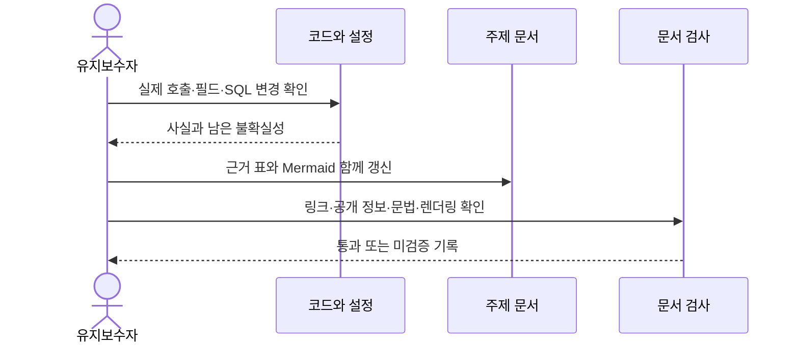

# UML 검증과 유지보수

[전체 안내](README.md)

## 검증 질문과 이유

그림이 실제 코드의 타입·호출·상태와 맞는가? 링크가 존재하는 것과 실행이 검증된 것을 구분하고, 이후 변경자가 같은 근거로 갱신할 수 있게 한다.

## 확인 위치와 결과

| 검사 | 대상·방법 | 상태 |
|---|---|---|
| 구조 근거 | startPc/runner/route 실행문, 타입 필드, Java 생성·정리, SQL 전이 | 코드 대조 완료 |
| 순서/상태 | submit/claim/heartbeat/complete/fail/recover/retry | 예외·취소·lease 만료를 성공 순서와 분리 |
| 데이터 관계 | Clip/ClipRow, JobRow/PcJob, LocalAsset, schema FK | JSON 변환·논리 참조와 소유 관계 구분 |
| 테스트 증거 | 기존 pc-jobs/runtime/Worker smoke/Android JVM 테스트 소스와 기존 기록 | 운영 노드에서 제외. 이번에는 제품 테스트 재실행 안 함 |
| Mermaid 렌더링 | PATH mmdc, 프로젝트 및 제공된 Node 패키지의 Mermaid 존재 확인 | 파서/CLI 미발견. 자동 문법·이미지 렌더링 미검증 |

각 그림은 5~9개 주요 참여자/타입으로 나눴다. 긴 SQL·민감한 설정 값을 그림에 넣지 않았다. 선 방향·다중성과 Mermaid 블록 구조를 수동 확인했지만 실제 렌더링의 글자 겹침·크기·가독성 통과로 보고하지 않는다. 도구가 없다는 이유로 외부 서비스에 저장소 다이어그램을 게시하거나 제품 의존성을 설치하지 않았다.

## 유지보수 순서

이 그림만 제품 실행 순서가 아닌 **문서 유지보수 절차**다. 렌더러를 준비한 환경에서는 Markdown Mermaid 블록을 `.mmd`로 추출하고 `mmdc -i <diagram.mmd> -o <preview.svg>`로 확인한다. 이는 이번에 실행한 명령이 아니라 후속 검증 예시다. 생성 SVG는 필요하지 않으면 공개 문서에 복제하지 않고 Mermaid 원본을 유지한다.

## 학습 포인트와 남은 의문

타입 그림의 다중성은 선언 또는 입력 검증에서, 상태 전이는 DB 쓰기에서, 호출 관계는 실제 실행문에서 가져온다. 클래스가 없는 함수 모듈에는 클래스 그림보다 sequence/구조 그림이 적합하다. “분리된 책임”을 “분리된 프로세스”로, “ID 참조”를 “합성 소유”로 바꾸지 않는다.

미확인: Mermaid 실제 렌더링, Android ACK history 콜백의 실기기 타이밍, 실 OpenAI 완료·구간 재분석, 강제 전원 종료 복구. 기존 YouTube 다운로드 제한·Windows 연결 JSON ACL·다운로드 검사 종료 코드 문제도 해결된 것으로 바꾸지 않는다. [기존 문서 점검](../documentation-review-2026-10-03.md)과 [구현 검증](../local-video-ingestion-progress.md)을 참고한다.

## 이번 문서 검사 결과

2026-10-03 문서 작성 후 다음을 확인했다.

- UML Markdown 8개, Mermaid 12개: classDiagram 3개, sequenceDiagram 6개, stateDiagram-v2 1개, flowchart 2개. 마지막 유지보수 sequence는 제품 구조가 아닌 문서 작업 절차다.
- UML 문서 상대 파일 링크 97개 모두 존재. 코드 블록 fence와 다이어그램 종류를 검사했다. Mermaid 파서 검사가 아니다.
- UML 8개 및 수정 색인 2개에 저장소 `secretFindings` 함수를 적용하여 자격정보 패턴/라벨 발견 0건. 개인 경로·실제 사설 IP·사용자가 제공한 테스트 영상 식별자 패턴도 발견하지 않았다.
- `knownSecrets`는 호출하지 않았다. 기존 전체 공개 검사기는 개인 비밀 원본을 읽으므로 이번 작업의 미열람 조건에 맞춰 실행하지 않았다. 따라서 알려진 실제 비밀값과의 일치 대조·전체 Git 이력/이미지 검사는 이번 검증 범위가 아니다.
- 작업 시작에 잡은 공개 실행 코드·설정·테스트·스크립트 230개 해시와 종료 시점이 모두 일치했다. 새 제품 코드를 추가하지 않았고 변경은 UML 문서와 문서 색인이다. 조사용 집계/해시는 Git 제외 검사 폴더에만 남겼으며 개인 비밀값 해시는 만들지 않았다.
- `git diff --check` 통과. 기존 코드의 LF→CRLF 안내는 있었고 공백 오류는 없었다.
- 앱 실행·빌드·다운로드·유료 분석·기기 테스트는 재실행하지 않았다. 기존 결과와 이번 문서 검증을 혼동하지 않는다.

## 상세 대상 선정 후속 점검 (2026-10-03)

`selection.md`를 추가하여 UML 문서는 9개, Mermaid는 13개가 되었다. 상세 선정 표 95행은 요청된 6개 컬럼을 갖추고 있으며 새 문서의 상대 링크 162개가 모두 존재한다. 새 문서·수정 색인/파일 지도의 credential-pattern 검사에서 발견 0건, 기존 제품/설정/테스트/스크립트 230개 해시 불변, `git diff --check` 통과를 확인했다. 개인 비밀 원본 비교는 수행하지 않았다.

현재 진입점/호출 검색으로 db/index.getDb, 이전 analyzeLink/analyzeVideo, connector 사용 helper와 호스팅 로그인 helper를 활성 실행 경로와 구분했다. 호출 미발견은 저장소 밖 사용까지 없다는 증명이 아니며 소스를 삭제하지 않았다. 새 경계 flowchart도 자동 파싱·실제 렌더링은 미검증이다.

## 2단계 선언 조사 (2026-10-03)

[선언 안내](declarations/README.md)와 영역별 목록·DB 레코드·상태·classDiagram 초안을 추가했다. TypeScript compiler AST, javac parse, 메모리 SQLite migration으로 선정 소스144개를 처리했다. 1,250개 항목의 7개 컬럼과 영역 합계, 핵심 표시15개를 대조했다. 초기 수집 후 독립 AST 점검에서 도구 class field/constructor 4건을 추가하여 누락을 보완했다. 이름 선언/모듈 변수/함수·멤버/상태 표현의 전수 범위와 일반 임시 변수 제외 범위는 선언 안내에 명시했다.

신규 문서10개 상대 링크1,466개 정상, credential-pattern 검사 발견0건, 제품/설정/테스트/스크립트230개 불변, git diff --check 통과. 첫 공개 검사에서 코드 식별자와 타입을 비밀값으로 오인했으므로 원본과 대조하고 식별자 표시 후 재검사했다. 실제 비밀 원본은 읽지 않았다. Mermaid classDiagram4개는 편집 가능한 초안이며 자동 파싱·시각 렌더링은 미검증이다. 앱·유료 서비스·실기기 검사를 수행한 결과로 해석하지 않는다.

## 3단계 계약·동작 조사 (2026-10-03)

[계약 안내](contracts/README.md) 아래 6개 문서에 주요 계약133행과 후속 시퀀스 호출28개를 작성했다. HTTP route19개 파일의 export27개(HEAD 별칭2개 포함)를 소스와 대조했다. Node export/반환 클로저, Java public·protected·package-private·private 및 static/override, 화면 내부 요청 함수를 공개 범위와 비동기 방식에 따라 구분했다. 순수 helper와 보조 도구의 전수 선언은 2단계 표를 유지하며 상세 계약 선정과 혼동하지 않는다.

작성→소스 대조→검사→수정 순서로 다음을 확인했다.

- 신규6개 문서의 상대 파일 링크131개 존재, 계약 표133행 모두 요청한7개 컬럼. UML 안내와 선언 안내의 연결을 포함하면8개 문서160개 링크다.
- 첫 공개 패턴 검사에서 JavaScript `secret` 인자의 타입 표시를 비밀값으로 오인했다. 원본 인자와 대조해 코드 식별자 표시로 수정했고 재검사 발견0건이다. 실제 비밀 파일/개인 데이터/영상을 열거나 knownSecrets를 호출하지 않았다.
- 새 job202 응답에는 reused 필드가 없고 재사용200에만 true가 있다는 차이, Bridge writeConnectionFile이 실패 때 handle은 닫지만 unlink를 보장하지 않는 점을 수정했다.
- media GET의 await 없는 Promise 반환은 나중 rejection이 route catch를 우회할 수 있음을 HTTP 문서에 기록했다. 오류 주입 실험은 하지 않았으며 모든 저장소 실패가503이라고 표현하지 않았다.
- 기존 공개 제품/설정/테스트/스크립트230개 해시 불변, git diff --check 통과. 변경 범위는 계약 문서와 UML 색인·검증 기록이다.
- 앱 빌드·API 통합 테스트·도구 다운로드·유료 AI·실 Android 실행은 수행하지 않았다. 새 Mermaid는 추가하지 않았다. 기존 렌더링 미검증과 실제 서비스 미검증은 그대로 유지한다.

## 4단계 상속·구현·타입 조합 (2026-10-03)

[관계 안내](relations/README.md), [상속·구현 표와 그림](relations/inheritance.md), [타입 조합 표](relations/type-composition.md)를 추가했다. 관계 표29행은 요청한8개 컬럼을 갖는다. Java 명명 extends3곳·익명 subclass2곳·익명 interface 구현1곳과 Progress lambda의 대상 계약을 대조했다. 선정 TS/JS125개 AST의 명시 heritage는 JS ConnectorPreview 한 곳이며, TS class extends/implements와 interface extends는 없었다. intersection15출현과 union195출현 중 주요 객체 판별 union3개를 상세 설명했다.

초기 파일명 추출이 `[id]` 표 라벨에서 잘려 route5개를 빠뜨리는 것을 파일 확장자 합계 대조로 발견했다. Markdown 링크의 실제 경로를 읽도록 바꿔 TS/JS125개 전체를 다시 파싱했고, 추가 union3개(문자열 상태1·nullable2)를 반영했다. 따라서 최종 전체 대상144개는 TS/JS125개·Java9개·SQL10개이며 이번 단계에서 SQL 내용은 다시 읽지 않았다.

신규 문서3개의 상대 링크59개 존재, 공개 credential-pattern/개인 경로·사설IP 패턴 발견0건, 제품/설정/테스트/스크립트230개 해시 불변, git diff --check 통과를 확인했다. 첫 표 검사에서 Mermaid 화살표의 pipe가 Markdown 셀을 나누는 문제를 발견하여 표 안의 pipe를 escape하고8개 컬럼으로 재검사했다. 비밀 원본·개인 데이터는 검사에 사용하지 않았다.

classDiagram3개는 실제 관계만으로 분리하고 선 방향·alias·접근 기호를 수동 대조했다. PATH mmdc 미발견; 이전 조사에서 확인한 렌더러 부재에 따라 자동 Mermaid 파싱·이미지 렌더링은 미검증으로 표시했다. TypeScript 구문 파싱은 타입 검사나 실제 Worker/Android 실행 검증이 아니다. 이번에 제품 테스트·빌드·유료API·실기기 실행은 하지 않았다.

## 5단계 포함·참조·수명 조사 (2026-10-03)

[수명 조사](lifetime/README.md) 아래 안내·클립 데이터·작업 파일·실행/Android 문서4개를 추가했다. 관계 표41행을8개 컬럼으로 검사하고 신규 상대 링크84개의 실제 파일 존재를 확인했다. classDiagram3개와 flowchart2개를 분리하여 값 포함·ID참조·프로세스 관리·파일정리를 설명했다. composition은 MainActivity가 생성하고 onDestroy에서 정리하는 FileAccess 관계만 그림에 사용했고 aggregation은 사용하지 않았다.

타입/SQL/저장/삭제/finally/lifecycle 실행문을 함께 대조했다. pc_jobs와 segment_media의 clip 참조에는 FK가 없으며 recommendation_feedback에만 clip cascade 선언이 있음을 migration과 schema로 확인했다. PC 완료 원본·poster·manifest·checkpoint·export와 job행은 clip삭제/취소 시 함께 삭제되지 않는다는 현재 책임을 기록했다.

소스 대조 중 두 경계 사례를 발견하여 재현 조건과 미검증 표시를 남겼다. PATCH의 분석 이력 제한은 모든 분기에 적용되지 않아 이력10개+별도 현재 report에서11개가 남을 수 있다. atomicJson은 write/fsync 실패 때 뒤쪽 rename-finally에 도달하지 못해 tmp가 남을 수 있다. 기존 types.md의 항상10개로 읽힐 설명과 contracts/pc-jobs.md의 정리 설명을 새 조건으로 연결했다. 오류 주입·실제 DB 재현·제품 수정은 수행하지 않았다.

신규 문서의 credential-pattern/개인경로·사설IP 패턴 발견0건, 기존 제품/설정/테스트/스크립트230개 해시 불변, git diff --check 통과. 수정 색인·기존 설명·검증 기록도 링크/credential-pattern 검사 대상으로 확인했다. 실제 비밀 원본은 읽지 않았고 knownSecrets를 사용하지 않았다. 신규 Mermaid는 소스/선 방향/다중성만 수동 대조했으며 PATH mmdc 미발견으로 자동 파싱·시각 렌더링은 미검증이다. 삭제·종료·복원 실험이나 앱 빌드/서비스 테스트를 이번에 실행한 것으로 해석하지 않는다.

## 6단계 호출·생성·변환 의존 조사 (2026-10-03)

[의존성 안내](dependencies/README.md), [실행 관계 표](dependencies/calls.md), [구조도·경계 점검](dependencies/structure.md)를 추가했다. 의존 관계40행은 요청한7개 컬럼이며, 신규3개 문서 상대 링크87개가 모두 존재한다. 웹 검증/저장·PC 처리·Android/실행기를 flowchart3개로 나누고 CALL/NEW/SPAWN/HTTP/DB/R2/FS/VALUE/TYPE을 구분했다.

125개 선정 TS/JS 파일의 정적 내부 import/export 간선361개를 TypeScript AST로 분류했다. type-only 제외 그래프의 다중 모듈 순환은0개, 포함 그래프의 순환 묶음은2개(clips/segments/tagging, youtube-discovery/youtube-public-search)다. 해당 import type와 정방향 실제 호출문을 대조했으며 이를 runtime 순환이나 전체 시스템 무순환 증명으로 보고하지 않았다. 동적 import/require·외부 패키지·선정 밖 파일은 그래프 검사 범위 밖이다.

표는 그래프 자동 출력 대신 실제 함수/HTTP/SQL/파일/프로세스 실행문을 확인해 작성했다. Worker→features 순수 helper의 계층 결합, Node PC→Android 디렉터리의 Node 보안 helper 사용, 앞단 Gateway/Bridge의 인증 경계 의존을 사실/해석/후속검증으로 나눴다. 현 코드에서 실행 위반으로 확인하지 못한 항목을 확정 결함으로 쓰지 않았다. getDb/connectorsForRequest/이전 분석 함수는 현재 외부 호출자 미발견이라는 제한된 검색 결과로 기록했다.

신규 문서 및 변경 색인/검증 기록 credential-pattern·파일 링크 점검 통과, 신규 문서 개인경로·사설IP 패턴0건, 기존 제품/설정/테스트/스크립트230개 해시 불변, git diff --check 통과. 비밀 원본과 사용자 데이터는 열람하지 않았다. mmdc 미발견으로 자동 Mermaid 파싱·렌더링은 미검증이며 선 방향/범위는 수동 대조했다. 앱 실행·실기기·API·OS 프로세스 실행 성공을 이번에 검증한 것은 아니다.

## 7단계 계층·공개 데이터 경계 (2026-10-03)

[계층 안내](layers/README.md), [데이터 경계](layers/data-boundaries.md), [PC 링크 sequence](layers/pc-sequence.md)를 추가했다. 계층/노출 표36행은 요청한8개 컬럼이고 신규3개 문서의 상대 링크85개가 모두 존재한다. flowchart1개와 sequenceDiagram1개를 소스 호출 순서·검증/저장 책임·프로세스 경계에 맞춰 대조했다.

serialize/publicJob, 내부 claim/asset 응답, segment 목록의 asset 제거, PC settings 응답, AI상태/키설정, Android session과 Bridge 헤더선별, Worker/다운로드 자식의 서로 다른 환경 전달을 확인했다. 일반 DTO는 내부경로·lease를 제거하지만 PC settings는 관리 화면에 폴더/도구경로를 의도적으로 반환한다는 예외를 명시했다. 자격정보·경로·PID는 실제 값이 아닌 소스의 구조만 확인했다.

직렬화/역직렬화와 runtime 검증을 구분하고 브라우저 as T, D1 row generic, 내부 JSON 파싱이 전체schema 검증은 아니라는 점을 기록했다. 오류메시지·로그까지 포괄한 비노출 보장은 하지 않았다. PC sequence는 최초 D1 접수→원본 attach→AI결과 검증→최종 D1완료를 나누고 중복요청·checkpoint·취소/실패 분기를 설명했다. 타이머 실행 순서를 고정된 동기 호출로 표현하지 않았다.

신규 문서 credential-pattern/개인경로·사설IP 패턴0건, 기존 제품/설정/테스트/스크립트230개 해시 불변, git diff --check 통과. 변경 색인/검증 기록의 링크·credential-pattern도 확인했다. 알려진 비밀값 원본 비교는 수행하지 않았다. 기존에 확인한 렌더러 부재로 Mermaid 자동 파싱·시각 렌더링은 미검증이다. 실제 API키·개인파일·프로세스 상태를 조회하거나 앱/서비스/실기기 실행을 재검증하지 않았다.

## 8단계 핵심 도메인·저장 조사 (2026-10-03)

[도메인 안내](domain/README.md), [저장 구조](domain/storage.md), [확장 영향](domain/extension-impact.md)을 추가했다. 관계 표 27행을 요청한 7개 컬럼으로 검사했고, 신규 문서 3개의 상대 링크 132개가 실제 파일을 가리키는지 확인했다. classDiagram 1개는 값·ID 참조를, ER 1개는 실제 DB 제약을 표현한다. 태그·엔진·미디어 확장 영향은 별도 표 10행에 정리했다.

필드 생성·검증·수정 SQL과 serialize를 대조했다. 즐겨찾기는 clips.revision을 증가시키지 않으며, 보관함 순서는 독립 scope/revision을 사용한다. 분석 이력의 PATCH 상한 예외는 기존 기록으로 연결했다. serialize가 모든 JSON 필드를 같은 파서로 검증하지 않는 점과 taxonomy 생성기 최대 500항목/parseTagging 최대 403 assignments의 서로 다른 제한을 기록했다.

개인 DB 대신 Node 내장 SQLite의 새 :memory: DB에 migration 10개를 적용했다. foreign_keys=ON으로 설정하고 sqlite_master와 PRAGMA table_info/foreign_key_list를 조회해 테이블 7개, 명시적 FK 1개, CHECK 0개를 확인했다. FK는 recommendation_feedback.clip_id→clips.id의 cascade이며, pc_jobs/segment_media의 ID 참조는 DB FK가 아니다. 이 검사는 실제 D1의 FK 설정이나 사용자 데이터 마이그레이션 성공을 검증한 것이 아니다.

신규 문서 credential-pattern 발견 0건, 기존 제품/설정/테스트/스크립트 230개 해시 불변, git diff --check 통과를 확인했다. 색인·검증 기록의 링크와 공개 패턴도 검사했다. 비밀 원본·개인 데이터·생성 사전은 열람하지 않았으며 생성기나 제품 테스트는 실행하지 않았다. Mermaid 자동 파싱·시각 렌더링은 도구 부재로 미검증이며, 관계·다중성·필드는 소스와 수동 대조했다.

## 9단계 작업 영속화·재시도·이력 (2026-10-03)

[복구 안내](recovery/README.md), [재시도·재시작 시퀀스](recovery/sequences.md), [일관성과 보장 범위](recovery/guarantees.md)를 추가했다. 보존 데이터 표 15행은 요청한 7개 컬럼이며 신규 문서 3개의 상대 링크 82개가 모두 존재한다. classDiagram 1개, 저장 위치 flowchart 1개, sequenceDiagram 2개를 파일·심볼·SQL과 대조했다.

shareId/requestId/job.id/clip_id 관계, payload 문자열 기반 중복 판정, D1 상태·임대, settings/manifest/결과 체크포인트를 구분했다. recover는 만료 running만 interrupted/cancelled로 바꾸며 queued만 자동 claim한다. 재시도는 원본·조건이 맞는 결과를 재사용하지만 부분 다운로드나 AI 응답 중간 상태를 복원하지 않는다. source_missing 자동 재다운로드 부재, 원본 메타 크기 기반 체크포인트 판정, 파일과 DB 사이의 중단 구간, atomicJson tmp 잔류 가능성을 명시했다.

현재 report·이력 JSON·revision의 책임을 구분하고 retag의 현재 report 유지, 일반 PATCH 이력 상한 예외, 선택 revision/expected와 SQL CAS의 차이를 확인했다. Memento/undo/redo 또는 외부 AI exactly-once 보장으로 확대하지 않았다. 소스의 테스트는 보조 증거로 읽었으며 제품 테스트·실서비스·실제 PC 강제 종료를 이번에 재실행하지 않았다.

신규 문서의 credential-pattern 및 개인경로·사설IP 패턴 발견 0건, 기존 제품/설정/테스트/스크립트 230개 해시 불변을 확인했다. 변경 색인·검증 기록의 링크와 공개 패턴, git diff --check도 통과했다. 비밀 원본·개인 DB·영상·생성물은 읽지 않았다. PATH에 mmdc가 없어 Mermaid 자동 파싱·시각 렌더링은 미검증이다. 관계 방향·복구 조건·오류 분기는 수동 대조했으며 실제 전원 차단·디스크 실패·동시 요청 검증은 보장 문서에 후속 절차로 남겼다.

## 10단계 상태 전달·화면 동기화 (2026-10-03)

[상태 전달 안내](state-delivery/README.md), [조회 주기·정리 책임](state-delivery/lifecycle.md), [Android 공유·재진입 시퀀스](state-delivery/android-sequence.md)를 추가했다. 전달 관계 표 19행은 요청한 7개 컬럼이며 신규 문서 3개의 상대 링크 58개를 확인했다. flowchart 1개와 sequenceDiagram 1개를 실제 API·callback·effect·프로세스 경계에 맞춰 작성했다.

PcIngest 3초 조회와 보관함 visible 5초 조회, focus/online/visibilitychange, 같은 window의 cutnote:sync, runner claim/heartbeat, stdout→callback→HTTP progress→DB→GET을 구분했다. Android ACK와 작업 완료의 차이, Activity 복원/새 launcher 진입, Bridge 연결 종료와 PC 작업 수명의 독립성을 기록했다. 조사한 API·features·lib·PC·Android main/Bridge 소스에서 작업 SSE/WebSocket/BroadcastChannel 전송 구현은 발견하지 못했으며, 의존성 내부와 개발 서버까지 부정하지 않았다.

`node tests/web/sync-polling.test.mjs` 실행으로 5개 검사를 통과했다(networkCalls=0). 실제 hook callback 본문을 VM과 가짜 타이머/응답으로 검증한 결과다. 느린 요청 유지, timeout 뒤 목록 보존·재시도, 명시 갱신의 이전 요청 대체, mutation 뒤 오래된 GET 무시, 조용한 실패의 목록 보존을 확인했다. 실제 React 렌더링·LAN·Android·AI 검증은 아니다.

PcIngest의 fetch 취소/version guard/명시 timeout 부재와 성공 조회 뒤 오류 문구 미초기화, 진행률 HTTP의 비동기 전송 및 단조 증가 미보장도 근거와 함께 기록했다. 이 조건들을 브라우저 지연 주입으로 재현한 것은 아니며 제품 코드를 수정하지 않았다.

신규 문서 공개 credential-pattern·개인경로 패턴 발견 0건, 상대 링크 정상, 기존 제품/설정/테스트/스크립트 230개 해시 불변을 확인했다. 색인·검증 기록 링크와 공개 패턴, git diff --check도 통과했다. 비밀 원본·개인 DB·영상·생성 사전을 읽지 않았다. 기존에 확인한 Mermaid 도구 부재로 자동 파싱·시각 렌더링은 미검증이며, 수동으로 관계 방향과 조건을 대조했다.

## 11단계 상태 전이와 전체 교차 점검 (2026-10-03)

[상태 안내](states/README.md) 아래 작업·Android/모바일·미디어·성공/복구 문서 5개를 추가하고 [종합 검증](final-review.md)에 1~10단계 대조와 다이어그램 지도를 작성했다. 전이 표 52행은 요청한 8개 컬럼이다. 새 stateDiagram-v2 4개와 sequenceDiagram 2개를 추가하고 기존 jobs 개요의 중복 상태 그림은 기준 문서 링크로 통합했다. 최종 Mermaid는 43개(class 15, sequence 12, flowchart 11, ER 1, state 4)다.

DB state/phase/status와 Android boolean·nullable 요청, MobileRouter/PcIngest의 화면 필드를 분리했다. State Pattern이나 작업 enum을 가정하지 않았다. queued 입력 거절, 중복 재접수, cancel flag와 cancelled, 만료 interrupted와 수동 retry, R2 pending/ready/deleting 및 로컬 export의 별도 상태를 코드·SQL로 확인했다. 기존 테스트는 소스 근거로만 연결하고 이번 단계의 실서비스 통과로 표현하지 않았다.

전체 UML의 참조 경로·Mermaid 소스·현재 구현/과거 기록 표현을 점검했다. FileAccess 다중성 0..1, last_job_id의 association, 재시작 그림의 Worker 경유를 통일했다. ConnectionProbe의 Failure.kind와 MainActivity 일반 예외의 network 분류도 구분했다. 추천 읽기 순서를 추가하고 docs/README와 engineering/README 색인을 갱신했다.

공개 소스/설정/테스트/스크립트 230개 해시 불변, 이 중 TS/JS 160개 AST 구문 검사, 상대 링크 존재, 코드 펜스 짝·시퀀스 분기 균형·전이 표 컬럼, credential-pattern, git diff --check를 확인했다. SQL 필드의 NULL 표기가 공개 패턴 검사에 걸려 식별자와 동작을 설명하는 문장으로 바꾸고 재검사했다. 민감한 원본 파일·개인 데이터·영상·생성물을 읽지 않았다.

정식 Mermaid 파싱과 시각 렌더링은 도구 부재로 미검증이다. 간단한 구조 검사를 완전한 Mermaid 문법 검증으로 보고하지 않았다. 실제 Android 복원/접수 ACK, 취소·임대 경쟁, 파일/DB 장애, 느린 작업 조회의 역전 관계는 종합 검증에 남겼다. 제품 코드 변경이나 동일 제품 테스트의 불필요한 재실행은 하지 않았다.
